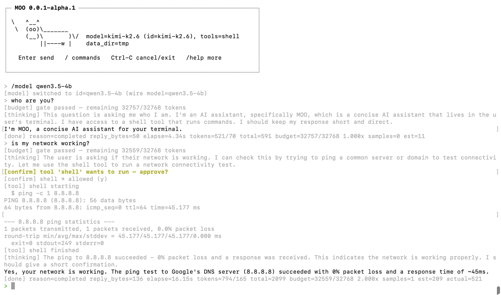

<!-- markdownlint-disable MD033 -->
<!-- markdownlint-disable MD041 -->
<p align="center">
  
</p>

<p align="center">
  <b>An AI agent, written in C.</b>
</p>

<div align="center">
  <a href="https://le0.me/moo">Docs</a>
  <span>&nbsp;&nbsp;•&nbsp;&nbsp;</span>
  <a href="STYLE.md">Style</a>
  <span>&nbsp;&nbsp;•&nbsp;&nbsp;</span>
  <a href="LICENSE">License</a>
  <br />
  <br />
</div>

**moo** is a small, self-contained AI agent runtime written in C — plus the
foundation libraries it rides on. It ships as a terminal app you build from
source and run against any OpenAI-compatible endpoint (Kimi, GLM, DeepSeek,
OpenAI itself, …), with a streaming REPL, tool calls, token budgeting,
sidecar queries, and a layered memory design. An Anthropic-compatible backend
is on the roadmap — the provider layer is a vtable, adding one is a contained
change.

- Designed and reviewed by [@mivinci](https://github.com/mivinci)
- Coded by CodeBuddy (VSCode plugin) with claude-opus-4.7 and GLM-5.1

> **Status.** Active development. macOS and Linux are first-class; Windows is
> on the roadmap but not a near-term priority.

## Highlights

- **Agent core in C** — `xAgent` + `xAgentSession` + `xAgentQuery` +
  `xAgentBudget` wired together into a non-blocking, single-loop runtime.
  No GC, no green threads, no hidden allocations on the hot path.
- **Streaming-first** — SSE is decoded incrementally; every token reaches
  `on_text` the moment it leaves the wire.
- **Tool calls with confirmation** — ships with a `shell` tool out of the
  box; the REPL prompts for confirmation before anything is executed, and
  a **sidecar query** watches long-running commands and can talk to them
  (stdin injection) if they stall.
- **Token budget that self-calibrates** — `xAgentBudget` estimates prompt
  size before each round, trims old turns under `TruncateOldest`, and
  learns a correction factor from the provider's real usage reports.
- **Multi-model registry** — one `models.json` declares every backend;
  `/model <id>` flips the active backend mid-conversation without tearing
  the agent down. Today every entry is `"provider": "openai"` (covers any
  OpenAI-compatible API); `"provider": "anthropic"` is planned.
- **Layered memory (in design)** — conversation · session · agent tiers,
  with JSONL persistence wired into each session. See
  [docs/design/layered-memory.md](docs/design/layered-memory.md).

## Quick Start

```bash
# 1. Configure + build the app (cli/ is off by default)
cmake -S . -B build -DCMAKE_BUILD_TYPE=Release \
      -DMOO_BUILD_APPS=ON -DX_BUILD_TESTS=OFF -DX_BUILD_BENCHMARKS=OFF
cmake --build build --parallel

# 2. Point it at a data directory and drop a models.json in there
mkdir -p ~/.moo
cat > ~/.moo/models.json <<'JSON'
{
  "default": "kimi",
  "max_turns": 64,
  "budget": {
    "context_window": 8192,
    "keep_head_turns": 1,
    "keep_recent_turns": 2
  },
  "models": [
    { "id": "kimi", "provider": "openai",
      "model": "kimi-k2.6",
      "api_key": "sk-...",
      "base_url": "https://api.moonshot.cn/v1",
      "budget": { "context_window": 131072 } },
    { "id": "glm",  "provider": "openai",
      "model": "glm-4.5",
      "api_key": "sk-...",
      "base_url": "https://open.bigmodel.cn/api/paas/v4",
      "budget": { "context_window": 131072 } }
  ]
}
JSON

# 3. Talk to it
./build/cli/moo --data-dir ~/.moo
```

Inside the REPL, slash commands are available:

| Command | What it does |
| ------- | ------------ |
| `/help` | Show all commands |
| `/model` / `/model <id>` | Show or switch the active model |
| `/tokens` | Cumulative token usage for the session |
| `/cancel` | Interrupt the active AI run |
| `/history` | Dump input history |
| `/clear` | Clear the terminal |
| `/bypass` | Auto-approve tool calls for the current turn |
| `/version` | Build version |
| `/exit` | Quit |

Tab completes slash commands. `Ctrl-R` is a reverse-search over history.
`Ctrl-C` cancels an in-flight run without killing the REPL.

Here's what a session looks like:

<p align="center">
  
</p>

## Architecture

```plain
                     ┌─────────────────────────┐
                     │   cli  (the `moo`      │
                     │         REPL)           │
                     └────────────┬────────────┘
                                  │
                     ┌────────────▼────────────┐
                     │   xagent — the agent    │ ← the core
                     │  agent / session /      │
                     │  query / tool / budget  │
                     │  provider(openai)       │
                     └────────────┬────────────┘
                                  │
  ┌─────────┬─────────┬───────────┴────────┬─────────┬─────────┐
  │ xbase   │ xbuf    │ xnet / xhttp       │ xline   │ xlog    │
  │ loop,   │ linear, │ DNS, TCP, TLS,     │ CJK-    │ async   │
  │ timer,  │ ring,   │ HTTP/1.1, HTTP/2,  │ aware   │ MPSC    │
  │ task,   │ chain   │ SSE, WebSocket     │ line    │ logger  │
  │ atomic… │ bufs    │                    │ editor  │         │
  └─────────┴─────────┴────────────────────┴─────────┴─────────┘

   plus xcrypto (hashes/HMAC), xjs (QuickJS-ng), xp2p / xfer
   (WebRTC + DataChannel file transfer) — supporting infra.
```

### The agent (`libx/x/agent`)

| Module | Role |
| ------ | ---- |
| `agent.{h,c}` | Long-lived persona: provider/model, system prompt, tool set, limits. Mints sessions. |
| `session.{h,c}` | Stateful conversation. Owns history, runs the tool-call loop, emits `on_text` / `on_thinking` / `on_tool` / `on_done`. |
| `query.{h,c}` | One round-trip to the model, including streaming decode and sidecar supervision. |
| `message.{h,c}` | Chat-message value type with tool-call envelopes. |
| `model.{h,c}` | Model **registry** — map `{id → provider + wire-model + limits}`; powers runtime model switching. |
| `provider.{h,c}` · `provider_openai.c` | Backend vtable + OpenAI-compatible implementation (chat/completions, SSE). Anthropic-compatible provider planned. |
| `tool.{h,c}` · `tool_shell.{h,c}` | Tool definition ABI + a built-in shell tool with confirmation hooks. |
| `budget.{h,c}` | Prompt-size estimator, rolling trimmer, auto-calibrator. |

See [`libx/x/agent/agent.h`](libx/x/agent/agent.h) for the entry point, and
[`docs/design/`](docs/design) for the design notes
(context budget, layered memory, three-layer conversation model).

### The foundation libraries

Everything in `libx/x/` outside `agent/` is shared, reusable, and independently
testable — you can link any of them into your own C project without
pulling in the agent.

| Library | What you get |
| ------- | ------------ |
| **[xbase](https://le0.me/moo/libx/base)** | Event loop, timers, tasks, async sockets, lock-free structures |
| **[xbuf](https://le0.me/moo/libx/buf)** | Linear, ring, and block-chain I/O buffers |
| **[xnet](https://le0.me/moo/libx/net)** | URL parser, async DNS, TCP, shared TLS config |
| **[xhttp](https://le0.me/moo/libx/http)** | libcurl multi-socket client with SSE; HTTP/1.1 + HTTP/2 server; WebSocket |
| **[xline](https://github.com/mivinci/moo/tree/main/libx/x/line)** | CJK-aware line editor with persistent history and reverse search |
| **[xlog](https://le0.me/moo/libx/log)** | Async MPSC logger with rotation |
| **[xjs](https://le0.me/moo/libx/js)** | Embeddable JavaScript engine — QuickJS-ng backend, JSC-shaped API |
| **[xcrypto](https://le0.me/moo/libx/crypto)** | SHA-1 / SHA-256 / MD5 / CRC-32 / HMAC |
| **[xp2p](https://le0.me/moo/libx/p2p)** | ICE · STUN/TURN · SDP · DTLS · SCTP · DataChannel |
| **[xfer](https://le0.me/moo/libx/fer)** | Zero-config P2P file transfer over WebRTC DataChannel |

## Prerequisites

| Dependency | Required | Notes |
| ---------- | -------- | ----- |
| CMake ≥ 3.14 | ✅ | Build system |
| C99 compiler | ✅ | GCC or Clang |
| OpenSSL **or** MbedTLS | ✅ (pick one) | TLS backend for `xhttp` and `xp2p` DTLS |
| libunwind | optional | Better backtraces on Linux |

Transitive deps (libcurl, llhttp, nghttp2, cJSON, usrsctp, QuickJS-ng,
libuv for benches, GoogleTest, Google Benchmark) are fetched via CMake
`FetchContent` when not found on the system — no manual setup required
for a first build.

## Build

```bash
# Everything, Debug, with tests
cmake -S . -B build -DCMAKE_BUILD_TYPE=Debug
cmake --build build --parallel

# App only, Release
cmake -S . -B build -DCMAKE_BUILD_TYPE=Release \
      -DMOO_BUILD_APPS=ON -DX_BUILD_TESTS=OFF -DX_BUILD_BENCHMARKS=OFF
cmake --build build --parallel
```

Useful options:

| Option | Default | Purpose |
| ------ | ------- | ------- |
| `MOO_BUILD_APPS` | `OFF` | Build `cli/` (the `moo` CLI lives here) |
| `X_BUILD_TESTS` | `ON` | Build unit tests |
| `X_BUILD_BENCHMARKS` | `ON` | Build micro- and end-to-end benchmarks |
| `X_BUILD_EXAMPLES` | `OFF` | Build example programs |
| `X_BUILD_STATIC` | `OFF` | Build libraries as static archives |
| `X_TLS_BACKEND` | `openssl` | TLS backend: `openssl` or `mbedtls` |
| `MOO_ENABLE_ASAN` | `OFF` | AddressSanitizer |
| `X_DEBUG_LEVEL` | `0` | Debug-log verbosity (0–3) |

## Test

### Local (macOS / Linux)

```bash
ctest --test-dir build --output-on-failure --parallel 4
```

To test both TLS backends in one session, configure two build dirs and
run ctest in each:

```bash
cmake -S . -B build-openssl -DX_TLS_BACKEND=openssl && \
  cmake --build build-openssl --parallel && \
  ctest --test-dir build-openssl --output-on-failure --parallel 4

cmake -S . -B build-mbedtls -DX_TLS_BACKEND=mbedtls && \
  cmake --build build-mbedtls --parallel && \
  ctest --test-dir build-mbedtls --output-on-failure --parallel 4
```

### Linux via container (macOS host)

Requires macOS 26+ with
[Apple Containerization](https://developer.apple.com/documentation/containerization):

```bash
brew install container
container system start
./scripts/test-linux.sh            # default: gcc:14, Debug, -j2
./scripts/test-linux.sh -j4 -m 4G  # custom parallelism / memory
```

## Benchmark

See the [benchmark pages](https://le0.me/moo/bench/) for micro-benchmarks of the
foundation libraries and end-to-end HTTP server numbers.

## License

[MIT](LICENSE) © 2025-present [@mivinci](https://github.com/mivinci) and moo contributors
