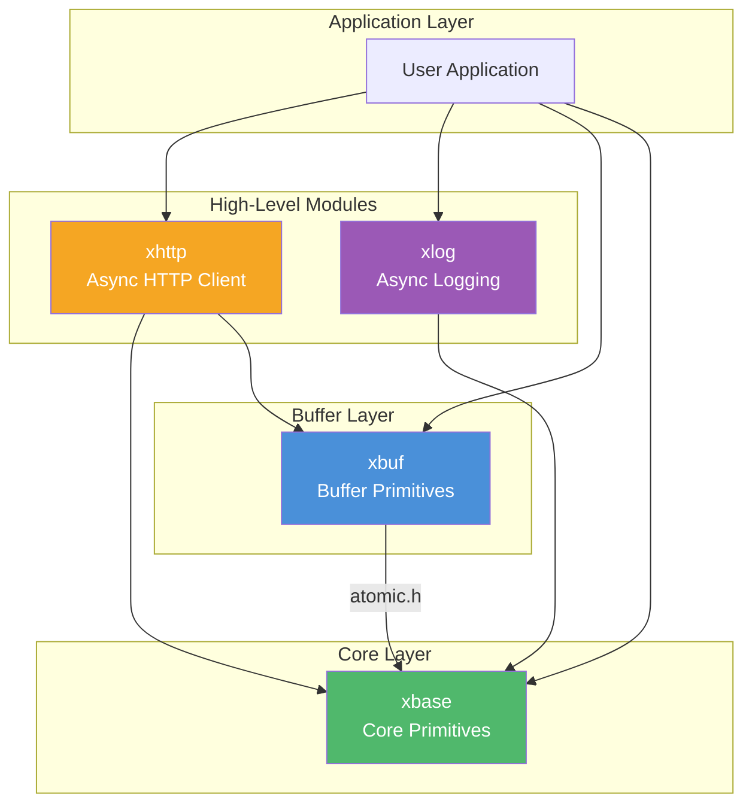
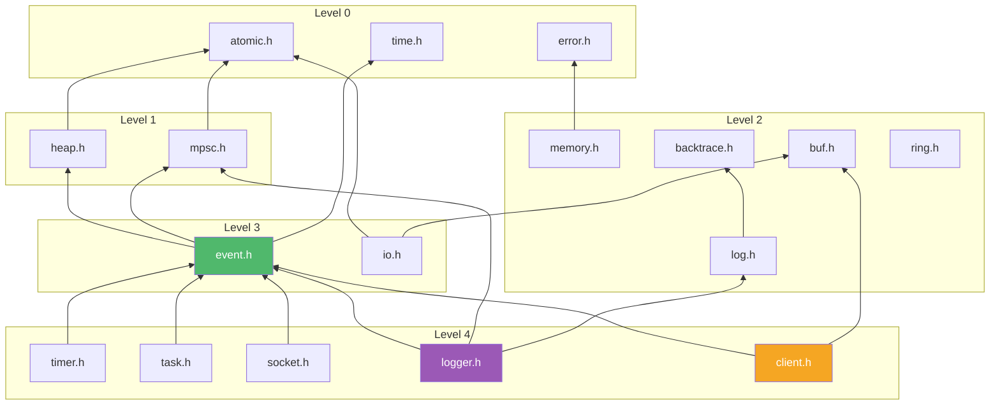

<!-- markdownlint-disable MD033 MD041 -->
# xKit Documentation

<p align="center">
  
</p>

Welcome to the xKit documentation. xKit is a collection of low-level C building blocks for event-driven, asynchronous programming on **macOS** and **Linux**. (Windows is on the roadmap but not a near-term priority).

- Designed and reviewed by Leo X.
- Coded by Codebuddy with claude-4.6-opus

## Architecture Overview



## Module Index

### [xbase](xbase/README.md) — Core Primitives

The foundation of xKit. Provides event loop, timers, tasks, async sockets, memory management, and lock-free data structures.

| Sub-Module | Description |
| --- | --- |
| [event.h](xbase/event.md) | Cross-platform event loop — kqueue (macOS) / epoll (Linux) / poll (fallback) |
| [timer.h](xbase/timer.md) | Monotonic timer with Push (thread-pool) and Poll (lock-free MPSC) fire modes |
| [task.h](xbase/task.md) | N:M task model — lightweight tasks multiplexed onto a thread pool |
| [socket.h](xbase/socket.md) | Async socket abstraction with idle-timeout support |
| [memory.h](xbase/memory.md) | Reference-counted allocation with vtable-driven lifecycle |
| [error.h](xbase/error.md) | Unified error codes and human-readable messages |
| [heap.h](xbase/heap.md) | Min-heap with index tracking (used by timer subsystem) |
| [mpsc.h](xbase/mpsc.md) | Lock-free multi-producer / single-consumer queue |
| [atomic.h](xbase/atomic.md) | Compiler-portable atomic operations (GCC/Clang builtins) |
| [log.h](xbase/log.md) | Per-thread callback-based logging with optional backtrace |
| [backtrace.h](xbase/backtrace.md) | Platform-adaptive stack trace (libunwind > execinfo > stub) |
| `time.h` | Time utilities: `xMonoMs()` (monotonic) and `xWallMs()` (wall-clock) |

### [xbuf](xbuf/README.md) — Buffer Primitives

Three buffer types for different I/O patterns — linear, ring, and block-chain.

| Sub-Module | Description |
| --- | --- |
| [buf.h](xbuf/buf.md) | Linear auto-growing byte buffer with 2× expansion |
| [ring.h](xbuf/ring.md) | Fixed-size ring buffer with power-of-2 mask indexing |
| [io.h](xbuf/io.md) | Reference-counted block-chain I/O buffer with zero-copy split/cut |

### [xhttp](xhttp/README.md) — Async HTTP Client

Non-blocking HTTP client powered by libcurl multi-socket API + xEventLoop, with built-in SSE streaming.

| Sub-Module | Description |
| --- | --- |
| [client.h](xhttp/client.md) | Async HTTP client (GET / POST / PUT / DELETE / PATCH / HEAD) |
| [client_sse.c](xhttp/client_sse.md) | SSE streaming client with W3C-compliant event parsing |

### [xlog](xlog/README.md) — Async Logging

High-performance async logger with MPSC queue, three flush modes, and file rotation.

| Sub-Module | Description |
| --- | --- |
| [logger.h](xlog/logger.md) | Async logger with Timer / Notify / Mixed modes and `XLOG_*` macros |

## Quick Navigation Guide

### By Use Case

| I want to... | Start here |
| --- | --- |
| Build an event-driven server | [xbase/event.h](xbase/event.md) → [xbase/socket.h](xbase/socket.md) |
| Schedule timers | [xbase/timer.h](xbase/timer.md) |
| Run tasks on a thread pool | [xbase/task.h](xbase/task.md) |
| Make async HTTP requests | [xhttp/client.h](xhttp/client.md) |
| Stream LLM API responses (SSE) | [xhttp/client_sse.c](xhttp/client_sse.md) |
| Add async logging | [xlog/logger.h](xlog/logger.md) |
| Manage object lifecycles | [xbase/memory.h](xbase/memory.md) |
| Choose the right buffer type | [xbuf overview](xbuf/README.md) |
| Build a lock-free producer/consumer pipeline | [xbase/mpsc.h](xbase/mpsc.md) |

### By Dependency Level

```text
Level 0 (no deps)     : atomic.h, error.h, time.h
Level 1 (atomic only) : heap.h, mpsc.h
Level 2 (Level 0-1)   : memory.h, log.h, backtrace.h, buf.h, ring.h
Level 3 (Level 0-2)   : event.h, io.h
Level 4 (event loop)  : timer.h, task.h, socket.h, logger.h, client.h
```

## Module Dependency Graph



## Build & Test

```bash
# Build
cmake -S . -B build -DCMAKE_BUILD_TYPE=Debug
cmake --build build --parallel

# Test
ctest --test-dir build --output-on-failure --parallel 4
```

See the project [README](../README.md) for full build instructions, prerequisites, and container-based Linux testing.

## License

[MIT](../LICENSE) © 2025-present Leo X. and xKit contributors
