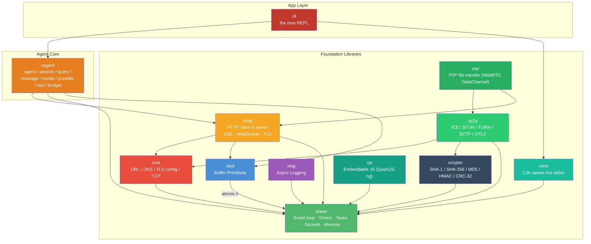
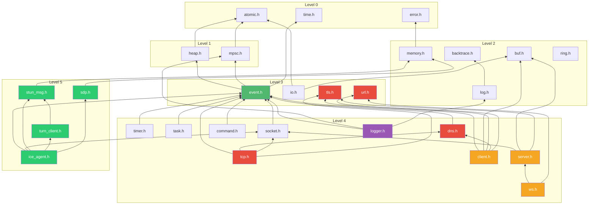

<!-- markdownlint-disable MD033 -->
<!-- markdownlint-disable MD041 -->
# moo

Welcome to the moo documentation. **moo** is a small, self-contained **AI agent written in C** — plus the foundation libraries it rides on. It ships as a terminal app (`moo`) that talks to any OpenAI-compatible endpoint (Kimi, GLM, DeepSeek, OpenAI itself, …); an Anthropic-compatible provider is on the roadmap. Runs on **macOS** and **Linux**; Windows is on the roadmap but not a near-term priority.

- Designed and reviewed by [@mivinci](https://github.com/mivinci)
- Coded by CodeBuddy (VSCode plugin) with claude-opus-4.7 and GLM-5.1

Here's what a session looks like:

<p align="center">
  
</p>

## Architecture Overview

moo is layered. The **agent core** (`xagent`) sits on top of a set of reusable C libraries that together form the runtime: an event loop, buffers, networking, HTTP, logging, a line editor, and more. Each lower-level lib is independently usable in your own project.



## Module Index

### [xagent](https://github.com/mivinci/moo/tree/main/libx/x/agent) — The Agent

moo's headline module: a non-blocking, single-loop AI agent runtime. No GC, no green threads, no hidden allocations on the hot path.

| Sub-Module | Description |
| --- | --- |
| `agent.h` | Long-lived persona — provider/model, system prompt, tool set, limits. Mints sessions. |
| `session.h` | Stateful conversation — owns history, runs the tool-call loop, emits `on_text` / `on_thinking` / `on_tool` / `on_done` |
| `query.h` | One round-trip to the model, including streaming decode and sidecar supervision |
| `message.h` | Chat-message value type with tool-call envelopes |
| `model.h` | Model registry — `{id → provider + wire-model + limits}`; powers runtime model switching |
| `provider.h` · `provider_openai.c` | Backend vtable + OpenAI-compatible implementation (chat/completions, SSE). Anthropic provider planned. |
| `tool.h` · `tool_shell.h` | Tool definition ABI + a built-in shell tool with confirmation hooks |
| `budget.h` | Prompt-size estimator, rolling trimmer, self-calibrating token budgeter |

Design notes: [context budget](design/context_budget.md) · [layered memory](design/layered_memory.md) · [three-layer conversation model](design/three_layer_conversation.md).

### [cli](https://github.com/mivinci/moo/tree/main/cli) — The `moo` REPL

A terminal app built on `xagent` + `xline`. Streaming output, slash commands (`/help` `/model` `/tokens` `/cancel` `/bypass` …), tool-call confirmation prompts, persistent history with reverse search, and model hot-swap via `models.json`. See the project [README](../README.md#quick-start) for the quick start.

### [xbase](libx/base/index.html) — Core Primitives

The foundation every other module sits on. Event loop, timers, tasks, async sockets, memory, lock-free structures, plus a few batteries-included utilities.

| Sub-Module | Description |
| --- | --- |
| [event.h](libx/base/event.md) | Cross-platform event loop — kqueue (macOS) / epoll (Linux) / poll (fallback) |
| [timer.h](libx/base/timer.md) | Monotonic timer with Push (thread-pool) and Poll (lock-free MPSC) fire modes |
| [task.h](libx/base/task.md) | N:M task model — lightweight tasks multiplexed onto a thread pool |
| [socket.h](libx/base/socket.md) | Async socket abstraction with idle-timeout support |
| [command.h](libx/base/command.md) | Async subprocess execution (used by `xagent`'s shell tool) |
| [flag.h](libx/base/flag.md) | GNU-style command-line flag parser |
| [memory.h](libx/base/memory.md) | Reference-counted allocation with vtable-driven lifecycle |
| [string.h](libx/base/string.md) | Small-string-optimized mutable byte string |
| [array.h](libx/base/array.md) / [list.h](libx/base/list.md) / [map.h](libx/base/map.md) / [slab.h](libx/base/slab.md) | Generic containers |
| [error.h](libx/base/error.md) | Unified error codes and human-readable messages |
| [heap.h](libx/base/heap.md) | Min-heap with index tracking (used by timer subsystem) |
| [mpsc.h](libx/base/mpsc.md) | Lock-free multi-producer / single-consumer queue |
| [atomic.h](libx/base/atomic.md) | Compiler-portable atomic operations (GCC/Clang builtins) |
| [log.h](libx/base/log.md) | Per-thread callback-based logging with optional backtrace |
| [backtrace.h](libx/base/backtrace.md) | Platform-adaptive stack trace (libunwind > execinfo > stub) |
| [base64.h](libx/base/base64.md) / [hex.h](libx/base/hex.md) | Binary-to-text codecs |
| `time.h` | Time utilities: `xMonoMs()` (monotonic) and `xWallMs()` (wall-clock) |

### [xbuf](libx/buf/index.html) — Buffer Primitives

Three buffer types for different I/O patterns — linear, ring, and block-chain.

| Sub-Module | Description |
| --- | --- |
| [buf.h](libx/buf/buf.md) | Linear auto-growing byte buffer with 2× expansion |
| [ring.h](libx/buf/ring.md) | Fixed-size ring buffer with power-of-2 mask indexing |
| [io.h](libx/buf/io.md) | Reference-counted block-chain I/O buffer with zero-copy split/cut |

### [xnet](libx/net/index.html) — Networking Primitives

Shared networking utilities: URL parser, async DNS resolver, and TLS configuration types used by higher-level modules.

| Sub-Module | Description |
| --- | --- |
| [url.h](libx/net/url.md) | Lightweight URL parser with zero-copy component extraction |
| [dns.h](libx/net/dns.md) | Async DNS resolution via thread-pool offload |
| [tls.h](libx/net/tls.md) | Shared TLS configuration types (client & server) |
| [tcp.h](libx/net/tcp.md) | Async TCP connection, connector & listener with optional TLS |

### [xhttp](libx/http/index.html) — Async HTTP Client & Server & WebSocket

Full-featured async HTTP framework: libcurl-powered client with SSE streaming (which `xagent` uses to stream model responses), event-driven server with HTTP/1.1 & HTTP/2 (h2c), TLS support (OpenSSL / mbedTLS), and RFC 6455 WebSocket (server & client).

| Sub-Module | Description |
| --- | --- |
| [client.h](libx/http/client.md) | Async HTTP client (GET / POST / PUT / DELETE / PATCH / HEAD) |
| [sse.c](libx/http/sse.md) | SSE streaming client with W3C-compliant event parsing |
| [server.h](libx/http/server.md) | Event-driven HTTP server with HTTP/1.1 and HTTP/2 (h2c) |
| [ws.h](libx/http/ws_server.md) | RFC 6455 WebSocket server with handler-initiated upgrade |
| [ws.h](libx/http/ws_client.md) | RFC 6455 WebSocket client with async connect |
| [transport.h](libx/http/tls.md) | Pluggable TLS transport layer (OpenSSL / mbedTLS / plain) |

### xline — CJK-Aware Line Editor

Powers the `moo` REPL's input: Unicode-width-aware editing, persistent history, reverse search (`Ctrl-R`), and redraw-while-streaming so the prompt stays put while the AI is typing above it. Docs TBD.

### [xlog](libx/log/index.html) — Async Logging

High-performance async logger with MPSC queue, three flush modes, and file rotation.

| Sub-Module | Description |
| --- | --- |
| [logger.h](libx/log/logger.md) | Async logger with Timer / Notify / Mixed modes and `XLOG_*` macros |

### [xjs](libx/js/index.html) — Embeddable JavaScript Engine

QuickJS-ng backend behind a JSC-shaped C API: ES modules, native class wrappers, stable value types.

### [xcrypto](libx/crypto/index.html) — Cryptographic Primitives

SHA-1, SHA-256 (OpenSSL / mbedTLS / builtin), MD5, CRC-32, and generic HMAC (HMAC-SHA1 / HMAC-SHA256 / HMAC-MD5).

### [xp2p](libx/p2p/index.html) — P2P Connectivity

ICE-based peer-to-peer connectivity with full STUN/TURN client stack, SDP codec, and NAT traversal. Ships with DTLS + SCTP + DataChannel for WebRTC browser interop.

| Sub-Module | Description |
| --- | --- |
| [ice_agent.h](libx/p2p/ice.md) | Full ICE agent — candidate gathering, connectivity checks, nomination, data transport |
| [peer_connection.h](libx/p2p/pc.md) | High-level peer connection (DTLS + SCTP + DataChannel) |
| `stun_msg.h` / `stun_attr.h` / `stun_txn.h` | STUN message / attribute / transaction (RFC 5389) |
| `turn_client.h` | TURN allocation, permissions, channel bindings (RFC 5766) |
| `sdp.h` | SDP offer/answer encoding and decoding (RFC 4566) |

### [xfer](libx/fer/index.html) — P2P File Transfer

Zero-config send/receive over WebRTC DataChannel — signaling, chunking, SHA-1 verification, resume support.

### [bench](bench/) — End-to-End Benchmarks

End-to-end benchmark results comparing moo's foundation libs against other frameworks. These numbers are what makes the agent loop feel free — they're not the agent's numbers themselves.

| Benchmark | Description |
| --- | --- |
| [HTTP/1.1 Server](bench/http_server.md) | moo single-threaded HTTP/1.1 server vs Go `net/http` — GET/POST throughput and latency |
| [HTTP/2 Server](bench/http2_server.md) | moo single-threaded HTTP/2 (h2c) server vs Go `net/http` h2c — GET/POST throughput and latency |
| [HTTPS Server](bench/https_server.md) | moo single-threaded HTTPS (TLS 1.3) server vs Go `net/http` — GET/POST throughput and latency |

## Quick Navigation Guide

### By Use Case

| I want to... | Start here |
| --- | --- |
| **Run the `moo` agent** | Project [README — Quick Start](../README.md#quick-start) |
| **Embed the agent in my own app** | `libx/x/agent/agent.h` + `session.h` (docs TBD) |
| **Add a tool to the agent** | `libx/x/agent/tool.h` (shell tool as reference: `tool_shell.h`) |
| **Plug in a new LLM provider** | `libx/x/agent/provider.h` + `provider_openai.c` as reference |
| **Understand context budgeting** | [design/context_budget.md](design/context_budget.md) |
| **Understand layered memory** | [design/layered_memory.md](design/layered_memory.md) |
| Build an event-driven server | [xbase/event.h](libx/base/event.md) → [xbase/socket.h](libx/base/socket.md) |
| Schedule timers | [xbase/timer.h](libx/base/timer.md) |
| Run tasks on a thread pool | [xbase/task.h](libx/base/task.md) |
| Spawn subprocesses | [xbase/command.h](libx/base/command.md) |
| Parse command-line flags | [xbase/flag.h](libx/base/flag.md) |
| Make async HTTP requests | [xhttp/client.h](libx/http/client.md) |
| Stream LLM API responses (SSE) | [xhttp/sse.c](libx/http/sse.md) |
| Build an HTTP server | [xhttp/server.h](libx/http/server.md) |
| Add WebSocket server / client | [xhttp/ws.h](libx/http/ws_server.md) · [ws_client](libx/http/ws_client.md) |
| Parse a URL · resolve DNS · make TCP / TLS connections | [xnet](libx/net/) |
| Add async logging | [xlog/logger.h](libx/log/logger.md) |
| Manage object lifecycles | [xbase/memory.h](libx/base/memory.md) |
| Choose the right buffer type | [xbuf overview](libx/buf/index.html) |
| Build a lock-free producer/consumer pipeline | [xbase/mpsc.h](libx/base/mpsc.md) |
| Embed JavaScript | [xjs overview](libx/js/index.html) |
| Hash / HMAC / CRC | [xcrypto overview](libx/crypto/index.html) |
| Establish P2P connectivity | [xp2p/ice_agent.h](libx/p2p/ice.md) · [peer_connection.h](libx/p2p/pc.md) |
| P2P file transfer | [xfer overview](libx/fer/index.html) |
| See micro-benchmark results | Each module doc has a **Benchmark** section (e.g. [mpsc.h](libx/base/mpsc.md#benchmark)) |
| See HTTP server benchmarks | [HTTP/1.1](bench/http_server.md) · [HTTP/2](bench/http2_server.md) · [HTTPS](bench/https_server.md) |

### By Dependency Level (foundation libs)

```text
Level 0 (no deps)     : atomic.h, error.h, time.h
Level 1 (atomic only) : heap.h, mpsc.h
Level 2 (Level 0-1)   : memory.h, log.h, backtrace.h, buf.h, ring.h
Level 3 (Level 0-2)   : event.h, io.h, url.h, tls.h
Level 4 (event loop)  : timer.h, task.h, socket.h, command.h, dns.h, tcp.h,
                        logger.h, client.h, server.h, ws.h
Level 5 (xbase+xnet)  : ice_agent.h, stun_msg.h, turn_client.h, sdp.h
Level 6 (top)         : xagent (uses xbase + xbuf + xhttp),
                        xfer   (uses xp2p + xhttp)
```

## Module Dependency Graph

The graph below covers the **foundation layer** only — `xagent` and `xfer` sit above these and use them. See the top-level Architecture Overview for the full picture.



## Build & Test

```bash
# Build libraries + tests (Debug)
cmake -S . -B build -DCMAKE_BUILD_TYPE=Debug
cmake --build build --parallel

# Build the moo CLI (cli/ is OFF by default)
cmake -S . -B build -DCMAKE_BUILD_TYPE=Release \
      -DMOO_BUILD_APPS=ON -DX_BUILD_TESTS=OFF -DX_BUILD_BENCHMARKS=OFF
cmake --build build --parallel

# Run tests
ctest --test-dir build --output-on-failure --parallel 4
```

See the project [README](../README.md) for full build instructions, the complete option table, TLS backend selection, prerequisites, and container-based Linux testing.

## Benchmark

Micro-benchmark results are included in each module's documentation page (see the **Benchmark** section at the bottom of each page, e.g. [mpsc.h](libx/base/mpsc.md#benchmark), [buf.h](libx/buf/buf.md#benchmark)).

End-to-end benchmarks:

| Benchmark | Description |
| --- | --- |
| [HTTP/1.1 Server](bench/http_server.md) | moo vs Go `net/http` — 152K req/s single-threaded, +15~60% faster across all scenarios |
| [HTTP/2 Server](bench/http2_server.md) | moo vs Go h2c — single-threaded HTTP/2 (h2c) throughput comparison |
| [HTTPS Server](bench/https_server.md) | moo vs Go HTTPS — single-threaded TLS 1.3 throughput comparison |

## License

[MIT](https://github.com/mivinci/moo/blob/main/LICENSE) © 2025-present [@mivinci](https://github.com/mivinci) and moo contributors
