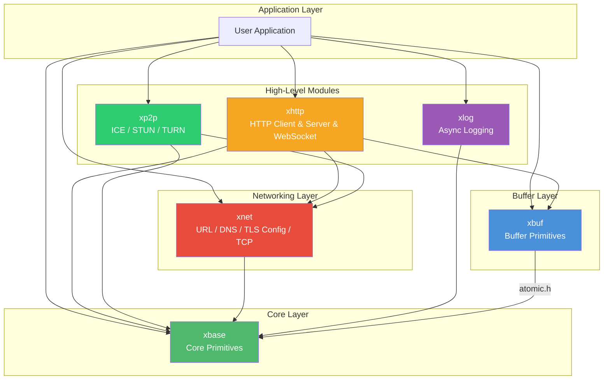
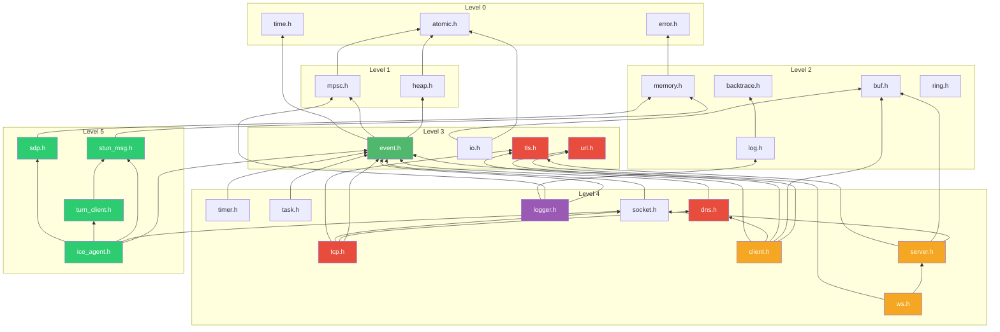

# xKit

Welcome to the xKit documentation. xKit is a collection of low-level C building blocks for event-driven, asynchronous programming on **macOS** and **Linux**. (Windows is on the roadmap but not a near-term priority).

- Designed and reviewed by Leo X.
- Coded by Codebuddy with claude-4.6-opus

## Architecture Overview



## Module Index

### [xbase](modules/xbase/index.html) — Core Primitives

The foundation of xKit. Provides event loop, timers, tasks, async sockets, memory management, and lock-free data structures.

| Sub-Module | Description |
| --- | --- |
| [event.h](modules/xbase/event.md) | Cross-platform event loop — kqueue (macOS) / epoll (Linux) / poll (fallback) |
| [timer.h](modules/xbase/timer.md) | Monotonic timer with Push (thread-pool) and Poll (lock-free MPSC) fire modes |
| [task.h](modules/xbase/task.md) | N:M task model — lightweight tasks multiplexed onto a thread pool |
| [socket.h](modules/xbase/socket.md) | Async socket abstraction with idle-timeout support |
| [memory.h](modules/xbase/memory.md) | Reference-counted allocation with vtable-driven lifecycle |
| [error.h](modules/xbase/error.md) | Unified error codes and human-readable messages |
| [heap.h](modules/xbase/heap.md) | Min-heap with index tracking (used by timer subsystem) |
| [mpsc.h](modules/xbase/mpsc.md) | Lock-free multi-producer / single-consumer queue |
| [atomic.h](modules/xbase/atomic.md) | Compiler-portable atomic operations (GCC/Clang builtins) |
| [log.h](modules/xbase/log.md) | Per-thread callback-based logging with optional backtrace |
| [backtrace.h](modules/xbase/backtrace.md) | Platform-adaptive stack trace (libunwind > execinfo > stub) |
| `time.h` | Time utilities: `xMonoMs()` (monotonic) and `xWallMs()` (wall-clock) |

### [xbuf](modules/xbuf/index.html) — Buffer Primitives

Three buffer types for different I/O patterns — linear, ring, and block-chain.

| Sub-Module | Description |
| --- | --- |
| [buf.h](modules/xbuf/buf.md) | Linear auto-growing byte buffer with 2× expansion |
| [ring.h](modules/xbuf/ring.md) | Fixed-size ring buffer with power-of-2 mask indexing |
| [io.h](modules/xbuf/io.md) | Reference-counted block-chain I/O buffer with zero-copy split/cut |

### [xnet](modules/xnet/index.html) — Networking Primitives

Shared networking utilities: URL parser, async DNS resolver, and TLS configuration types used by higher-level modules.

| Sub-Module | Description |
| --- | --- |
| [url.h](modules/xnet/url.md) | Lightweight URL parser with zero-copy component extraction |
| [dns.h](modules/xnet/dns.md) | Async DNS resolution via thread-pool offload |
| [tls.h](modules/xnet/tls.md) | Shared TLS configuration types (client & server) |
| [tcp.h](modules/xnet/tcp.md) | Async TCP connection, connector & listener with optional TLS |

### [xhttp](modules/xhttp/index.html) — Async HTTP Client & Server & WebSocket

Full-featured async HTTP framework: libcurl-powered client with SSE streaming, event-driven server with HTTP/1.1 & HTTP/2 (h2c), TLS support (OpenSSL / mbedTLS), and RFC 6455 WebSocket (server & client).

| Sub-Module | Description |
| --- | --- |
| [client.h](modules/xhttp/client.md) | Async HTTP client (GET / POST / PUT / DELETE / PATCH / HEAD) |
| [sse.c](modules/xhttp/sse.md) | SSE streaming client with W3C-compliant event parsing |
| [server.h](modules/xhttp/server.md) | Event-driven HTTP server with HTTP/1.1 and HTTP/2 (h2c) |
| [ws.h](modules/xhttp/ws_server.md) | RFC 6455 WebSocket server with handler-initiated upgrade |
| [ws.h](modules/xhttp/ws_client.md) | RFC 6455 WebSocket client with async connect |
| [transport.h](modules/xhttp/tls.md) | Pluggable TLS transport layer (OpenSSL / mbedTLS / plain) |

### [xlog](modules/xlog/index.html) — Async Logging

High-performance async logger with MPSC queue, three flush modes, and file rotation.

| Sub-Module | Description |
| --- | --- |
| [logger.h](modules/xlog/logger.md) | Async logger with Timer / Notify / Mixed modes and `XLOG_*` macros |

### [xp2p](modules/xp2p/index.html) — P2P Connectivity

ICE-based peer-to-peer connectivity with full STUN/TURN client stack, SDP codec, and NAT traversal.

| Sub-Module | Description |
| --- | --- |
| [ice_agent.h](modules/xp2p/ice.md) | Full ICE agent — candidate gathering, connectivity checks, nomination, data transport |
| `stun_msg.h` | STUN message encoding/decoding (RFC 5389) |
| `stun_attr.h` | STUN attribute encoding/decoding with integrity and fingerprint |
| `stun_txn.h` | STUN transaction manager with exponential-backoff retransmission |
| `turn_client.h` | TURN allocation, permissions, channel bindings (RFC 5766) |
| `sdp.h` | SDP offer/answer encoding and decoding (RFC 4566) |
| `ice_crypto.h` | Built-in HMAC-SHA1, SHA-1, MD5, CRC-32 (zero external deps) |

### [bench](bench/) — End-to-End Benchmarks

End-to-end benchmark results comparing xKit against other frameworks in real-world scenarios.

| Benchmark | Description |
| --- | --- |
| [HTTP/1.1 Server](bench/http_server.md) | xKit single-threaded HTTP/1.1 server vs Go `net/http` — GET/POST throughput and latency |
| [HTTP/2 Server](bench/http2_server.md) | xKit single-threaded HTTP/2 (h2c) server vs Go `net/http` h2c — GET/POST throughput and latency |
| [HTTPS Server](bench/https_server.md) | xKit single-threaded HTTPS (TLS 1.3) server vs Go `net/http` — GET/POST throughput and latency |

## Quick Navigation Guide

### By Use Case

| I want to... | Start here |
| --- | --- |
| Build an event-driven server | [xbase/event.h](modules/xbase/event.md) → [xbase/socket.h](modules/xbase/socket.md) |
| Schedule timers | [xbase/timer.h](modules/xbase/timer.md) |
| Run tasks on a thread pool | [xbase/task.h](modules/xbase/task.md) |
| Make async HTTP requests | [xhttp/client.h](modules/xhttp/client.md) |
| Stream LLM API responses (SSE) | [xhttp/sse.c](modules/xhttp/sse.md) |
| Build an HTTP server | [xhttp/server.h](modules/xhttp/server.md) |
| Add WebSocket server | [xhttp/ws.h](modules/xhttp/ws_server.md) |
| Connect as WebSocket client | [xhttp/ws.h](modules/xhttp/ws_client.md) |
| Parse a URL | [xnet/url.h](modules/xnet/url.md) |
| Resolve DNS asynchronously | [xnet/dns.h](modules/xnet/dns.md) |
| Make async TCP connections | [xnet/tcp.h](modules/xnet/tcp.md) |
| Build a TCP server | [xnet/tcp.h](modules/xnet/tcp.md) |
| Configure TLS | [xnet/tls.h](modules/xnet/tls.md) |
| Enable TLS (HTTPS) | [xhttp/transport.h](modules/xhttp/tls.md) |
| Add async logging | [xlog/logger.h](modules/xlog/logger.md) |
| Manage object lifecycles | [xbase/memory.h](modules/xbase/memory.md) |
| Choose the right buffer type | [xbuf overview](modules/xbuf/index.html) |
| Build a lock-free producer/consumer pipeline | [xbase/mpsc.h](modules/xbase/mpsc.md) |
| Establish P2P connectivity | [xp2p/ice_agent.h](modules/xp2p/ice.md) |
| Send data peer-to-peer | [xp2p/ice_agent.h](modules/xp2p/ice.md) |
| See micro-benchmark results | Each module doc has a **Benchmark** section (e.g. [mpsc.h](modules/xbase/mpsc.md#benchmark)) |
| See HTTP server benchmarks | [HTTP/1.1](bench/http_server.md) · [HTTP/2](bench/http2_server.md) · [HTTPS](bench/https_server.md) |

### By Dependency Level

```text
Level 0 (no deps)     : atomic.h, error.h, time.h
Level 1 (atomic only) : heap.h, mpsc.h
Level 2 (Level 0-1)   : memory.h, log.h, backtrace.h, buf.h, ring.h
Level 3 (Level 0-2)   : event.h, io.h, url.h, tls.h
Level 4 (event loop)  : timer.h, task.h, socket.h, dns.h, tcp.h, logger.h, client.h, server.h, ws.h
Level 5 (xbase+xnet) : ice_agent.h, stun_msg.h, turn_client.h, sdp.h
```

## Module Dependency Graph



## Build & Test

```bash
# Build
cmake -S . -B build -DCMAKE_BUILD_TYPE=Debug
cmake --build build --parallel

# Test
ctest --test-dir build --output-on-failure --parallel 4
```

See the project [README](../README.md) for full build instructions, prerequisites, and container-based Linux testing.

## Benchmark

Micro-benchmark results are included in each module's documentation page (see the **Benchmark** section at the bottom of each page, e.g. [mpsc.h](modules/xbase/mpsc.md#benchmark), [buf.h](modules/xbuf/buf.md#benchmark)).

End-to-end benchmarks:

| Benchmark | Description |
| --- | --- |
| [HTTP/1.1 Server](bench/http_server.md) | xKit vs Go `net/http` — 152K req/s single-threaded, +15~60% faster across all scenarios |
| [HTTP/2 Server](bench/http2_server.md) | xKit vs Go h2c — single-threaded HTTP/2 (h2c) throughput comparison |
| [HTTPS Server](bench/https_server.md) | xKit vs Go HTTPS — single-threaded TLS 1.3 throughput comparison |

## License

[MIT](https://github.com/mivinci/xKit/blob/main/LICENSE) © 2025-present Leo X. and xKit contributors
