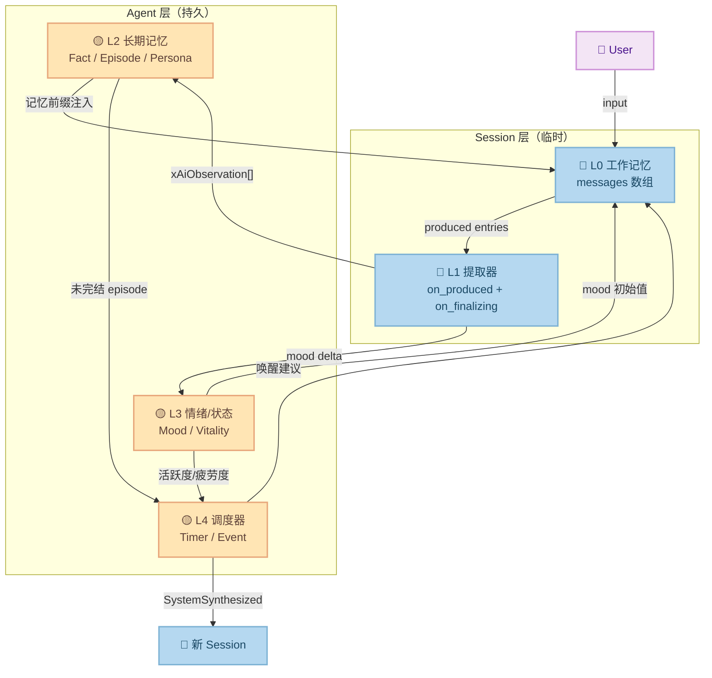

# 分层记忆体系：L1–L4 的职责、协议与落地路径

> 一套在 **不推翻现有三层架构（Agent / Session / Query）**、**不破坏公开 API** 的前提下，给 `xAiAgent` 加上"即时提取 → 长期存储 → 情绪追踪 → 主动唤醒"四层能力的结构化方案。
>
> 本文面向已经熟悉 xKit 三层会话模型（[Agent / Session / Query](three-layer-conversation-model.md)）、[上下文预算](context-budget.md)和 [类人 AI 四维度](../todo/human-like-ai.md)的读者，描述 L1–L4 每一层住在哪里、跟谁交互、数据怎么流动，以及每层的落地次序。

---

## TL;DR

四层从底到顶，每一层只依赖下面的层，不反向穿透：

```text
┌─────────────────────────────────────────────────────────┐
│ L4  主动唤醒 / 调度                                      │
│   Agent 决定"要不要主动起一个 Session 叫用户"              │
│   依赖：L3 状态量 + L2 记忆 + 外部事件                    │
├─────────────────────────────────────────────────────────┤
│ L3  情绪 / 状态追踪                                      │
│   追踪 mood delta、活跃度、疲劳度                         │
│   依赖：L1 的产出信号                                    │
├─────────────────────────────────────────────────────────┤
│ L2  长期记忆存储与检索                                    │
│   持久化 L1 提取物；创建 Session 时注入相关记忆            │
│   依赖：L1 的提取结果                                    │
├─────────────────────────────────────────────────────────┤
│ L1  即时记忆提取                                          │
│   从每次对话产出中提取结构化观察                           │
│   依赖：Session / Query 的回调钩子                       │
└─────────────────────────────────────────────────────────┘
```

| 层 | 住哪 | 有状态 | 核心动作 | 落地状态 |
| --- | --- | --- | --- | --- |
| **L1** | `xAiSession` 的 `on_produced` + `on_finalizing` 钩子 | 无（提取即交出） | 每轮产出后抽取观察；session 销毁前做最终汇总 | ✅ 钩子已预留，提取逻辑待实现 |
| **L2** | `xAiAgent` 内部 | 有（持久化存储） | 存储 L1 产物；`xAiAgentCreateSession` 时注入 | ❌ 未开始 |
| **L3** | `xAiAgent` 内部 | 有（running state） | 追踪 mood / 活跃度 / 疲劳度 | ❌ 未开始 |
| **L4** | `xAiAgent` 内部 | 有（调度器 + timer） | 主动创建 `origin=SystemSynthesized` Session | ❌ 未开始 |

---

## 为什么要把记忆拆成四层

拆层的理由跟三层会话模型拆 Agent / Session / Query 一样：**生存期不同，归属不同，消费者不同**。

如果把"记忆"塞进一个 `xAiMemory` 对象：

1. **写入路径冲突**——Session 结束时的沉淀（L1→L2）和 Agent 后台反刍（L4）都要写同一个 store，锁冲突。
2. **读取路径分裂**——Query 需要 L0 工作记忆，Session 需要 L1 情景缓冲，Agent 需要 L2/L3 长期状态。一个 store 要服务三个完全不同的查询模式，要么接口膨胀要么性能差。
3. **生命周期纠缠**——L0 随 Session 生死，L2 跨 Session 持久，L3 比 L2 还稳。混在一起，"什么时候该删"变成一笔糊涂账。

拆成四层后，每一层的生存期、写入者、消费者都是明确的——和三层会话模型的切法一脉相承。

---

## L1：即时记忆提取

### 职责 — 即时提取

从每次对话产出中提取**结构化观察**——用户偏好、关键事实、决策记录——然后交给 L2 裁决落盘。

**L1 自己不存任何东西**。它是纯提取器，提取完了就交出产物，不保留副本。这保证了一个硬不变量：**Session 销毁后 L1 痕迹为零**，留给后续 Session 看到的一定是已经经过 L2 裁决的内容。

### 钩子挂载点

两个钩子已经在 Session 层预留：

#### `on_produced` — 每轮产出后

```c
/* session_private.h 中已有 */
void (*on_produced)(xAiSession sess,
                    const struct xAiSessionMsg_ *produced,
                    size_t n_produced,
                    const xAiUsage *usage,
                    void *ud);
```

- **触发时机**：`sess_fwd_on_done` 里，produced entries 已合并进 history，但**在** caller 的 `on_done` **之前**。
- **注入者**：`xAiAgentCreateSession`。
- **提取目标**：本轮 assistant 产出的关键信息——用户明确表达的偏好、涉及专有名词/数字/时间的陈述、工具调用的决策理由。

#### `on_finalizing` — Session 销毁前

```c
/* session_private.h 中已有 */
xAiSessionFinalizingFunc on_finalizing;
void                    *finalizing_owner;
```

- **触发时机**：`xAiSessionDestroy` 内部，资源释放之前。
- **注入者**：`xAiAgentCreateSession`。
- **提取目标**：会话级汇总——整体印象、情绪 delta、未完结话题。

### 为什么"提取在 Session，裁决在 Agent"

这是从 [xai_architecture.md](../todo/xai_architecture.md) §2.3 继承的硬要求。简述：

- **多 Session 并存时的写冲突**：Session A 和 Session B 同时上报"用户偏好 tab"，Agent 层能去重；Session 层各写各的就会留两条。
- **全局视野缺失**：某条事实在单个 Session 里价值一般，但**跨 Session 反复出现 5 次**才显出它是稳定事实。去重计数必须由"看得到全局"的层做。

### L1 提取逻辑的实现路径

当前两个钩子是空 stub。实现步骤：

1. **设计提取产物的结构化 schema**。初步方向：

```c
XDEF_ENUM(xAiObservationKind) {
  xAiObservationKind_Preference,   /* "我喜欢简洁的代码风格" */
  xAiObservationKind_Fact,         /* "项目使用 UTF-8 编码" */
  xAiObservationKind_Decision,     /* "决定用 SQLite 而不是 JSONL" */
};

XDEF_STRUCT(xAiObservation) {
  xAiObservationKind kind;
  const char *content;    /* 结构化摘要，非原文 */
  float       confidence; /* 0..1，规则路径给 1.0，LLM 路径给模型输出 */
  const char *source_id;  /* 产出它的 session id，供 L2 去重 */
};
```

1. **`on_produced` 内的提取逻辑**。两阶段：
   - **规则先过**：检测硬特征（专有名词、数字、时间、URL、明确偏好词"我喜欢/讨厌/用…"），匹配则直接构造 `xAiObservation`，confidence=1.0。
   - **不确定时调 LLM**：一次 prompt ≤ 200 tokens，让模型判断 yes/no + 提取摘要。这个 LLM call 复用 Agent 配置的 provider。

2. **`on_finalizing` 内的汇总逻辑**。用一次 LLM call 做会话级摘要，输出若干 `xAiObservation` + mood delta + 未完结话题。

3. **提取结果交付给 L2**。`on_produced` 和 `on_finalizing` 的产物通过回调交给 Agent 层，Agent 层的 L2 模块裁决是否落盘。

### 提取的成本控制

MVP-a 阶段的目标：**≥ 60% 的观察不需要 LLM call 就能决定入库与否**。规则快速路径覆盖明确偏好和硬事实；只有模糊陈述才走 LLM。这样 90% 的写入走零成本路径。

---

## L2：长期记忆存储与检索

### 职责 — 持久化与注入

1. **持久化** L1 提取的结构化记忆。
2. 在 `xAiAgentCreateSession` 创建新 Session 时，**检索与当前上下文相关的记忆，注入到 system prompt**。
3. 管理记忆的**淘汰与合并**。

### 记忆存储后端

两阶段选型：

| 阶段 | 方案 | 优点 | 缺点 |
| --- | --- | --- | --- |
| **MVP-a** | JSONL 文件 | 零依赖、易调试、易手工修 | 只能按时间索引，无语义检索 |
| **MVP-b** | SQLite + sqlite-vec | 语义检索、灵活查询 | 加依赖、加构建体积 |

MVP-a 的文件布局：

```text
~/.<app>/xai/episodes/<agent_id>/<YYYY-MM>/<session_id>.jsonl
```

每条 `xAiEpisode` 一行，包含 session 摘要、时间戳、关键事实引用。MVP-b 切 SQLite 时提供迁移脚本，老 JSONL 归档不删。

### 记忆注入到新 Session

`xAiAgentCreateSession` 的注入协议（继承 [xai_architecture.md](../todo/xai_architecture.md) §2.1）：

1. **人格描述 / 风格约束**：注入到 system prompt，跨 Session 一致。
2. **记忆前缀**：Agent 根据 Session 类型/意图挑选相关记忆，打包成结构化上下文塞进 system prompt。**Session 不反向查询 Agent 的记忆仓**——避免 Session 层需要理解记忆索引。
3. **Mood 初始值**（v1 之后）：从 Agent 当前 mood state 拷贝给 Session。

注入的数据流：

```text
xAiAgentCreateSession(agent, conf)
      │
      ├── 构建 memory_prefix = agent->memory.retrieve(conf->intent_hint)
      ├── 构建 persona_prefix = agent->persona.render()
      ├── 构建 mood_init      = agent->mood.snapshot()
      │
      └── 注入到 Session 的 system_prompt 前缀
          session->system_prompt = persona_prefix + memory_prefix + original_prompt
```

### 记忆淘汰 / 合并策略

长期运行后记忆条目会膨胀。三个机制：

1. **相似合并**：借鉴 Mem0 的 **Add/Update/Delete/NOOP 四选一**——写入前先向量检索语义最近的 3 条老 fact，相似度 < 0.6 直接 Add（零 LLM call），≥ 0.6 才调 LLM 判断 Add/Update/Delete。90% 的写入走快速路径。

2. **时间衰减**：借鉴 MemoryBank 的**艾宾浩斯遗忘曲线**。Episode 超过 30 天未被引用 → 降级为纯 summary（丢 highlights）；超过 180 天 → 删除。

3. **容量上限**：LRU + 优先级排序。当 fact 数量超过配置上限时，优先淘汰低 confidence + 低 reference_count + 长期未被检索到的条目。

---

## L3：情绪 / 状态追踪

### 职责 — 状态追踪

1. 追踪每次会话的**情绪变化量**（mood delta）。
2. 维护 Agent 级的**活跃度 / 疲劳度**模型。
3. 为 L4 的唤醒频率提供**状态信号**。

### Mood delta 追踪

Mood 不用连续浮点（难解释难 debug），用**小维度向量**：

```c
XDEF_STRUCT(xAiMoodState) {
  float valence;      /* -1 (消极) .. +1 (积极) */
  float arousal;      /* 0 (平静) .. 1 (激动) */
  float fatigue;      /* 0 (精力充沛) .. 1 (疲惫) */
  float confidence;   /* 0 (焦虑) .. 1 (笃定) */
  uint64_t updated_ms;
};
```

这是 VAD 模型（Valence-Arousal-Dominance）的工程简化，心理学有共识基础。

**更新公式**：

```text
mood_new = λ · mood_observed + (1-λ) · mood_prev · decay(Δt)
λ = 0.3
decay(Δt) = exp(-Δt / half_life)
half_life = 12 小时（可配置）
```

**信号来源**：

- `on_finalizing` 中记录 mood delta。不需要额外 LLM 调用，从 usage pattern 推断：
  - 对话长度极短 → 可能敷衍 / 疲惫
  - tool 调用频繁 → 可能焦虑 / 紧迫
  - 连续感谢 / 表扬 → valence 正向
  - 连续追问同一问题 → confusion 高

**消费方式**：mood 序列化进 system prompt，作为"当前用户情绪基线"。模型的回复语气自然被引导。**注意**：mood 不覆盖回复内容，只影响风格——AI 永远不应该说"我看你很疲惫"这种直接暴露检测。

### 活跃度 / 疲劳度模型

追踪 Agent 的"工作状态"：

```c
XDEF_STRUCT(xAiAgentVitality) {
  int    sessions_last_24h;     /* 近 24h 内完成的 session 数 */
  size_t tokens_last_24h;      /* 近 24h 内消耗的总 token 数 */
  float  activity_score;       /* 0 (空闲) .. 1 (高负载) */
  float  fatigue_score;        /* 0 (精力充沛) .. 1 (过劳) */
};
```

- **activity_score** → 影响 L4 的唤醒频率（活跃时少打扰，空闲时可以提醒）。
- **fatigue_score** → 触发 context budget 更激进的压缩策略（累的时候上下文要更精简）。

---

## L4：主动唤醒 / 调度

### 职责 — 主动唤醒

Agent 自行决策何时主动创建 `origin=SystemSynthesized` 的 Session，调 `xAiSessionInput` 发起主动对话。

### 三种 Session 的交互模型

| 场景 | Origin | 谁创建 | 谁销毁 | 生命周期 |
| --- | --- | --- | --- | --- |
| Default Session | `User` | Agent 创建时自动 | Agent 销毁时自动 | 跟 Agent 同生共死 |
| 用户新开 Session | `User` | 用户调 `xAiAgentCreateSession` | 用户调 `xAiSessionDestroy` | 用户控制 |
| Agent 主动唤醒 Session | `SystemSynthesized` | Agent 内部 | Agent 内部 | Agent 控制 |

Default Session 是用户的默认入口——用户可以随时跟它对话，不用显式创建。Agent 也可以自己唤醒自己主动新开一个 Session 叫用户——这种 Session 的 input 不是用户发的，是 Agent 合成的。

### 唤醒场景

1. **定时提醒**："该复查代码了"
2. **任务完成通知**：后台 tool 执行完毕
3. **主动建议**："我发现一个优化点"
4. **情感关怀**：上次用户说很累，隔天问候

### 唤醒策略

基于状态量决定是否唤醒——**建议而非强制**：

```text
触发条件（AND 全满足才考虑唤醒）：
  1. 用户主动开启新会话（绝不在静默时打扰） ← 默认策略，可配置
  2. 当前会话还没聊到相关话题
  3. L2 命中了未完结 / 强情绪 episode
  4. 距上次唤醒 ≥ X 天
  5. L3 活跃度允许（高负载时少打扰）
```

**关键设计**：scheduler 只往 system prompt 里注入一条 "Consider proactively asking about: ..."，**是否真的开口让模型自己决定**。模型读完上下文觉得不合适就不提——天然有一层过滤。

### 唤醒 Session 的生命周期

```text
1. Agent 调度器（timer / 事件）决定"该起一个新 Session 了"
2. Agent 调 xAiAgentCreateSession，origin = SystemSynthesized
3. Agent 组装 nudge input："对了，关于 X..."
4. Agent 调 xAiSessionInput(session, nudge_input)
5. Session 像普通对话一样跑起来
6. 对话结束后 xAiSessionDestroy
```

**与 Default Session 的关系**：两者独立，互不干扰。Default Session 是用户的默认入口（`origin=User`），唤醒 Session 是 Agent 主动发起（`origin=SystemSynthesized`）。同一时刻可以共存。

### 用户体验底线

1. **默认保守**——宁可错过主动时机也不要乱刷屏。
2. **用户可控**——提供"关闭 / 降频 / 场景白名单"开关。
3. **不在静默时打扰**——scheduler 默认只在用户开启新会话时注入建议，不做主动弹窗 / 推送。

---

## 四层数据流全景



**读路径**（每个 Session 创建时）：

```text
Agent → Session 注入三样东西：
  1. persona_prefix  (来自 L3 的自我认知)
  2. memory_prefix   (来自 L2 的检索结果)
  3. mood_init       (来自 L3 的当前状态)
  + scheduler_hint   (来自 L4 的唤醒建议，如果有)
```

**写路径**（每个 Session 结束时）：

```text
Session → Agent 上报三样东西：
  1. L1 观察候选 → L2 裁决落盘
  2. mood delta → L3 更新 running state
  3. 生命周期事件 → L4 更新调度状态
```

---

## 与三层会话模型的关系

L1–L4 不是"另外一套架构"，是**三层会话模型在记忆维度的自然展开**：

| 三层概念 | 对应的记忆层 | 原因 |
| --- | --- | --- |
| **Query** | 不涉及 | Query 无状态，不碰记忆 |
| **Session** | L0 + L1 | Session 拥有 messages（L0），负责 L1 提取 |
| **Agent** | L2 + L3 + L4 | 跨 Session 持久的状态必须挂在 Agent 上 |

这和 [three-layer-conversation-model.md](three-layer-conversation-model.md) 里"Session 结束时有一个沉淀时刻"的判断完全一致——L1 → L2 的裁决就是那个沉淀。

---

## 与现有代码的映射

| 代码位置 | 已有 | 待加 |
| --- | --- | --- |
| `session_private.h` :: `on_produced` | ✅ 钩子字段 | L1 提取逻辑 |
| `session_private.h` :: `on_finalizing` | ✅ 钩子字段 | L1 汇总逻辑 |
| `agent.h` :: `xAiAgentCreateSession` | ✅ 注入钩子 | L2 记忆注入、L3 mood 注入 |
| `agent.h` :: `xAiAgentCreateSession` | ✅ 创建 Session | L4 SystemSynthesized Session 创建 |
| `session.h` :: `xAiInputOrigin` | ✅ `User` / `SystemSynthesized` 枚举 | — |
| `agent.c` / `agent.h` | — | `xAiMemory` 内部组件 |
| `agent.c` / `agent.h` | — | `xAiMoodTracker` 内部组件 |
| `agent.c` / `agent.h` | — | `xAiScheduler` 内部组件 |

**核心原则**：这三个组件的更新都在 `xAiSession` 内部完成（通过预留的钩子），使用方从不直接操作 memory / mood / scheduler。公开 API 几乎不用动。

---

## 落地次序

```text
  now                                                    future
   │                                                        │
   ├── L1 提取逻辑实现（当前钩子是空 stub）──┐              │
   │   ● xAiObservation schema               │              │
   │   ● on_produced 规则 + LLM 提取          │              │
   │   ● on_finalizing 会话级汇总             │              │
   │   ● 提取结果交付接口                     ↓              │
   │                                                        │
   ├── L2 长期记忆 ─────────────────────────────────┐      │
   │   ● MVP-a: JSONL 存储                          │      │
   │   ● 记忆注入到新 Session                        │      │
   │   ● MVP-b: SQLite + sqlite-vec + 向量检索       │      │
   │   ● 淘汰 / 合并策略                             ↓      │
   │                                                        │
   ├── L3 情绪 / 状态追踪 ──────────────────────────┐      │
   │   ● xAiMoodState 结构                          │      │
   │   ● Mood delta 追踪                             │      │
   │   ● 活跃度 / 疲劳度模型                         ↓      │
   │                                                        │
   └── L4 主动唤醒 / 调度 ──────────────────────────┘      │
       ● 定时 / 事件驱动唤醒框架                                │
       ● 唤醒策略（基于 L2+L3 状态量）                        │
       ● SystemSynthesized Session 生命周期管理                │
                                                             │
```

每层都有独立的可测指标（见 [human-like-ai.md](../todo/human-like-ai.md) §6），不做"感觉更像人"这种玄学验收。

---

## 参考

- [三层会话模型：Agent / Session / Query](three-layer-conversation-model.md)
- [上下文预算：Session 的 prompt-size 守门员](context-budget.md)
- [类人 AI 的四个维度](../todo/human-like-ai.md)
- [xai 三层架构设计方案](../todo/xai_architecture.md)
- MemGPT: Towards LLMs as Operating Systems (Packer et al., 2023)
- A-MEM: Agentic Memory for LLM Agents (Xu et al., 2025)
- Mem0 — github.com/mem0ai/mem0
- MemoryBank — 艾宾浩斯遗忘曲线的 LLM 记忆工程化
- Russell (1980), "A Circumplex Model of Affect" (VAD 情绪模型)
