# 三层会话模型：Agent / Session / Query

> 一种给 AI agent 系统重新切分层次的方法论——把"长期身份"、"一段对话"、"一次请求"明确拆成三个一等公民。
>
> 本文主要面向已经熟悉当代 AI agent 架构（Claude Code、LangChain Agent、ReAct、AutoGPT、MemGPT 等）的读者，讨论为什么这些架构在面对"类人 AI"的长期需求时会开始吃力，以及这个切法具体解决了什么。

---

## TL;DR

当代 AI agent 架构几乎都围绕**一次 query 的控制循环**在做文章——`while(!done) { llm_call(); tool_call(); }`。这个循环很优雅，但它默认把"AI 是谁"、"这段对话从什么时候开始"、"这一次用户请求"三件事挤在同一个对象里（通常叫 `Agent`、`AgentExecutor`、`ChatSession` 等等，命名不同但形状类似）。

**三层切法**主张把这三件事拆成三个相互独立的对象：

| 层 | 生存期 | 承载 | 类比 |
| --- | --- | --- | --- |
| **Agent** | 跨进程、跨会话、持久化 | 身份、长期记忆、情绪基线、人格 | 一个"人" |
| **Session** | 一次对话从开始到结束 | 短期记忆、当前情绪状态、工具启用集 | 一次"见面" |
| **Query** | 一次 user turn 到 assistant 完成 | 消息、tool call loop、取消、usage | 一次"发问" |

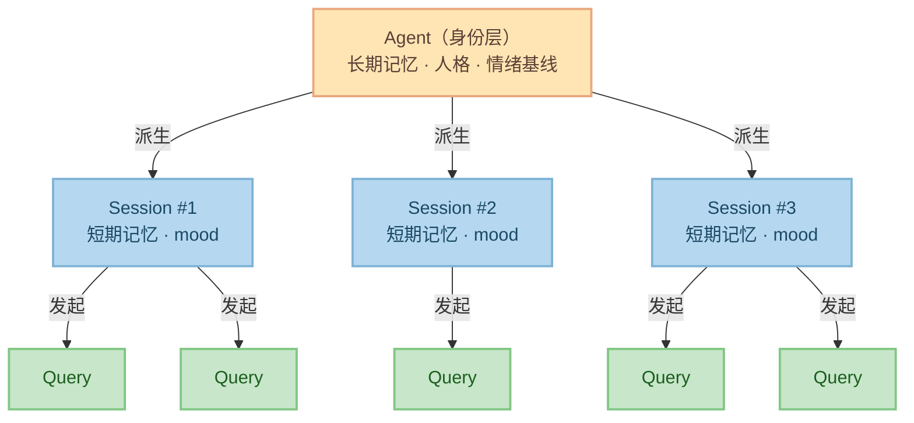

这不是一个"更好的实现"，是一个**更好的切法**。下文说明为什么要切，以及和当前业界主流架构的具体差异。

> **关于配图配色**：全文所有架构图统一配色语义——
> 🟡 **杏黄** = Agent 层 / 持久身份；
> 🔵 **淡蓝** = Session 层 / 会话态；
> 🟢 **薄荷绿** = Query 层 / 请求执行；
> 🟣 **淡紫** = 通用节点（User、LLM、Tools、Output 等外部实体）；
> 🔴 **樱花粉** = 反面例子 / 问题项。
>
> 看图只要记颜色，就能跨图对齐概念。

---

## 动机：为什么当前架构撑不起"类人 AI"

我们先把话题拉到动机，否则"为什么要拆三层"会显得没来由。

在另一篇讨论 [类人 AI 的四个维度](../todo/human-like-ai.md)（分层记忆 / 情感连续性 / 选择性遗忘 / 主动唤醒）中，我们定义了一个判据：一个 AI 要像人，至少得同时满足四件事。

现在把这四件事反过来拷问当代 agent 架构：

- **分层记忆**——记忆放哪？放 `Agent.memory` 还是 `Session.history`？当前大多数框架只给了一个 memory 对象，于是"这件事是我作为这个 AI 的长期积累，还是这次对话的临时上下文"永远混着。
- **情感连续性**——mood 的生存期跟谁绑？如果跟单个 agent 实例绑，重启就没了；如果跟每条消息绑，跨对话就接不上。
- **选择性遗忘**——要遗忘什么？短期对话内容？还是长期人格中的某些事实？这两种遗忘的代价完全不同，需要不同对象承担。
- **主动唤醒**——谁来触发？"agent 自己想起一件事"和"这次对话里 AI 提出一个问题"不是同一回事，前者是 Agent 层行为，后者是 Session 层行为。

**这四个需求都在要求架构暴露出一个比"一次请求"更粗、比"一个进程"更细的中间层**——也就是 Session。没有这一层的架构，要么被迫把短期记忆和长期记忆挤在一起，要么把 mood 挂在错的生存期上。

---

## 当代 agent 架构的几种典型形态

为了说清楚差异，我们先把当前业界几种代表性架构的骨架画出来。

### 1. Claude Code：query-centric 架构

Claude Code 是目前开源实现里最完整的 coding agent 之一，核心是一个 `query()` AsyncGenerator：

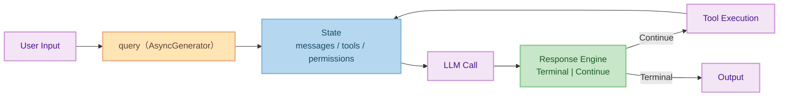

特点：

- **State 是一个扁平对象**，messages / tools / permissions / todos 都在里面。
- **没有"会话"这个概念**——一次 `query()` 调用从开始到结束就是全部生命周期。
- **没有"身份"这个概念**——AI 是谁由 system prompt + CLAUDE.md 等外部文件隐式组成，不是一等公民。
- 跨对话的状态（比如 `/resume`）通过**把整个 messages 数组持久化**来实现。

这种架构在**一次性编程任务**上非常好用——它的设计目标就是如此。但把它当作通用 agent 架构时，"AI 身份"和"对话实例"都是缺席的。

### 2. LangChain AgentExecutor：memory-as-plugin 架构

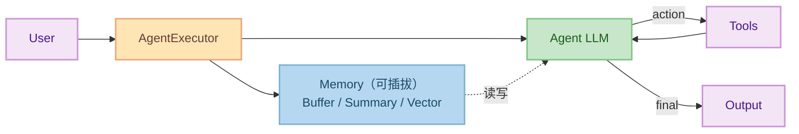

特点：

- Memory 是**可插拔组件**，有很多种实现（`ConversationBufferMemory`、`ConversationSummaryMemory`、`VectorStoreRetrieverMemory`）。
- 但 Memory 的**生存期跟谁绑**没有统一答案——用户常常自己 new 一个 Memory 挂到 AgentExecutor 上，然后靠业务代码维护它和"某个用户的某次对话"的对应关系。
- "Agent 是谁"和"这次对话"的边界由使用者自己划，框架不管。

结果：长期记忆、短期记忆、mood 怎么分、怎么持久化，完全是使用者的作业。框架给了 Memory 插槽，但没给"把什么插在什么生存期上"的答案。

### 3. ReAct / AutoGPT：goal-driven 循环

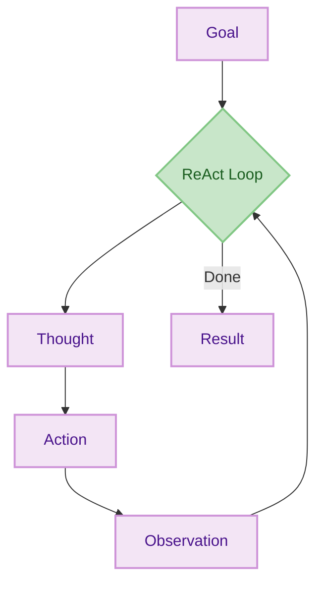

特点：

- 核心是 **Thought → Action → Observation** 循环，为**完成一个 goal** 服务。
- 没有对话概念——一次运行就是一个任务实例。
- 长期记忆通常通过外挂向量库实现，但"AI 跨任务的自我"基本不存在。

这个范式把 agent 当**任务执行器**而不是**对话对象**——很多场景够用，但做不了"类人 AI"。

### 4. MemGPT / Letta：memory-first 架构

MemGPT 走向了另一个极端——把**记忆**提升到一等公民：

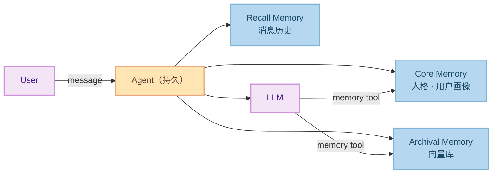

特点：

- Agent 是一等公民，而且是**持久化**的——这比 Claude Code 和 LangChain 都进了一步。
- Core / Archival / Recall 三种 memory 让记忆分层了。
- 但仍然**没有 Session 这一层**——多次对话和一次对话在数据模型上没有边界，都是 recall memory 里的连续消息流。
- 于是"**这次见面**从什么时候开始到什么时候结束"、"这段短期上下文要不要写进长期记忆"这类决策，没有一个具体对象来承载。

### 小结

| 架构 | 身份层 | 会话层 | 请求层 |
| --- | :---: | :---: | :---: |
| Claude Code | ✗（外部文件） | ✗ | ✓（query） |
| LangChain | 部分（prompt） | 部分（Memory） | ✓（run） |
| ReAct / AutoGPT | ✗ | ✗ | ✓（loop） |
| MemGPT / Letta | ✓ | ✗ | ✓ |
| **三层切法** | **✓** | **✓** | **✓** |

**Session 是几乎所有当代架构都缺的一层**——这正是本文要补上的。

---

## 三层切法：定义和边界

### Agent：身份层

Agent 是一个**有持久身份的实体**。它的生存期是"从被创造出来到被销毁"，跨越任意次进程重启。

承载的内容：

- **谁**：名字、角色、system prompt、人格设定
- **长期记忆**：经年累月积累下来的事实、经验、偏好
- **情绪基线**：这个 AI 的"性格倾向"——容易开心？容易焦虑？
- **能力目录**：它能用哪些 tool、连接哪些 provider

Agent **不直接处理请求**。当一个对话要发生时，它派生出一个 Session。

### Session：会话层

Session 是一次**有明确开始和结束的对话实例**。它的生存期从"开始聊"到"结束聊"，短则几分钟，长则几小时。

承载的内容：

- **短期记忆**：这次对话的上下文——最近说过什么、共同约定了什么
- **当前情绪状态**：mood 在这次对话里的演化（被骂了会沮丧，得到感谢会愉悦）
- **工具启用集**：这次对话能用哪些工具（可以是 Agent 能力目录的子集）
- **对话元数据**：开始时间、对方是谁、所在设备/环境

Session 结束时有一个**关键时刻**：决定短期记忆里的哪些内容要沉淀到 Agent 的长期记忆里——这就是**选择性遗忘**的绑定点。

### Query：请求层

Query 是**一次 user turn 到 assistant 完成**的过程。它的生存期从"用户发来一条消息"到"AI 完成所有回复和 tool call"。

承载的内容：

- **这次的消息对**：user message + assistant reply（可能穿插若干 tool call）
- **tool call loop**：ReAct 风格的 think→act→observe 在这里发生
- **取消作用域**：用户按 Ctrl+C 取消的是**这一次 Query**，不影响 Session 或 Agent
- **usage / token 统计**：这一次的 token 开销

Query 是**无状态的**——它只借用 Session 的短期记忆和 Agent 的长期记忆，自己不存任何跨 Query 的东西。

### 三层的时序

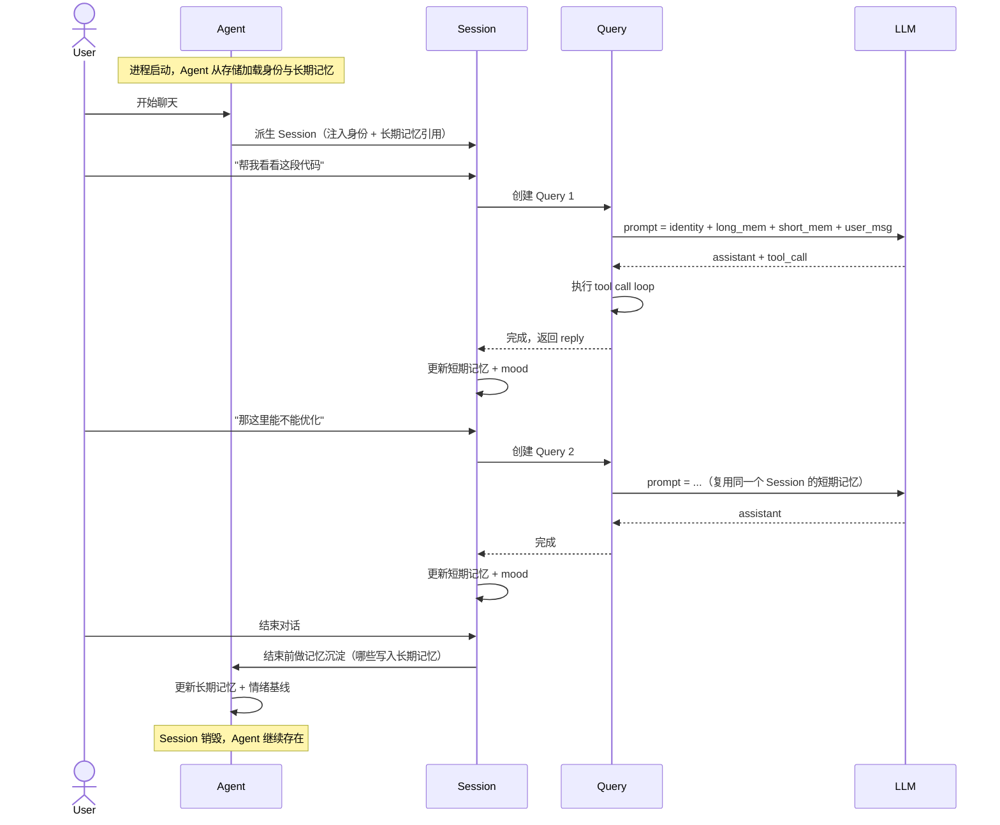

**几个关键观察**：

1. **Query 只和 Session 交互**，不直接碰 Agent——这是封装。
2. **Session 结束时有一个固定的"沉淀时刻"**，这是短期记忆变长期记忆的唯一入口。
3. **Agent 跨 Session 持久**——下一次聊天的 Session 能看到上一次沉淀进来的内容。

---

## 对比：和当代架构的具体差异

这一节是全文要点。我们取**四个具体维度**，说明三层切法和前面四种架构的本质区别。

### 差异 1：记忆的归属

| 架构 | 短期记忆 | 长期记忆 | 跨对话连续性 |
| --- | --- | --- | --- |
| Claude Code | `state.messages` | 外部文件（CLAUDE.md 等） | `/resume` 加载旧 messages |
| LangChain | Memory 对象 | Memory 对象（可能另一个） | 使用者自己维护 |
| ReAct | 循环内部 | 不存在 | 不存在 |
| MemGPT | Recall memory | Core + Archival | Recall 连续流 |
| **三层切法** | **Session 内部** | **Agent 内部** | **Session 结束时的沉淀步骤** |

关键差异：**三层切法是唯一明确把"短期→长期"的转换定为架构事件的**。在 MemGPT 里，短期和长期的边界是"消息在 recall 里被压缩/搬到 archival 的时机"——但这个时机不对应任何真实的人类概念。而 Session 结束这件事对应人类经验里"这次聊天结束了，让我想想有什么值得记住的"，是一个更自然的切入点。

### 差异 2：情绪的生存期

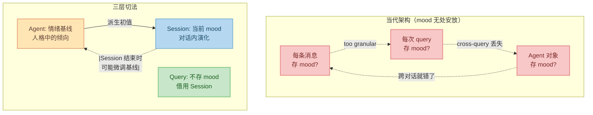

mood 天然是"一段对话内的事"——它比一次 query 长，比一个 agent 的一生短。没有 Session 这一层，mood 只能要么挂错要么丢失。

### 差异 3：并发的表达

假设一个 agent 同时和三个用户聊天。

**Claude Code 做法**：跑三个进程或三个 `query()` 实例，各有各的 state——身份/记忆靠读同一份外部文件做到"共享"，但实际上是拷贝。

**LangChain 做法**：三个 AgentExecutor 实例，各自挂各自的 Memory。"这三个 AI 其实是同一个 AI"这件事框架不感知。

**MemGPT 做法**：三个 Agent 实例，或一个 Agent 处理 session_id 不同的消息流。如果选后者，那 recall memory 就必须按 session_id 分区——但 MemGPT 里 session 不是一等公民，这个分区得使用者自己拼。

**三层切法做法**：

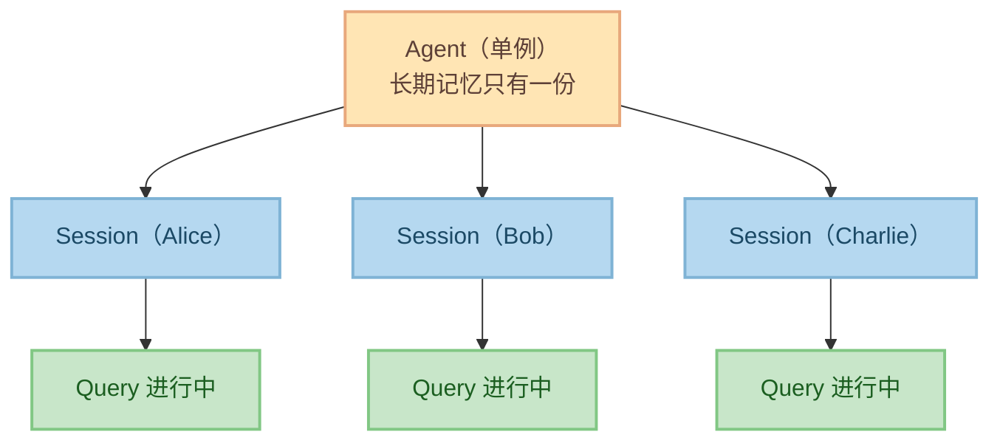

Agent 在**架构层面就是共享的**——三个 Session 读同一份长期记忆，写入时通过 Session 结束的沉淀步骤串行化。mood 因为挂在 Session 上，天然对三个用户独立。Query 因为挂在 Session 上，取消一个不影响另一个。

### 差异 4：取消的作用域

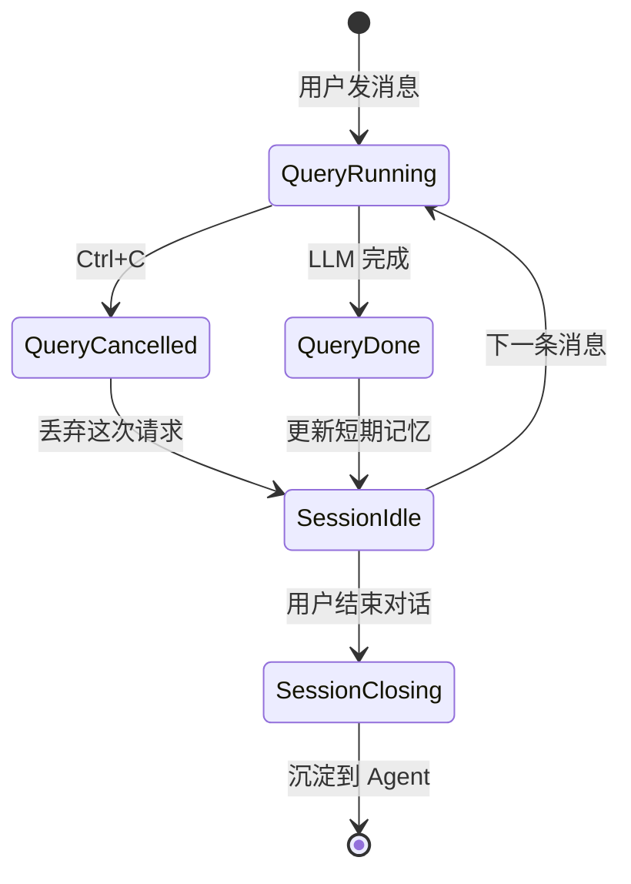

三层架构下"取消"有非常清晰的语义：**取消一次 Query**不影响 Session（下一次还能聊），**关闭 Session**不影响 Agent（下一次对话还能找回身份），**销毁 Agent**才是真的 bye bye。

当代 agent 架构普遍做不到这一点——因为它们没区分这三层。取消一个 Claude Code 的 query 意味着什么？技术上是 cancel 那个 AsyncGenerator，但"这次 query 之前积累的短期上下文要不要留下"框架不置可否，由使用者自己处理。

---

## 这个切法解锁了什么

说了这么多差异，具体能干什么？

### 解锁 1：自然的记忆沉淀点

**Session 结束**就是记忆沉淀的天然时机。这比 MemGPT 的"在 recall memory 里用 tool 主动搬运"更省 token，也比 LangChain 的"使用者自己写一个 callback"更标准化。

### 解锁 2：可预测的情绪演化

mood 挂在 Session 上——对话内演化，对话结束时可能对 Agent 基线产生微小影响。这一模型非常贴近人类经验：一次糟糕的聊天会让你记仇几天，但不会永久改变你的性格。

### 解锁 3：多人格/多会话的并发

一个 Agent 可以同时维护多个 Session，而且它们**在架构上就是隔离的**——不需要使用者额外用 session_id 做分区。这对 server-side 的 agent-as-a-service 场景是刚需。

### 解锁 4：清晰的测试边界

- 测 Query 层——不需要 Session，mock 一个就行
- 测 Session 层——不需要 Agent，mock 一个就行
- 测 Agent 层——甚至不需要真实 LLM，只测长期记忆的读写

### 解锁 5：主动唤醒的落点

[类人 AI 的第四个维度](../todo/human-like-ai.md)（主动唤醒）是"AI 自己想起一件事来说"——**触发者不是 user，而是 AI 自己**。这是四个维度里最难落地的一个，因为它直接挑战了当代所有 agent 架构的底层前提：**一切对话都从 user 消息开始**。

**关键观察**：主动唤醒不是一种行为，是**两种**。混为一谈是所有已有架构的共同错误。

#### 形态 A：Agent 层唤醒（跨会话）

触发源是**时间 / 外部事件 / 后台反刍**。AI 突然想起和某个 user 上周聊过但没结论的事，主动找他开口。

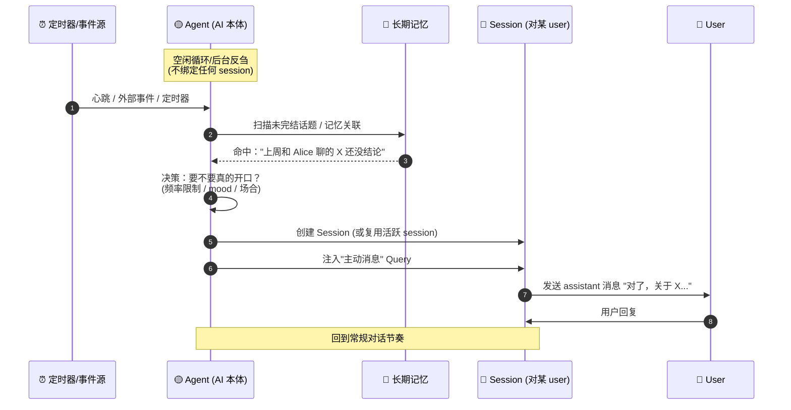

**关键点**：

- 触发器在 **Agent 层**——`while (true) { sleep; check_memory; maybe_speak; }` 这类 dormant loop 必须是 Agent 的一部分，不能挂在任何 Session 下。
- 对话渠道由 Agent 主动**创建或复用** Session——这意味着 Session 不能是"user 来了才创建"的被动资源。
- "要不要开口"的决策需要访问**跨 Session 的历史**——只有 Agent 层持有这个视角。

#### 形态 B：Session 层唤醒（会话内）

触发源是**当前对话里的信息不足**。AI 读完 user 消息，觉得不澄清就没法答，**在开始正式回答前**先主动抛一个问题。

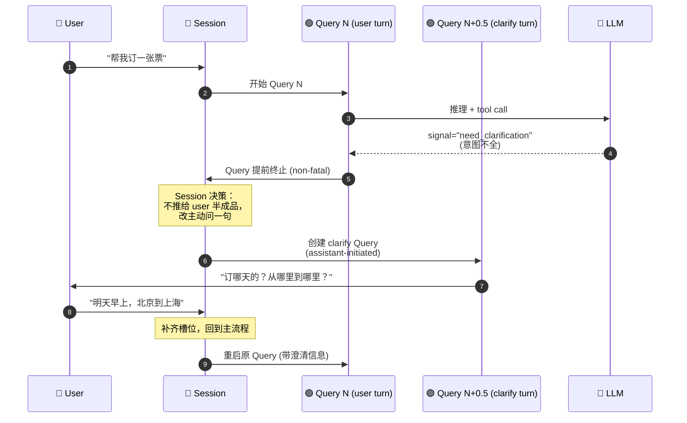

**关键点**：

- 触发器在 **Session 层**——是 Session 对"上一个 Query 结果不完整"的**反应策略**。
- 不需要创建新 Session，也不需要访问跨会话记忆。
- **Query N+0.5** 是 assistant-initiated 的——messages 数组里多一条 assistant 消息，但它不是对某条 user message 的回复。

#### 两种形态必须区分

| 维度 | 形态 A（Agent 层） | 形态 B（Session 层） |
| ---- | ------------------ | -------------------- |
| **触发源** | 时间 / 外部事件 / 后台反刍 | 当前 Query 的结果不完整 |
| **触发频率** | 小时 / 天 级别 | 毫秒 / 秒级 |
| **所需视角** | 跨所有 Session 的长期记忆 | 当前 Session 的上下文 |
| **是否新建 Session** | 可能需要（如果没有活跃 session） | 不需要 |
| **失败代价** | 打扰 user，mood 要保守 | 多一轮对话，代价低 |
| **实现位置** | Agent 的 dormant loop | Session 的 query scheduler |

混为一谈的后果很具体：

- **把形态 A 塞进 Session**——Session 被迫背一个"后台定时器"，违反 Session 应该是 user 驱动的半被动资源的设定；多 Session 并发时每个 Session 都跑自己的 timer，语义乱。
- **把形态 B 塞进 Agent**——每次需要澄清都要惊动 Agent 层（跨 session 的重决策），延迟飙升，而且 Agent 没有 Session 的即时上下文，决策质量还更差。
- **完全不区分**（当代多数架构的现状）——主动唤醒这个维度落不了地，因为你不知道把 dormant loop 挂在哪里，也不知道它能访问什么状态。

#### 为什么三层是主动唤醒的必要条件

> 没有 Agent 层 → 无处挂载"跨 session 的后台反刍"
> 没有 Session 层 → 无处表达"澄清轮"和"原始轮"的关系
> 没有 Query 层 → 无法区分"user-initiated"和"assistant-initiated"的消息来源

**主动唤醒不是功能，是一个架构判据**：一个 agent 架构如果不能优雅地表达这两种形态，它就不可能真的像人。Claude Code（只有 Query+State）、LangChain（memory 不是一等公民）、ReAct（连 Session 都没有）、MemGPT（有 Agent 没 Session）——都只能实现其中一种，或者都实现得很扭曲。

三层切法给主动唤醒留了**两个明确的落点**——Agent 的 dormant loop 和 Session 的 mid-turn clarifier——这才是这个维度能落地的前提。

---

## 什么时候不该这样切

这个切法不是万能的——当以下条件之一成立时，它带来的复杂度不划算：

1. **一次性任务**。如果你的 agent 就是"跑一个 goal 然后退出"，Claude Code 和 AutoGPT 的 query-centric / loop 架构更简单。
2. **无状态 API**。如果你的 agent 是无状态的问答 API，连 Session 都不需要。
3. **demo / POC**。验证概念阶段别过度设计，LangChain 的 Memory 插槽够用。

三层切法的成本是**多出两层对象和两次状态转换**（Agent→Session→Query），收益是"类人 AI"所需的全部非功能性属性（记忆分层、情绪连续、取消作用域、并发隔离）都有了自然归宿。你得先确认收益大于成本。

---

## 常见误区

- **"Session 就是 message list"**——不对。Session 承载的是**一次对话的完整状态**，包括 mood、工具启用集、元数据。message list 只是它的一部分。
- **"Agent 就是 system prompt"**——不对。system prompt 是身份的**投影**，Agent 还包括长期记忆、情绪基线、能力目录这些不会直接出现在 prompt 里的东西。
- **"Query 就是一次 LLM 调用"**——不对。一次 Query 里可能有若干次 LLM 调用（tool call loop），但对外只是一次请求。
- **"分三层就是写三个 class"**——不完全对。三层是**概念上的边界**，实现上可以是三个对象、也可以是带 scope 标记的一个对象。重点是让"这件事归谁"在代码里有一个清晰的答案。

---

## 和 Actor 模型的关系

熟悉 Actor 的读者会发现，Agent 层非常像 Actor——有身份、有邮箱、可并发。但 Actor 模型没有原生的 Session 概念——多个 message 组成一次对话这件事是使用者自己在 Actor 内部状态里维护的。

可以这样理解：**三层切法是在 Actor 的基础上，把"一段对话"提升成一等公民**。底层完全可以用 Actor 实现。

---

## 最小实现指南

如果要在一门静态语言（比如 C、Go、Rust）里落地这个切法，大致有几条准则：

1. **三个显式类型**：`Agent`、`Session`、`Query`，带各自的创建/销毁函数。
2. **生存期约束**：Session 持有 Agent 的引用；Query 持有 Session 的引用；反向引用通过事件/回调。
3. **状态归属清单**：写一张表，把每个状态字段归到一层（这张表就是你的架构契约）。
4. **三个明确的转换点**：Agent→Session（开始对话）、Session→Query（收到消息）、Session→Agent（记忆沉淀）。每个转换点暴露一个 hook 给使用者。
5. **取消的层次化传播**：cancel query 不 cancel session；close session 不 destroy agent。

---

## 附：在 moo 中的落地

moo 的 `xagent` 模块大体就是按这个切法做的：

- `xAgent` 承担 Agent 层——身份、长期记忆（计划中）、能力目录（tool 注册表）。
- `xAgentSession` 承担 Session 层——message history、streaming 回调、cancel 作用域。
- 单次 `xAgentSessionSend` 的执行过程对应 Query 层——虽然没有独立的 `xAgentQuery` 类型（用运行中的内部状态表达），但它的生存期和取消作用域就是 Query 层概念。

这个映射不是本文想展开的重点——真正的重点是方法论本身。具体实现细节见 [xagent 架构文档](../todo/xagent_architecture.md)。

---

## 参考

- [类人 AI 的四个维度](../todo/human-like-ai.md)
- Claude Code 架构分析（Anthropic 开源实现，query-centric 范式的代表作）
- MemGPT: Towards LLMs as Operating Systems（Packer et al., 2023）
- LangChain Agent 文档（memory-as-plugin 范式）
- ReAct: Synergizing Reasoning and Acting in Language Models（Yao et al., 2022）
