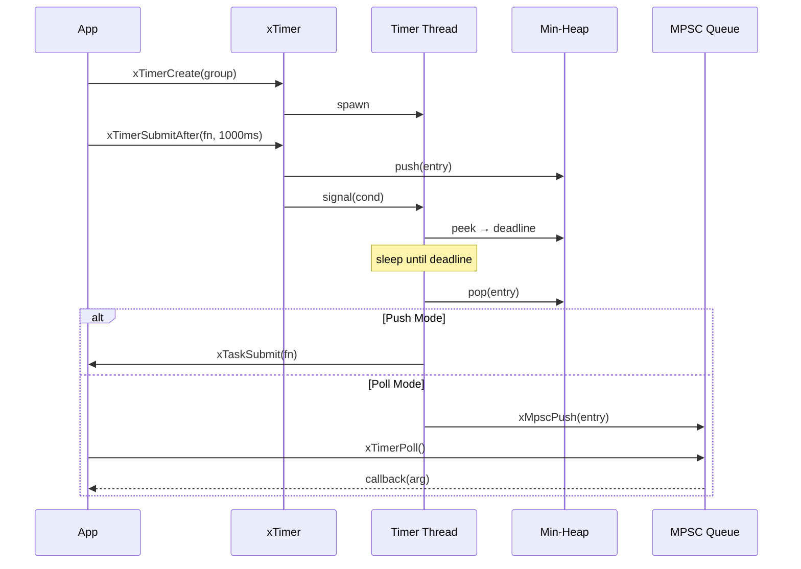
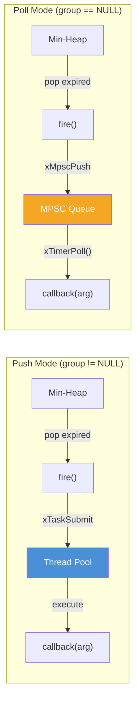

# timer.h — Monotonic Timer

## Introduction

`timer.h` provides a standalone monotonic timer that schedules callbacks to fire after a delay or at an absolute time. It supports two fire modes — **Push mode** (dispatch to a thread pool) and **Poll mode** (enqueue to a lock-free MPSC queue for caller-driven execution) — making it suitable for both multi-threaded and single-threaded architectures.

> **Note:** For timers integrated directly into an event loop, see [`xEventLoopTimerAfter()`](event.md) / [`xEventLoopTimerAt()`](event.md) in `event.h`. The standalone `timer.h` is useful when you need timers without an event loop, or when you want explicit control over which thread executes the callbacks.

## Design Philosophy

1. **Dual Fire Modes** — Push mode hands expired callbacks to a thread pool for concurrent execution; Poll mode queues them for the caller to drain synchronously. This lets latency-sensitive code (e.g., an event loop) avoid thread-switch overhead by polling, while background services can use push mode for simplicity.

2. **Dedicated Timer Thread** — Each `xTimer` instance spawns one background thread that sleeps on a condition variable, waking only when the earliest deadline arrives or a new entry is submitted. This avoids busy-waiting and keeps CPU usage near zero when idle.

3. **Min-Heap for O(log n) Scheduling** — Timer entries are stored in a min-heap ordered by deadline. Insert, cancel, and fire-next are all O(log n). The heap is provided by [`heap.h`](heap.md).

4. **Lock-Free Poll Queue** — In poll mode, expired entries are pushed onto an intrusive MPSC queue ([`mpsc.h`](mpsc.md)) without holding the mutex, minimizing contention between the timer thread and the polling thread.

## Architecture



## Implementation Details

### Internal Structure

```c
struct xTimerTask_ {
    xMpsc        node;       // Intrusive MPSC node (poll mode)
    uint64_t     deadline;   // Absolute expiry time (CLOCK_MONOTONIC, ms)
    xTimerFunc   fn;         // User callback
    void        *arg;        // User argument
    size_t       heap_idx;   // Position in min-heap (TIMER_INVALID_IDX when not in heap)
    int          cancelled;  // Set to 1 under mutex before removal
};

struct xTimer_ {
    xHeap            heap;      // Min-heap ordered by deadline
    xTaskGroup       group;     // Non-NULL → push mode; NULL → poll mode
    xMpsc           *mq_head;   // Poll-mode MPSC queue head
    xMpsc           *mq_tail;   // Poll-mode MPSC queue tail
    pthread_t        thread;    // Background timer thread
    pthread_mutex_t  mu;        // Protects heap and stopped flag
    pthread_cond_t   cond;      // Wakes timer thread on new entry or stop
    int              stopped;   // Shutdown flag
};
```

### Timer Thread Loop

The background thread follows this algorithm:

1. **Wait** — If the heap is empty, block on `pthread_cond_wait()`.
2. **Check top** — Peek at the minimum-deadline entry.
3. **Fire or sleep** — If `deadline ≤ now`, pop and fire. Otherwise, `pthread_cond_timedwait()` until the deadline or a new signal.
4. **Repeat** until `stopped` is set.

When a new entry is submitted, `pthread_cond_signal()` wakes the thread so it can re-evaluate whether the new entry has an earlier deadline.

### Push vs. Poll Mode



### Cancellation

`xTimerCancel()` acquires the mutex, checks if the entry is still in the heap (not already fired or cancelled), removes it via `xHeapRemove()`, marks it cancelled, and frees the memory. If the entry has already fired, `xErrno_Cancelled` is returned.

### Memory Ownership

- **Push mode:** The timer thread transfers ownership of the `xTimerTask_` to the worker thread via `xTaskSubmit()`. The worker frees it after executing the callback.
- **Poll mode:** The timer thread pushes the entry to the MPSC queue. `xTimerPoll()` pops and frees each entry after executing its callback.
- **Cancellation:** The caller frees the entry immediately.
- **Destroy:** Remaining heap entries and poll-queue entries are freed without firing.

## API Reference

### Types

| Type | Description |
| --- | --- |
| `xTimerFunc` | `void (*)(void *arg)` — Timer callback signature |
| `xTimer` | Opaque handle to a timer instance |
| `xTimerTask` | Opaque handle to a submitted timer entry |

### Functions

| Function | Signature | Description | Thread Safety |
| --- | --- | --- | --- |
| `xTimerCreate` | `xTimer xTimerCreate(xTaskGroup g)` | Create a timer. `g != NULL` → push mode, `g == NULL` → poll mode. | Not thread-safe |
| `xTimerDestroy` | `void xTimerDestroy(xTimer t)` | Stop the timer thread and free all resources. Pending entries are discarded. | Not thread-safe |
| `xTimerSubmitAfter` | `xTimerTask xTimerSubmitAfter(xTimer t, xTimerFunc fn, void *arg, uint64_t delay_ms)` | Schedule a callback after a relative delay. | **Thread-safe** |
| `xTimerSubmitAt` | `xTimerTask xTimerSubmitAt(xTimer t, xTimerFunc fn, void *arg, uint64_t abs_ms)` | Schedule a callback at an absolute monotonic time. | **Thread-safe** |
| `xTimerCancel` | `xErrno xTimerCancel(xTimer t, xTimerTask task)` | Cancel a pending entry. Returns `xErrno_Ok` if cancelled, `xErrno_Cancelled` if already fired. | **Thread-safe** |
| `xTimerPoll` | `int xTimerPoll(xTimer t)` | Execute all due callbacks (poll mode only). Returns count. No-op in push mode. | Not thread-safe |
| ~~`xTimerNowMs`~~ | `uint64_t xTimerNowMs(void)` | **Deprecated.** Use `xMonoMs()` from `<xbase/time.h>`. | Thread-safe |

## Usage Examples

### Push Mode (Thread Pool Dispatch)

```c
#include <stdio.h>
#include <xbase/timer.h>
#include <xbase/task.h>
#include <unistd.h>

static void on_timeout(void *arg) {
    printf("Timer fired on worker thread! arg=%p\n", arg);
}

int main(void) {
    xTaskGroup group = xTaskGroupCreate(NULL);
    xTimer timer = xTimerCreate(group);

    // Fire after 500ms on a worker thread
    xTimerSubmitAfter(timer, on_timeout, NULL, 500);

    sleep(1); // Wait for timer to fire

    xTimerDestroy(timer);
    xTaskGroupDestroy(group);
    return 0;
}
```

### Poll Mode (Event Loop Integration)

```c
#include <stdio.h>
#include <xbase/timer.h>
#include <xbase/time.h>

static void on_timeout(void *arg) {
    int *count = (int *)arg;
    printf("Timer #%d fired on caller thread\n", ++(*count));
}

int main(void) {
    xTimer timer = xTimerCreate(NULL); // Poll mode
    int count = 0;

    // Schedule 3 timers
    xTimerSubmitAfter(timer, on_timeout, &count, 100);
    xTimerSubmitAfter(timer, on_timeout, &count, 200);
    xTimerSubmitAfter(timer, on_timeout, &count, 300);

    // Poll loop
    uint64_t start = xMonoMs();
    while (xMonoMs() - start < 500) {
        int n = xTimerPoll(timer);
        if (n > 0) printf("  Polled %d timer(s)\n", n);
        usleep(10000); // 10ms
    }

    xTimerDestroy(timer);
    return 0;
}
```

## Use Cases

1. **Event Loop Timer Backend** — The event loop's builtin timers (`xEventLoopTimerAfter`) use the same min-heap approach internally. Use standalone `xTimer` when you need timers independent of an event loop.

2. **Retry / Backoff Logic** — Schedule retries with exponential backoff using `xTimerSubmitAfter()`. Cancel pending retries with `xTimerCancel()` when a response arrives.

3. **Periodic Health Checks** — In poll mode, integrate `xTimerPoll()` into your main loop to execute periodic health checks without spawning additional threads.

## Best Practices

- **Choose the right mode.** Use push mode when callbacks are independent and can run concurrently. Use poll mode when callbacks must run on a specific thread (e.g., the event loop thread) or when you want to avoid thread-switch latency.
- **Don't use the handle after fire or cancel.** Once a timer entry fires or is cancelled, the memory is freed. Accessing the handle is undefined behavior.
- **Destroy before the task group.** If using push mode, destroy the timer before destroying the task group to ensure all in-flight callbacks complete.
- **Prefer `xEventLoopTimerAfter()` when using an event loop.** It avoids the overhead of a separate timer thread and integrates seamlessly with I/O dispatch.

## Comparison with Other Libraries

| Feature | xbase timer.h | timerfd (Linux) | POSIX timer (`timer_create`) | libuv `uv_timer` |
| --- | --- | --- | --- | --- |
| **Platform** | macOS + Linux | Linux only | POSIX (varies) | Cross-platform |
| **Fire Mode** | Push (thread pool) or Poll (MPSC) | fd-based (integrates with epoll) | Signal or thread | Event loop callback |
| **Resolution** | Millisecond (CLOCK_MONOTONIC) | Nanosecond | Nanosecond | Millisecond |
| **Data Structure** | Min-heap (O(log n)) | Kernel-managed | Kernel-managed | Min-heap |
| **Thread Safety** | Submit/Cancel are thread-safe | fd operations are thread-safe | Varies | Not thread-safe |
| **Cancellation** | O(log n) via heap index | `timerfd_settime(0)` | `timer_delete()` | `uv_timer_stop()` |
| **Overhead** | 1 background thread per xTimer | 1 fd per timer | 1 kernel timer per instance | Shared with event loop |
| **Dependencies** | heap.h, mpsc.h, task.h | Linux kernel | POSIX RT library | libuv |

**Key Differentiator:** xbase's timer provides a unique dual-mode design (push/poll) that lets you choose between concurrent execution and single-threaded polling without changing your callback code. The poll mode's lock-free MPSC queue makes it ideal for integration with custom event loops.

## Benchmark

> Environment: Apple Mac15,7 (12 cores), 36 GB RAM, macOS 26.x, Release build (`-O2`). Each result is the median of 3 repetitions.
> Source: [`xbase/timer_bench.cpp`](https://github.com/mivinci/moo/blob/main/libs/xbase/timer_bench.cpp)

| Benchmark | N | Time (ns) | CPU (ns) | Throughput |
| --- | ---: | ---: | ---: | --- |
| `BM_Timer_SubmitCancel` | — | 68.7 | 61.0 | — |
| `BM_Timer_SubmitBatch` | 10 | 1,287 | 1,247 | 8.02 M items/s |
| `BM_Timer_SubmitBatch` | 100 | 7,590 | 6,538 | 15.3 M items/s |
| `BM_Timer_SubmitBatch` | 1,000 | 61,647 | 53,211 | 18.8 M items/s |
| `BM_Timer_FirePoll` | 10 | 3,003 | 3,003 | 3.33 M items/s |
| `BM_Timer_FirePoll` | 100 | 16,993 | 15,878 | 6.30 M items/s |
| `BM_Timer_FirePoll` | 1,000 | 172,412 | 153,600 | 6.51 M items/s |

**Key Observations:**

- **Submit+Cancel** cycle takes ~61 ns CPU time, down from ~121 ns in the `calloc`-based implementation. The improvement comes from swapping `calloc`/`free` for `xSlabMt` (see [slab.md](slab.md)); the heap push + heap remove are unchanged.
- **Batch submit** throughput scales from ~8 M to ~19 M items/s as batch size grows. Larger batches amortise the per-entry xSlabMt CAS across the heap-push dominated cost.
- **Fire+Poll** is slower than submit alone because it includes the MPSC queue transfer and callback invocation. At N=1,000 it sustains ~6.5 M timer fires/s.
