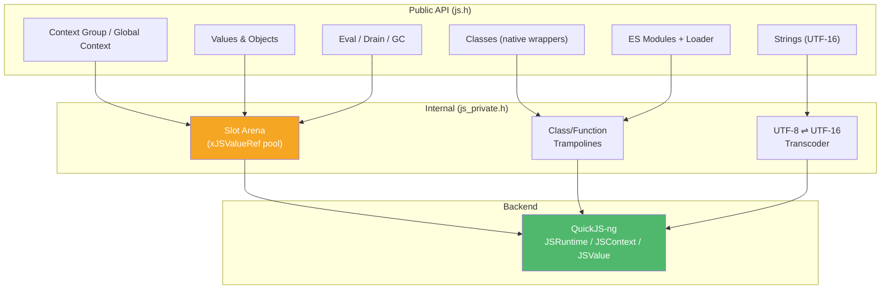

# xjs — JavaScript Scripting Engine

## Introduction

**xjs** is moo's embeddable JavaScript engine. It runs modern ECMAScript (ES2020+) in-process, is implemented on top of [QuickJS-ng](https://github.com/quickjs-ng/quickjs), and exposes a C API that mirrors Apple's [JavaScriptCore C API](https://developer.apple.com/documentation/javascriptcore) one-to-one (every `JS`/`kJS`/`OpaqueJS` prefix becomes `xJS`/`kXJS`/`OpaqueXJS`).

The mirror is deliberate — it keeps the public surface stable even if the engine backend is swapped — and it makes the API immediately familiar to anyone who has embedded JSC on macOS/iOS.

## Design Philosophy

1. **JSC-Shaped Public API** — Every opaque handle, constant and function in `js.h` has a direct JSC counterpart. Callers who know JSC already know xjs; code originally written against JSC usually ports with a mechanical `JS` → `xJS` rename.

2. **Backend Replaceable** — QuickJS types (`JSValue`, `JSRuntime`, `JSContext`, …) never leak through `js.h`. All QuickJS-specific plumbing lives in `.c` files and `js_private.h`. Swapping to another engine only requires reimplementing those translation units.

3. **Host-Driven Async** — xjs intentionally does **not** drive an event loop. The host is responsible for pumping pending microtasks (Promise reactions, `async`/`await` continuations, `queueMicrotask` jobs) via [`xJSContextDrainPendingJobs()`](eval.md) at appropriate yield points. Synchronous Promise waiting is provided by [`xJSAwaitPromise()`](module.md).

4. **Explicit Value Lifetimes** — Every `xJSValueRef`/`xJSObjectRef` returned by the API is reference-counted. The host balances its references with [`xJSValueUnprotect()`](value.md); there is no "stack scope" to release values for you. This is a deliberate deviation from JSC's Protect/Unprotect-only model and is documented in detail in [value.md](value.md).

5. **No Native Module Registration (yet)** — ES modules can be loaded from host-supplied source strings via a loader callback, but xjs does not expose an API for registering a `JSModuleDef` backed by C callbacks. The recommended pattern is the "global hook + JS facade" idiom; see [`examples/xjs_native_module.c`](../../../examples/xjs_native_module.c) and [module.md](module.md).

## Architecture



## Sub-Module Overview

| File | Description | Doc |
| --- | --- | --- |
| `js.h` (`Context group` section) | Runtime / global context lifecycle, module loader install | [context.md](context.md) |
| `js.h` (`Value` section) | Type queries, builders, conversions, JSON bridge, Protect/Unprotect | [value.md](value.md) |
| `js.h` (`Object` section) | Object/Array/Date/Error/RegExp/Promise/Function construction, property access, call-as-function/constructor | [object.md](object.md) |
| `js.h` (`Class registration` section) | `xJSClassDefinition`, `xJSClassCreate`, native finalizer contract | [class.md](class.md) |
| `js.h` (`String` section) | UTF-16 storage, UTF-8 transcoding helpers, ref counting | [string.md](string.md) |
| `js.h` (`Script evaluation` section) | `xJSEvaluateScript`, `xJSCheckScriptSyntax`, job draining, GC | [eval.md](eval.md) |
| `js.h` (`ES modules` section) | `xJSEvaluateModule`, `xJSAwaitPromise`, module loader callback | [module.md](module.md) |

## Quick Start

The smallest useful program — evaluate a script and print the result.

```c
#include <stdio.h>
#include <stdlib.h>
#include <x/js/js.h>

int main(void) {
    xJSGlobalContextRef ctx = xJSGlobalContextCreate(NULL);

    xJSStringRef src = xJSStringCreateWithUTF8CString("1 + 2 * 3");
    xJSValueRef  exc = NULL;
    xJSValueRef  r   = xJSEvaluateScript(ctx, src, NULL, NULL, 0, &exc);
    xJSStringRelease(src);

    if (!r) {
        xJSStringRef m = xJSValueToStringCopy(ctx, exc, NULL);
        char buf[256];
        xJSStringGetUTF8CString(m, buf, sizeof(buf));
        fprintf(stderr, "error: %s\n", buf);
        xJSStringRelease(m);
        xJSValueUnprotect(ctx, exc);
        xJSGlobalContextRelease(ctx);
        return 1;
    }

    printf("= %g\n", xJSValueToNumber(ctx, r, NULL));  // = 7
    xJSValueUnprotect(ctx, r);
    xJSGlobalContextRelease(ctx);
    return 0;
}
```

A fuller walk-through — ES modules, native hooks, and synchronous Promise await — lives in [`examples/xjs_native_module.c`](../../../examples/xjs_native_module.c).

## Relationship with Other Modules

- **xbase** — xjs depends on `xbase/base.h` for `XCAPI`, `XDEF_STRUCT`, and error-code conventions. No event loop or IO integration is mandated: xjs stays runtime-agnostic.
- **xagent** (planned) — xjs is the intended substrate for letting agent/tool logic be authored in JavaScript instead of C; see the [xagent roadmap](../../todo/xagent_architecture.md).

## Backend Notes

- The runtime backend is [QuickJS-ng](https://github.com/quickjs-ng/quickjs). It is a `PRIVATE` CMake dependency of `xjs` — nothing in `js.h` references a QuickJS type, so downstream targets never transitively see `quickjs.h`.
- ES2020 features supported by QuickJS-ng (classes, async/await, optional chaining, BigInt, top-level `await` in modules, …) are available to user scripts.
- Thread-safety follows QuickJS-ng: a `xJSContextGroupRef` (runtime) is single-threaded. Multiple runtimes can exist in the same process, but values and contexts from different groups must never be mixed.
