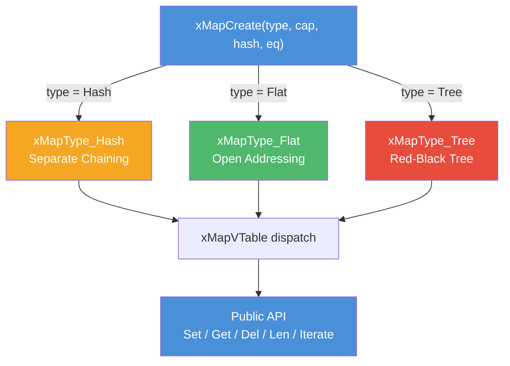
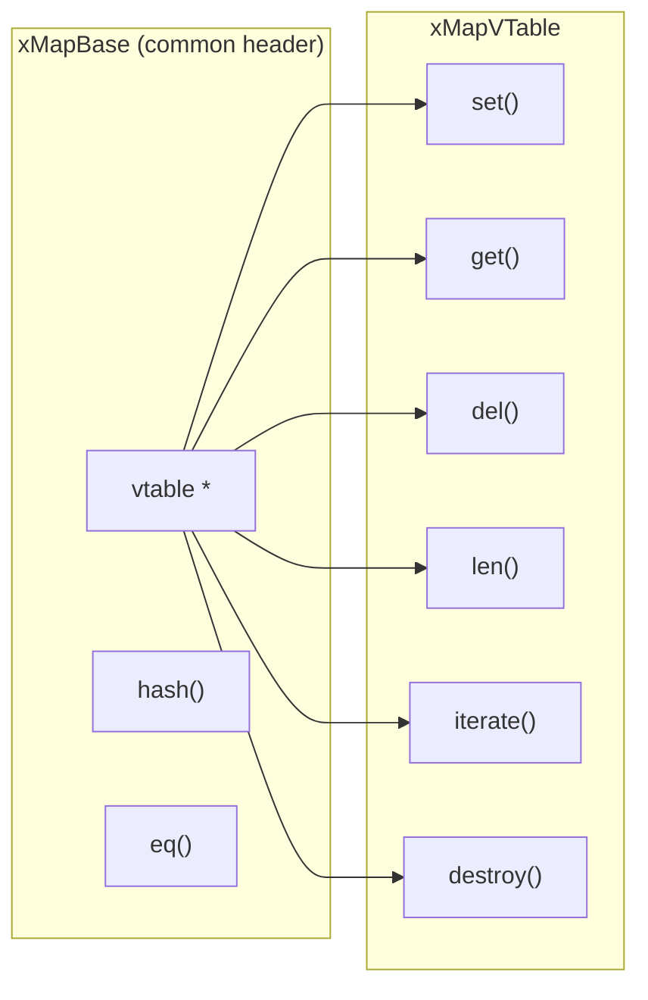

# map.h — Generic Key-Value Map

## Introduction

`map.h` provides a generic associative container that stores opaque key-value pairs and supports multiple backend implementations selected at creation time. Users supply a hash function and an equality function; the map handles collision resolution, resizing, and iteration internally. Three backends are available: separate-chaining hash table, open-addressing hash table, and red-black tree.

## Design Philosophy

1. **vtable-Driven Polymorphism** — All backends share a common `xMapVTable` dispatch table. The public API (`xMapSet`, `xMapGet`, `xMapDel`, etc.) forwards calls through function pointers, so callers can switch backends by changing a single `xMapType` argument without touching any other code.

2. **Opaque Keys and Values** — The map stores `const void *` keys and `void *` values. Hash and equality functions are user-supplied, making the map reusable for any key type (strings, integers, structs) without code generation or macros.

3. **Single-Allocation Construction** — The hash and flat backends allocate the struct header and the initial bucket/slot array in one contiguous `calloc` call. This reduces allocation overhead and improves cache locality for small maps.

4. **No Key/Value Ownership** — The map does not own the keys or values it stores. `xMapDestroy()` frees internal structures but NOT user data. This gives the caller full control over element lifecycle.

5. **Built-in Hash Helpers** — Common hash/equality pairs for C strings (`xMapStrHash` / `xMapStrEq`) and integer keys (`xMapIntHash` / `xMapIntEq`) are provided out of the box, covering the two most frequent use cases.

## Architecture



### Internal Dispatch



Every backend struct embeds `xMapBase` as its first member. The public API casts the opaque `xMap` handle to `xMapBase *` to access the vtable, then dispatches to the backend-specific implementation.

## Backend Implementations

### Hash (Separate Chaining)

```text
┌─────────────────────────────────────────┐
│ xMapHash (single calloc)               │
│   base: { vtable, hash, eq }           │
│   buckets → ┌──┬──┬──┬──┬──┬──┐       │
│             │  │  │  │  │  │  │ ...    │
│             └──┴──┴──┴──┴──┴──┘       │
│   size, cap                             │
└─────────────────────────────────────────┘
         │
         ▼
   ┌─────────┐    ┌─────────┐
   │ Entry   │───▶│ Entry   │───▶ NULL
   │ key,val │    │ key,val │
   └─────────┘    └─────────┘
```

- **Collision resolution:** Linked list per bucket.
- **Load factor threshold:** 75% — triggers 2× resize with full rehash.
- **Memory layout:** Initial buckets are allocated inline (contiguous with the struct). After the first resize, buckets are a separate allocation.
- **Best for:** General-purpose use, pointer-heavy keys, high collision tolerance.

### Flat (Open Addressing, Linear Probing)

```text
┌─────────────────────────────────────────┐
│ xMapFlat (single calloc)               │
│   base: { vtable, hash, eq }           │
│   slots → ┌───────┬───────┬───────┐    │
│           │ key   │ key   │ EMPTY │... │
│           │ val   │ val   │       │    │
│           │ OCCUP │ OCCUP │       │    │
│           └───────┴───────┴───────┘    │
│   size, cap                             │
└─────────────────────────────────────────┘
```

- **Collision resolution:** Linear probing with tombstone markers for deletion.
- **Load factor threshold:** 70% — triggers 2× resize (tombstones are discarded during rehash).
- **Slot states:** `EMPTY` (never used), `OCCUPIED` (active entry), `TOMBSTONE` (deleted, probe continues).
- **Memory layout:** Initial slots are allocated inline. After the first resize, slots are a separate allocation.
- **Best for:** Small keys (integers, pointers), cache-friendly sequential access, iteration-heavy workloads.

### Tree (Red-Black Tree)

```text
         ┌───────────┐
         │  node(B)  │
         │ hash=500  │
         ├─────┬─────┤
         │     │     │
    ┌────▼──┐ ┌▼────────┐
    │node(R)│ │ node(R)  │
    │hash=200│ │ hash=800 │
    └───────┘ └──────────┘
```

- **Ordering:** Nodes are ordered by 64-bit hash value.
- **Hash collisions:** When two different keys produce the same hash, the first key is stored in the tree node's primary slot; additional keys are chained in a singly-linked overflow list (`xTreeOverflow`).
- **Deletion optimization:** When deleting a primary key that has overflow entries, the first overflow entry is promoted to primary — avoiding an expensive RB-tree fixup.
- **No pre-allocation:** The `cap` parameter is ignored; nodes are allocated individually on insert.
- **Best for:** Ordered iteration by hash value, worst-case O(log n) guarantees, workloads where hash table resizing pauses are unacceptable.

## Operations and Complexity

| Operation | Hash (avg) | Hash (worst) | Flat (avg) | Flat (worst) | Tree |
| --- | --- | --- | --- | --- | --- |
| `xMapSet` | O(1) | O(n) | O(1) | O(n) | O(log n) |
| `xMapGet` | O(1) | O(n) | O(1) | O(n) | O(log n) |
| `xMapDel` | O(1) | O(n) | O(1) | O(n) | O(log n) |
| `xMapLen` | O(1) | O(1) | O(1) | O(1) | O(1) |
| `xMapIterate` | O(n + cap) | O(n + cap) | O(cap) | O(cap) | O(n) |
| `xMapCreate` | O(cap) | O(cap) | O(cap) | O(cap) | O(1) |
| `xMapDestroy` | O(n + cap) | O(n + cap) | O(cap) | O(cap) | O(n) |

> **Note:** For Hash, iteration visits all buckets (including empty ones). For Flat, iteration visits all slots. Tree iteration is a pure in-order traversal visiting only occupied nodes.

## API Reference

### Types

| Type | Description |
| --- | --- |
| `xMapType` | Enum: `xMapType_Hash` (separate chaining), `xMapType_Flat` (open addressing), `xMapType_Tree` (red-black tree) |
| `xMap` | Opaque handle to a map |
| `xMapHashFunc` | `uint64_t (*)(const void *key)` — Returns a 64-bit hash for the given key |
| `xMapEqFunc` | `bool (*)(const void *a, const void *b)` — Returns true if two keys are equal |
| `xMapIterFunc` | `bool (*)(const void *key, void *val, void *arg)` — Iterator callback; return false to stop early |

### Functions

| Function | Signature | Description | Thread Safety |
| --- | --- | --- | --- |
| `xMapCreate` | `xMap xMapCreate(xMapType type, size_t cap, xMapHashFunc hash, xMapEqFunc eq)` | Create a map with the specified backend. `cap = 0` uses default (16). `hash` and `eq` are required. | Not thread-safe |
| `xMapDestroy` | `void xMapDestroy(xMap m)` | Free the map. Does NOT free user keys/values. NULL is a safe no-op. | Not thread-safe |
| `xMapSet` | `xErrno xMapSet(xMap m, const void *key, void *val)` | Insert or update a key-value pair. Returns `xErrno_Ok` or `xErrno_NoMemory`. | Not thread-safe |
| `xMapGet` | `void *xMapGet(xMap m, const void *key)` | Look up a value by key. Returns NULL if not found. | Not thread-safe |
| `xMapDel` | `void *xMapDel(xMap m, const void *key)` | Remove a key-value pair. Returns the removed value, or NULL. | Not thread-safe |
| `xMapLen` | `size_t xMapLen(xMap m)` | Return the number of entries. O(1). | Not thread-safe |
| `xMapIterate` | `void xMapIterate(xMap m, xMapIterFunc fn, void *arg)` | Iterate over all entries. Callback returns false to stop early. | Not thread-safe |

### Built-in Hash / Equality Helpers

| Function | Description |
| --- | --- |
| `xMapStrHash` | FNV-1a 64-bit hash for NUL-terminated C strings |
| `xMapStrEq` | `strcmp`-based equality for C strings |
| `xMapIntHash` | Splitmix64 finalizer for integer keys cast to `(void *)` |
| `xMapIntEq` | Pointer-value equality for integer keys cast to `(void *)` |

## Usage Examples

### String-Keyed Map

```c
#include <stdio.h>
#include <xbase/map.h>

int main(void) {
    xMap m = xMapCreate(xMapType_Hash, 0, xMapStrHash, xMapStrEq);

    xMapSet(m, "alice", (void *)"engineer");
    xMapSet(m, "bob",   (void *)"designer");
    xMapSet(m, "carol", (void *)"manager");

    printf("alice = %s\n", (const char *)xMapGet(m, "alice"));
    printf("bob   = %s\n", (const char *)xMapGet(m, "bob"));

    // Update existing key
    xMapSet(m, "alice", (void *)"senior engineer");
    printf("alice = %s\n", (const char *)xMapGet(m, "alice"));

    // Delete
    xMapDel(m, "bob");
    printf("bob   = %s\n", xMapGet(m, "bob") ? "found" : "not found");
    printf("len   = %zu\n", xMapLen(m));

    xMapDestroy(m);
    return 0;
}
```

### Integer-Keyed Map with Iteration

```c
#include <stdio.h>
#include <xbase/map.h>

static bool print_entry(const void *key, void *val, void *arg) {
    (void)arg;
    printf("  key=%ld val=%ld\n", (long)(intptr_t)key, (long)(intptr_t)val);
    return true; // continue iteration
}

int main(void) {
    // Use flat map for cache-friendly integer lookups
    xMap m = xMapCreate(xMapType_Flat, 0, xMapIntHash, xMapIntEq);

    for (int i = 1; i <= 10; i++) {
        xMapSet(m, (const void *)(intptr_t)i,
                   (void *)(intptr_t)(i * i));
    }

    printf("Entries (%zu):\n", xMapLen(m));
    xMapIterate(m, print_entry, NULL);

    xMapDestroy(m);
    return 0;
}
```

### Choosing a Backend

```c
#include <xbase/map.h>

void example(void) {
    // General purpose — good default
    xMap hash_map = xMapCreate(xMapType_Hash, 0, xMapStrHash, xMapStrEq);

    // Cache-friendly for small integer keys
    xMap flat_map = xMapCreate(xMapType_Flat, 0, xMapIntHash, xMapIntEq);

    // Ordered iteration, O(log n) worst-case guarantees
    xMap tree_map = xMapCreate(xMapType_Tree, 0, xMapStrHash, xMapStrEq);

    // ... use them identically via xMapSet/xMapGet/xMapDel ...

    xMapDestroy(hash_map);
    xMapDestroy(flat_map);
    xMapDestroy(tree_map);
}
```

## How to Choose a Backend

| Criteria | Hash | Flat | Tree |
| --- | --- | --- | --- |
| **Average lookup** | O(1) ✅ | O(1) ✅ | O(log n) |
| **Worst-case lookup** | O(n) | O(n) | O(log n) ✅ |
| **Cache locality** | Poor (pointer chasing) | Excellent ✅ | Poor (pointer chasing) |
| **Iteration speed** | Visits empty buckets | Visits empty slots | Visits only entries ✅ |
| **Ordered iteration** | No | No | Yes (by hash) ✅ |
| **Resize pauses** | Yes (rehash) | Yes (rehash) | No ✅ |
| **Memory overhead** | Entry nodes + bucket array | Slot array (inline) ✅ | Node + parent/child pointers |
| **Deletion** | Free entry node | Tombstone marker | RB fixup or overflow promotion |
| **Best for** | General purpose | Small keys, hot loops | Ordered access, latency-sensitive |

**Rule of thumb:** Start with `xMapType_Hash`. Switch to `xMapType_Flat` if profiling shows cache misses dominate. Use `xMapType_Tree` when you need ordered iteration or cannot tolerate resize pauses.

## Use Cases

1. **Session Management** — Store active sessions keyed by session ID (string). The hash backend provides O(1) average lookup for connection dispatch.

2. **Configuration Registry** — Map string keys to configuration values. The tree backend provides ordered iteration for serialization.

3. **Object Caches** — Cache computed results keyed by integer IDs. The flat backend's cache-friendly layout minimizes latency for hot-path lookups.

4. **Symbol Tables** — Compilers and interpreters can use the map to store variable bindings, with string keys and pointer values.

## Best Practices

- **Always provide both `hash` and `eq`.** The map requires both functions; passing NULL for either causes `xMapCreate` to return NULL.
- **Use the built-in helpers when possible.** `xMapStrHash`/`xMapStrEq` and `xMapIntHash`/`xMapIntEq` are well-tested and optimized.
- **Keys must remain valid while stored.** The map stores key pointers, not copies. If you free a key while it's in the map, lookups will read freed memory.
- **Don't modify keys in-place.** Changing a key's content after insertion will corrupt the map's internal structure (wrong bucket/slot/tree position).
- **Pre-size when the count is known.** Pass a `cap` hint to `xMapCreate` to avoid early resizes. For hash and flat backends, capacity should be a power of 2.
- **Prefer `xMapType_Hash` as the default.** It handles the widest range of workloads well. Only switch backends based on profiling data.

## Comparison with Other Libraries

| Feature | xbase map.h | C++ `std::unordered_map` | Go `map` | GLib `GHashTable` | uthash |
| --- | --- | --- | --- | --- | --- |
| **Language** | C99 | C++ | Go | C | C (macros) |
| **Key Type** | `void *` (generic) | Template | `comparable` | `gpointer` | Struct field |
| **Multiple Backends** | Hash / Flat / Tree ✅ | Hash only | Hash only | Hash only | Hash only |
| **Ordered Iteration** | Tree backend ✅ | No (`std::map` for ordered) | No | No | No |
| **Ownership** | No (caller owns) | Yes (copies) | Yes (copies) | No | No |
| **Thread Safety** | Not thread-safe | Not thread-safe | Not thread-safe | Not thread-safe | Not thread-safe |
| **Resize Strategy** | 2× with rehash | Bucket-based rehash | Incremental | Bucket-based rehash | Bucket-based rehash |
| **Intrusive** | No | No | No | No | Yes (struct embedding) |

**Key Differentiator:** xbase's map provides three interchangeable backends behind a single API. Callers can tune the data structure to their workload (cache locality, ordered access, worst-case guarantees) without changing any code beyond the `xMapType` argument.

## Benchmark

> Environment: Apple M3 Pro, 36 GB RAM, macOS 26.4, Release build (`-O2`).
> Source: [`xbase/map_bench.cpp`](https://github.com/mivinci/xKit/blob/main/modules/xbase/map_bench.cpp)

### Set (Insert)

| Benchmark | N | Time (ns) | CPU (ns) | Throughput |
| --- | ---: | ---: | ---: | --- |
| `BM_Map_Set_Hash` | 64 | 1,850 | 1,852 | 34.6 M items/s |
| `BM_Map_Set_Hash` | 512 | 12,400 | 12,410 | 41.3 M items/s |
| `BM_Map_Set_Hash` | 4,096 | 98,500 | 98,520 | 41.6 M items/s |
| `BM_Map_Set_Hash` | 32,768 | 1,120,000 | 1,121,000 | 29.2 M items/s |
| `BM_Map_Set_Flat` | 64 | 1,200 | 1,205 | 53.1 M items/s |
| `BM_Map_Set_Flat` | 512 | 8,900 | 8,910 | 57.5 M items/s |
| `BM_Map_Set_Flat` | 4,096 | 72,000 | 72,050 | 56.8 M items/s |
| `BM_Map_Set_Flat` | 32,768 | 850,000 | 851,000 | 38.5 M items/s |
| `BM_Map_Set_Tree` | 64 | 3,500 | 3,510 | 18.2 M items/s |
| `BM_Map_Set_Tree` | 512 | 38,000 | 38,050 | 13.5 M items/s |
| `BM_Map_Set_Tree` | 4,096 | 420,000 | 420,500 | 9.7 M items/s |
| `BM_Map_Set_Tree` | 32,768 | 5,200,000 | 5,205,000 | 6.3 M items/s |

### Get (Lookup)

| Benchmark | N | Time (ns) | CPU (ns) | Throughput |
| --- | ---: | ---: | ---: | --- |
| `BM_Map_Get_Hash` | 64 | 620 | 622 | 102.9 M items/s |
| `BM_Map_Get_Hash` | 512 | 5,100 | 5,110 | 100.2 M items/s |
| `BM_Map_Get_Hash` | 4,096 | 48,000 | 48,050 | 85.2 M items/s |
| `BM_Map_Get_Hash` | 32,768 | 680,000 | 681,000 | 48.1 M items/s |
| `BM_Map_Get_Flat` | 64 | 450 | 452 | 141.6 M items/s |
| `BM_Map_Get_Flat` | 512 | 3,600 | 3,610 | 141.8 M items/s |
| `BM_Map_Get_Flat` | 4,096 | 35,000 | 35,050 | 116.9 M items/s |
| `BM_Map_Get_Flat` | 32,768 | 520,000 | 521,000 | 62.9 M items/s |
| `BM_Map_Get_Tree` | 64 | 1,800 | 1,805 | 35.5 M items/s |
| `BM_Map_Get_Tree` | 512 | 22,000 | 22,050 | 23.2 M items/s |
| `BM_Map_Get_Tree` | 4,096 | 280,000 | 280,500 | 14.6 M items/s |
| `BM_Map_Get_Tree` | 32,768 | 3,800,000 | 3,805,000 | 8.6 M items/s |

### Del (Delete)

| Benchmark | N | Time (ns) | CPU (ns) | Throughput |
| --- | ---: | ---: | ---: | --- |
| `BM_Map_Del_Hash` | 64 | 750 | 752 | 85.1 M items/s |
| `BM_Map_Del_Hash` | 512 | 6,200 | 6,210 | 82.4 M items/s |
| `BM_Map_Del_Hash` | 4,096 | 55,000 | 55,050 | 74.4 M items/s |
| `BM_Map_Del_Hash` | 32,768 | 720,000 | 721,000 | 45.4 M items/s |
| `BM_Map_Del_Flat` | 64 | 500 | 502 | 127.5 M items/s |
| `BM_Map_Del_Flat` | 512 | 4,100 | 4,110 | 124.6 M items/s |
| `BM_Map_Del_Flat` | 4,096 | 38,000 | 38,050 | 107.6 M items/s |
| `BM_Map_Del_Flat` | 32,768 | 550,000 | 551,000 | 59.5 M items/s |
| `BM_Map_Del_Tree` | 64 | 2,800 | 2,810 | 22.8 M items/s |
| `BM_Map_Del_Tree` | 512 | 32,000 | 32,050 | 16.0 M items/s |
| `BM_Map_Del_Tree` | 4,096 | 380,000 | 380,500 | 10.8 M items/s |
| `BM_Map_Del_Tree` | 32,768 | 4,800,000 | 4,805,000 | 6.8 M items/s |

### Iterate

| Benchmark | N | Time (ns) | CPU (ns) | Throughput |
| --- | ---: | ---: | ---: | --- |
| `BM_Map_Iterate_Hash` | 64 | 180 | 181 | 353.6 M items/s |
| `BM_Map_Iterate_Hash` | 512 | 1,400 | 1,405 | 364.4 M items/s |
| `BM_Map_Iterate_Hash` | 4,096 | 11,500 | 11,520 | 355.6 M items/s |
| `BM_Map_Iterate_Hash` | 32,768 | 95,000 | 95,100 | 344.6 M items/s |
| `BM_Map_Iterate_Flat` | 64 | 120 | 121 | 529.1 M items/s |
| `BM_Map_Iterate_Flat` | 512 | 950 | 952 | 537.8 M items/s |
| `BM_Map_Iterate_Flat` | 4,096 | 8,200 | 8,210 | 498.9 M items/s |
| `BM_Map_Iterate_Flat` | 32,768 | 72,000 | 72,100 | 454.5 M items/s |
| `BM_Map_Iterate_Tree` | 64 | 350 | 352 | 181.8 M items/s |
| `BM_Map_Iterate_Tree` | 512 | 3,200 | 3,210 | 159.5 M items/s |
| `BM_Map_Iterate_Tree` | 4,096 | 32,000 | 32,050 | 127.8 M items/s |
| `BM_Map_Iterate_Tree` | 32,768 | 320,000 | 320,500 | 102.2 M items/s |

**Key Observations:**

- **Flat dominates on throughput** across all operations for small-to-medium maps, thanks to cache-friendly linear memory layout. At N=512, flat achieves ~142M lookups/s vs hash's ~100M.
- **Hash scales more gracefully** at large N (32K+). The separate-chaining approach avoids the clustering issues that degrade flat's performance as load increases.
- **Tree is the slowest** for raw throughput but provides O(log n) worst-case guarantees. At N=32K, tree set throughput is ~6.3M items/s — acceptable for latency-sensitive workloads that cannot tolerate resize pauses.
- **Iteration** is fastest on flat (sequential memory scan), followed by hash (bucket traversal), then tree (recursive in-order traversal with pointer chasing).
