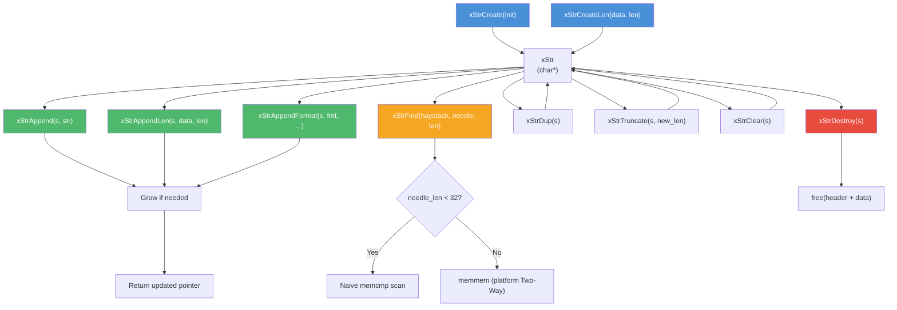

# str.h — SDS-Style Dynamic String

## Introduction

`str.h` provides an SDS-style dynamic string (`xStr`) that is fully compatible with all C string functions (`printf %s`, `strcmp`, `strlen`, …). The header (length + capacity) is hidden before the user-facing pointer, so every `xStr` **is** a `char*` — zero interop friction.

Inspired by Redis SDS (Simple Dynamic Strings).

Typical usage:

```c
xStr s = xStrCreate("hello");
s = xStrAppend(s, " world");
printf("%s (len=%zu)\n", s, xStrLen(s));

size_t pos = xStrFindStr(s, "world");
if (pos != XSTR_NONE) {
  printf("found at index %zu\n", pos);
}

xStrDestroy(s);
```

## Design Philosophy

1. **Binary-Compatible with C Strings** — `xStr` is a `typedef char *`. Every xStr can be passed directly to any C string API without conversion. It is always NUL-terminated.

2. **Hidden Header** — The metadata (length, capacity) lives in a header placed *before* the user pointer. This means `xStr` is indistinguishable from a regular `char*` at the call site, yet length queries are O(1).

3. **Auto-Growing** — Append operations automatically reallocate when capacity is exhausted. Callers must use the return value (`s = xStrAppend(s, "x")`) because reallocation may move the string.

4. **Binary-Safe** — Embedded NUL bytes are supported. `xStrCreateLen` and `xStrAppendLen` treat the input as raw bytes. Length is tracked explicitly, not via `strlen`.

5. **Dual-Strategy Search** — `xStrFind` uses naive `memcmp` for short patterns (below a threshold) and platform `memmem` for longer ones, balancing call overhead against algorithmic advantage.

## Architecture



## Implementation Details

### Memory Layout

```text
                    xStrHeader
                 ┌──────────────┐
                 │ len (size_t) │
                 │ cap (size_t) │
                 └──────────────┘ ← hdr + 1 = user pointer
                 ┌──────────────┐
  xStr (char*) → │  data …      │ ← always NUL-terminated
                 │  cap + 1     │
                 └──────────────┘
```

The `xStrHeader` is allocated as part of a single `malloc` block: `malloc(sizeof(xStrHeader) + cap + 1)`. The user receives a pointer to the data area, which is `(xStrHeader*)ptr + 1`. This layout means:

- `xStrLen(s)` is O(1) — reads `hdr->len` directly.
- `s` can be passed to any `const char*` API.
- The NUL terminator is always written after `len` bytes.

### Growth Strategy

When an append exceeds current capacity:

1. If current capacity < 1 MB → **double** the capacity.
2. If current capacity ≥ 1 MB → **add 1 MB**.
3. Minimum capacity is `XSTR_MIN_CAP = 64` bytes.

This mirrors the Redis SDS growth policy and provides good amortised O(1) appends without wasting memory on large strings.

### Search Strategy

`xStrFind` uses a threshold-based approach:

| Pattern Length | Algorithm | Rationale |
| --- | --- | --- |
| `< XSTR_FIND_THRESHOLD` (32) | Naive `memcmp` scan | Avoids `memmem` call overhead for short patterns where O(n·m) is negligible. |
| `≥ XSTR_FIND_THRESHOLD` | Platform `memmem` | Leverages glibc's Two-Way algorithm (O(n+m) worst case) or equivalent. |

Not-found results return `XSTR_NONE` (`(size_t)-1`), consistent with the `ARRAY_NPOS` convention used elsewhere in xbase.

### Operations and Complexity

| Operation | Function | Time Complexity | Description |
| --- | --- | --- | --- |
| Create | `xStrCreate` | O(n) | Copy init string + allocate header |
| Create (binary) | `xStrCreateLen` | O(n) | Copy n bytes + allocate header |
| Destroy | `xStrDestroy` | O(1) | Free the single allocation |
| Duplicate | `xStrDup` | O(n) | Copy all data into new allocation |
| Append | `xStrAppend` | Amortised O(n) | May realloc, then memcpy |
| Append (binary) | `xStrAppendLen` | Amortised O(n) | May realloc, then memcpy |
| Append (format) | `xStrAppendFormat` | Amortised O(n) | vsnprintf into available space; grow + retry if needed |
| Truncate | `xStrTruncate` | O(1) | Write NUL, update len |
| Clear | `xStrClear` | O(1) | Write NUL at index 0, set len = 0 |
| Length | `xStrLen` | O(1) | Read header field |
| Capacity | `xStrCap` | O(1) | Read header field |
| Available | `xStrAvail` | O(1) | cap − len |
| Grow | `xStrGrow` | O(n) | Pre-allocate, may realloc |
| Shrink to fit | `xStrShrinkToFit` | O(n) | realloc to exact size |
| Find | `xStrFind` | O(n·m) or O(n+m) | Threshold-based: naive or memmem |
| Find (C string) | `xStrFindStr` | O(n·m) or O(n+m) | Delegates to `xStrFind` |
| Compare | `xStrCmp` | O(n) | Binary-safe memcmp |
| Equal | `xStrEq` | O(n) | `xStrCmp == 0` |

## API Reference

### Types and Constants

| Type / Constant | Description |
| --- | --- |
| `xStr` | `typedef char *`. SDS-style dynamic string, compatible with all C string APIs. |
| `XSTR_NONE` | `((size_t)-1)`. Sentinel returned by `xStrFind` / `xStrFindStr` when the needle is not found. |

### Lifecycle Functions

| Function | Signature | Description | Thread Safety |
| --- | --- | --- | --- |
| `xStrCreate` | `xStr xStrCreate(const char *init)` | Create from C string. `init` may be NULL (→ empty). | Not thread-safe |
| `xStrCreateLen` | `xStr xStrCreateLen(const void *init, size_t len)` | Create from raw memory (binary-safe). `init` may be NULL if len == 0. | Not thread-safe |
| `xStrDestroy` | `void xStrDestroy(xStr s)` | Free the string. NULL is a no-op. | Not thread-safe |
| `xStrDup` | `xStr xStrDup(const xStr s)` | Deep copy. NULL → NULL. | Not thread-safe |

### Append Functions

| Function | Signature | Description | Thread Safety |
| --- | --- | --- | --- |
| `xStrAppend` | `xStr xStrAppend(xStr s, const char *append)` | Append C string. May realloc; use return value. | Not thread-safe |
| `xStrAppendLen` | `xStr xStrAppendLen(xStr s, const void *append, size_t len)` | Append raw bytes (binary-safe). | Not thread-safe |
| `xStrAppendFormat` | `xStr xStrAppendFormat(xStr s, const char *fmt, ...)` | Append printf-style formatted string. | Not thread-safe |

### Truncate / Clear

| Function | Signature | Description | Thread Safety |
| --- | --- | --- | --- |
| `xStrTruncate` | `void xStrTruncate(xStr s, size_t new_len)` | Shorten to `new_len`. No-op if `new_len > len`. Does not shrink allocation. | Not thread-safe |
| `xStrClear` | `void xStrClear(xStr s)` | Reset to empty string `""`. Does not shrink allocation. | Not thread-safe |

### Accessor Functions

| Function | Signature | Description | Thread Safety |
| --- | --- | --- | --- |
| `xStrLen` | `size_t xStrLen(const xStr s)` | String length in O(1). NULL → 0. | Not thread-safe |
| `xStrCap` | `size_t xStrCap(const xStr s)` | Allocated capacity. NULL → 0. | Not thread-safe |
| `xStrAvail` | `size_t xStrAvail(const xStr s)` | Available space = cap − len. NULL → 0. | Not thread-safe |

### Memory Control Functions

| Function | Signature | Description | Thread Safety |
| --- | --- | --- | --- |
| `xStrGrow` | `xStr xStrGrow(xStr s, size_t add_len)` | Pre-allocate for `add_len` more bytes. Does not change length. | Not thread-safe |
| `xStrShrinkToFit` | `xStr xStrShrinkToFit(xStr s)` | Realloc to fit content exactly. On failure, keeps original allocation. | Not thread-safe |

### Search Functions

| Function | Signature | Description | Thread Safety |
| --- | --- | --- | --- |
| `xStrFind` | `size_t xStrFind(const xStr haystack, const char *needle, size_t needle_len)` | Binary-safe search. Returns byte index or `XSTR_NONE`. | Not thread-safe |
| `xStrFindStr` | `size_t xStrFindStr(const xStr haystack, const char *needle)` | C string search. Equivalent to `xStrFind(haystack, needle, strlen(needle))`. Returns byte index or `XSTR_NONE`. | Not thread-safe |

### Comparison Functions

| Function | Signature | Description | Thread Safety |
| --- | --- | --- | --- |
| `xStrCmp` | `int xStrCmp(const xStr s1, const xStr s2)` | Binary-safe comparison. Returns <0, 0, >0. NULL sorts before non-NULL. | Not thread-safe |
| `xStrEq` | `int xStrEq(const xStr s1, const xStr s2)` | Returns non-zero if equal. NULL == NULL is true. | Not thread-safe |

## Usage Examples

### Basic Create / Append / Destroy

```c
#include <stdio.h>
#include <xbase/str.h>

int main(void) {
  xStr s = xStrCreate("hello");
  s = xStrAppend(s, " world");

  printf("%s (len=%zu, cap=%zu)\n", s, xStrLen(s), xStrCap(s));
  /* Output: hello world (len=11, cap=64) */

  xStrDestroy(s);
  return 0;
}
```

### Binary-Safe String (Embedded NUL)

```c
#include <stdio.h>
#include <xbase/str.h>

int main(void) {
  char data[] = { 'a', 'b', 'c', '\0', 'd', 'e', 'f' };
  xStr s = xStrCreateLen(data, 7);

  printf("len=%zu\n", xStrLen(s));  /* len=7, NOT 3 */

  size_t pos = xStrFind(s, "def", 3);
  if (pos != XSTR_NONE) {
    printf("found 'def' at index %zu\n", pos);  /* found 'def' at index 4 */
  }

  xStrDestroy(s);
  return 0;
}
```

### Formatted Append

```c
#include <stdio.h>
#include <xbase/str.h>

int main(void) {
  xStr s = xStrCreate("count: ");
  s = xStrAppendFormat(s, "%d items", 42);

  printf("%s\n", s);  /* count: 42 items */

  xStrDestroy(s);
  return 0;
}
```

### Search with XSTR_NONE

```c
#include <stdio.h>
#include <xbase/str.h>

int main(void) {
  xStr s = xStrCreate("the quick brown fox");

  size_t pos = xStrFindStr(s, "brown");
  if (pos != XSTR_NONE) {
    printf("'brown' at index %zu\n", pos);  /* 'brown' at index 10 */
  }

  pos = xStrFindStr(s, "cat");
  if (pos == XSTR_NONE) {
    printf("'cat' not found\n");
  }

  xStrDestroy(s);
  return 0;
}
```

### Pre-allocation and Shrink

```c
#include <stdio.h>
#include <xbase/str.h>

int main(void) {
  xStr s = xStrCreate("hello");

  /* Pre-allocate 1 KB to avoid repeated reallocs. */
  s = xStrGrow(s, 1024);
  printf("avail=%zu\n", xStrAvail(s));  /* >= 1024 */

  s = xStrAppend(s, " world");
  s = xStrShrinkToFit(s);
  printf("cap=%zu, len=%zu\n", xStrCap(s), xStrLen(s));
  /* cap=11, len=11 */

  xStrDestroy(s);
  return 0;
}
```

### Comparison and Equality

```c
#include <stdio.h>
#include <xbase/str.h>

int main(void) {
  xStr a = xStrCreate("abc");
  xStr b = xStrCreate("abc");
  xStr c = xStrCreate("abd");

  printf("a == b: %d\n", xStrEq(a, b));   /* 1 (true) */
  printf("a == c: %d\n", xStrEq(a, c));   /* 0 (false) */
  printf("a cmp c: %d\n", xStrCmp(a, c)); /* <0 */

  xStrDestroy(a);
  xStrDestroy(b);
  xStrDestroy(c);
  return 0;
}
```

## Use Cases

1. **Network Protocol Buffers** — xStr's binary safety and O(1) length make it ideal for building wire-format messages (HTTP headers, WebSocket frames, STUN attributes) where embedded NULs occur and `strlen` is unreliable.

2. **Log Message Assembly** — `xStrAppendFormat` provides a convenient way to build structured log lines incrementally, with automatic growth and no fixed-size buffer overflow risk.

3. **Configuration String Handling** — xStr can hold user-provided configuration values, supporting both C-string APIs and explicit-length operations. `xStrFindStr` enables simple key-value parsing.

4. **General String Builder** — Any module that needs to concatenate multiple strings or formatted output can use xStr as a safer, more ergonomic alternative to manual `malloc`/`realloc`/`snprintf` management.

## Best Practices

- **Always use the return value from append/grow functions.** `s = xStrAppend(s, "x")` — the pointer may change after reallocation. The old pointer remains valid on failure, so you can still use it, but the new data won't be appended.
- **Use `XSTR_NONE` to check search results.** `if (xStrFindStr(s, "key") != XSTR_NONE)` is clearer and more idiomatic than comparing against `(size_t)-1`.
- **Prefer `xStrCreateLen` for binary data.** `xStrCreate` uses `strlen` internally and will stop at the first NUL byte. `xStrCreateLen` copies exactly the bytes you specify.
- **Use `xStrClear` instead of Destroy+Create for reuse.** `xStrClear` resets to an empty string while preserving the allocated capacity, avoiding a fresh allocation cycle.
- **Pre-allocate with `xStrGrow` for known sizes.** If you know the approximate final size, `xStrGrow` avoids multiple intermediate reallocations during incremental appends.
- **Don't store derived pointers across mutations.** Pointers obtained from the `xStr` (e.g. `s + offset`) are invalidated by any append or grow operation that triggers reallocation.

## Comparison with Other Libraries

| Feature | xbase str.h | Redis SDS | C++ `std::string` | bstring |
| --- | --- | --- | --- | --- |
| **Style** | `char*` typedef | `char*` typedef | Class | Opaque struct |
| **Language** | C99 | C | C++ | C |
| **C String Compatible** | Yes | Yes | No (`.c_str()`) | No |
| **Binary-Safe** | Yes | Yes | Yes | Yes |
| **O(1) Length** | Yes | Yes | Yes | Yes |
| **Auto-Growing Append** | Yes | Yes | Yes | Yes |
| **Formatted Append** | `xStrAppendFormat` | `sdscatprintf` | `std::format_to` | No built-in |
| **Search** | `xStrFind` (threshold) | `strstr` only | `find()` | `bfind` |
| **Thread Safety** | Not thread-safe | Not thread-safe | Not thread-safe | Not thread-safe |

**Key Differentiator:** xStr combines Redis SDS's zero-friction `char*` compatibility with a threshold-based search strategy and `printf`-style formatted append — a practical middle ground between the minimalism of Redis SDS and the full feature set of C++ `std::string`.
