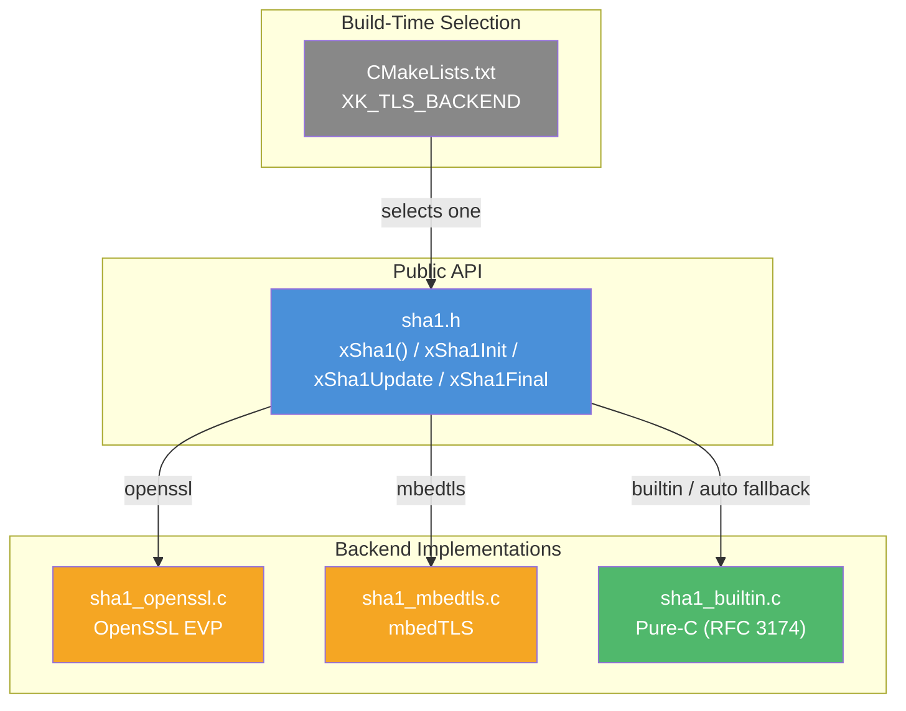
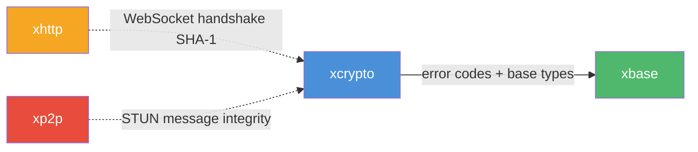

# xcrypto — Cryptographic Primitives

## Introduction

**xcrypto** is xKit's cryptographic module, providing common hash functions and related primitives for use by higher-level modules. It currently offers a SHA-1 implementation with both a one-shot convenience function and a streaming (init/update/final) API.

The underlying implementation is selected at build time based on the `XK_TLS_BACKEND` CMake option, supporting three backends: **OpenSSL**, **mbedTLS**, and a **pure-C builtin fallback**. This allows xcrypto to leverage hardware-accelerated crypto when available while remaining fully functional on minimal environments with zero external dependencies.

## Design Philosophy

1. **Backend Abstraction** — A single public header (`sha1.h`) exposes a unified API regardless of the underlying crypto library. The backend is selected at build time via `XK_TLS_BACKEND`, keeping runtime overhead at zero and the public interface stable.

2. **Zero Heap Allocation** — The `xSha1Ctx` structure uses a fixed-size opaque buffer (128 bytes) large enough to hold any backend's internal state. No dynamic allocation is needed for hashing operations.

3. **Dual API Surface** — Every algorithm provides both a one-shot function (`xSha1()`) for simple use cases and a streaming API (`xSha1Init` / `xSha1Update` / `xSha1Final`) for incremental hashing of large or chunked data.

4. **Compile-Time Static Assertions** — Each backend implementation uses `_Static_assert` to verify at compile time that the opaque buffer is large enough for its internal state, catching size mismatches before they become runtime bugs.

5. **Consistent Error Handling** — All functions return `xErrno` codes and validate arguments defensively, following the same error convention used throughout xKit.

## Architecture



## Backend Selection

The SHA-1 backend is chosen via the `XK_TLS_BACKEND` CMake variable:

| `XK_TLS_BACKEND` | Backend | External Dependency |
| --- | --- | --- |
| `openssl` | OpenSSL EVP API | `libssl`, `libcrypto` |
| `mbedtls` | mbedTLS | `libmbedtls` |
| `auto` | Auto-detect: OpenSSL → mbedTLS → builtin | Best available |
| *(anything else)* | Pure-C builtin (RFC 3174) | None |

When set to `auto`, CMake probes for OpenSSL first, then mbedTLS, and falls back to the builtin implementation if neither is found.

## Sub-Module Overview

| Header | Description |
| --- | --- |
| [`sha1.h`](sha1.md) | SHA-1 hash — one-shot and streaming API with pluggable backend |

## API Reference

### Constants

| Constant | Value | Description |
| --- | --- | --- |
| `XCRYPTO_SHA1_DIGEST_SIZE` | 20 | SHA-1 digest length in bytes |
| `XCRYPTO_SHA1_BLOCK_SIZE` | 64 | SHA-1 internal block size in bytes |

### Functions

| Function | Description |
| --- | --- |
| `xSha1(data, len, digest)` | One-shot: compute SHA-1 of a buffer |
| `xSha1Init(ctx)` | Initialize a streaming SHA-1 context |
| `xSha1Update(ctx, data, len)` | Feed data into the context incrementally |
| `xSha1Final(ctx, digest)` | Finalize and produce the 20-byte digest |

All functions return `xErrno_Ok` on success. After `xSha1Final`, the context must be re-initialized before reuse.

## Quick Start

### One-Shot Hashing

```c
#include <stdio.h>
#include <string.h>
#include <xcrypto/sha1.h>

int main(void) {
    const char *msg = "Hello, World!";
    uint8_t digest[XCRYPTO_SHA1_DIGEST_SIZE];

    xErrno err = xSha1((const uint8_t *)msg, strlen(msg), digest);
    if (err != xErrno_Ok) return 1;

    printf("SHA-1: ");
    for (int i = 0; i < XCRYPTO_SHA1_DIGEST_SIZE; i++) {
        printf("%02x", digest[i]);
    }
    printf("\n");
    return 0;
}
```

### Streaming (Incremental) Hashing

```c
#include <stdio.h>
#include <string.h>
#include <xcrypto/sha1.h>

int main(void) {
    xSha1Ctx ctx;
    uint8_t digest[XCRYPTO_SHA1_DIGEST_SIZE];

    xSha1Init(&ctx);
    xSha1Update(&ctx, (const uint8_t *)"Hello, ", 7);
    xSha1Update(&ctx, (const uint8_t *)"World!", 6);
    xSha1Final(&ctx, digest);

    printf("SHA-1: ");
    for (int i = 0; i < XCRYPTO_SHA1_DIGEST_SIZE; i++) {
        printf("%02x", digest[i]);
    }
    printf("\n");
    return 0;
}
```

Compile with:

```bash
gcc -o sha1_example sha1_example.c -I/path/to/xkit -lxcrypto -lxbase
```

## Relationship with Other Modules



- **xbase** — xcrypto depends on xbase for `xErrno` error codes, `XDEF_STRUCT`, and `XCAPI` macros.
- **xhttp** — The WebSocket handshake (RFC 6455) requires SHA-1 to compute the `Sec-WebSocket-Accept` header. xhttp may use xcrypto for this.
- **xp2p** — STUN message integrity (RFC 5389) uses HMAC-SHA1. xp2p may use xcrypto's SHA-1 as a building block.
