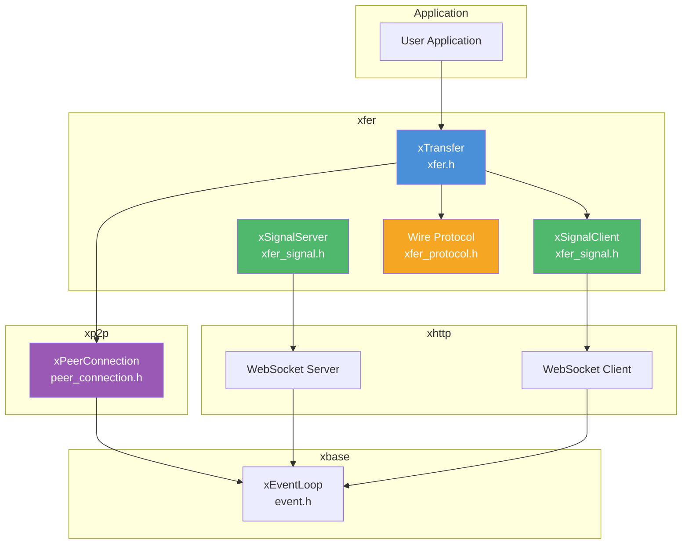
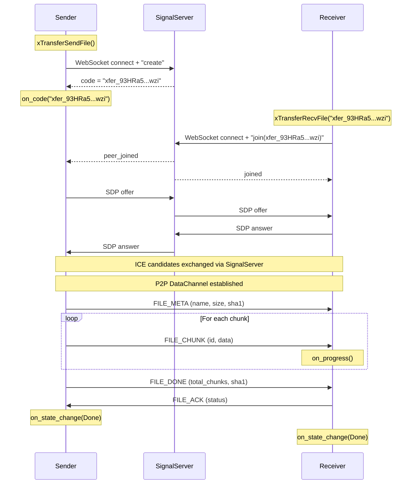
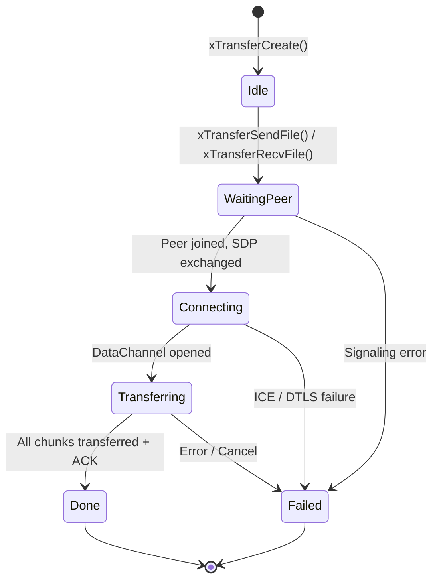

# xfer — P2P File Transfer

## Introduction

**xfer** is xKit's peer-to-peer file transfer module, providing a high-level API for sending and receiving files over WebRTC DataChannels. Built on top of [xp2p](../xp2p/README.md), it handles the full transfer pipeline — signaling server rendezvous, SDP/ICE exchange, file chunking, integrity verification (SHA-1), progress reporting, and resume support — all driven by the xKit event loop.

The module ships with a built-in signaling server (`xSignalServer`) and client (`xSignalClient`) that handle session creation, peer pairing, and SDP/ICE relay over WebSocket. Applications only need to provide a file path (sender) or a transfer code (receiver) to initiate a transfer. The transfer code (e.g. `xfer_93HRa5avgVymWxsKP4Bhfui7EJLVKJe6NT2ZPYMuvwzi`) encodes both the session ID and the signaling server address, so the receiver does not need to know the server URL separately.

## Design Philosophy

1. **Zero-Configuration P2P** — The sender registers with a signaling server and receives a transfer code that encodes both the session ID and the signaling server address. The receiver only needs this code to connect — no manual server configuration required. NAT traversal, encryption, and chunking are handled automatically.

2. **Event-Driven, Single-Threaded** — All callbacks (state changes, progress, errors) are invoked on the xKit event loop thread, consistent with the rest of the xKit stack.

3. **Resumable Transfers** — The wire protocol includes a `FILE_RESUME` message with a bitmap of received chunks, enabling the sender to skip already-transferred chunks after a reconnection.

4. **Integrity Verification** — Files are SHA-1 hashed before transfer. The receiver verifies the hash after reassembly, detecting corruption or incomplete transfers.

5. **Layered Architecture** — The module is cleanly separated into three layers: the high-level `xTransfer` API, the signaling layer (`xSignalServer` / `xSignalClient`), and the binary wire protocol (`xfer_protocol.h`). Each layer can be used independently.

## Architecture

### Component Stack



### Transfer Flow



### Wire Protocol

All messages are sent over the WebRTC DataChannel in binary. Multi-byte integers use network byte order (big-endian).

```text
┌──────────────────────────────────────────────────────────────┐
│  FILE_META   │ type(1B) │ name_len(2B) │ name │ size(8B)    │
│              │          │ chunk_sz(4B) │ sha1(20B)           │
├──────────────────────────────────────────────────────────────┤
│  FILE_CHUNK  │ type(1B) │ chunk_id(4B) │ data(variable)     │
├──────────────────────────────────────────────────────────────┤
│  FILE_DONE   │ type(1B) │ total_chunks(4B) │ sha1(20B)      │
├──────────────────────────────────────────────────────────────┤
│  FILE_ACK    │ type(1B) │ status(1B)                        │
├──────────────────────────────────────────────────────────────┤
│  FILE_RESUME │ type(1B) │ total_chunks(4B) │ bitmap_len(4B) │
│              │ bitmap(variable)                              │
└──────────────────────────────────────────────────────────────┘
```

| Message Type | Value | Direction | Description |
| --- | --- | --- | --- |
| `XFER_MSG_FILE_META` | 0x01 | Sender → Receiver | File metadata (name, size, chunk size, SHA-1) |
| `XFER_MSG_FILE_CHUNK` | 0x02 | Sender → Receiver | File data chunk |
| `XFER_MSG_FILE_DONE` | 0x03 | Sender → Receiver | Transfer complete signal |
| `XFER_MSG_ACK` | 0x04 | Receiver → Sender | Acknowledgement (success/failure) |
| `XFER_MSG_ERROR` | 0x05 | Both | Error message |
| `XFER_MSG_CANCEL` | 0x06 | Both | Cancel transfer |
| `XFER_MSG_FILE_RESUME` | 0x07 | Receiver → Sender | Resume bitmap for skipping received chunks |

## Sub-Module Overview

| Header | Component | Description |
| --- | --- | --- |
| `xfer.h` | `xTransfer` | High-level file transfer API — send/receive files with progress and state callbacks |
| `xfer_signal.h` | `xSignalServer` | WebSocket-based signaling server for session management and SDP/ICE relay |
| `xfer_signal.h` | `xSignalClient` | Signaling client for connecting to the server and exchanging SDP/ICE |
| `xfer_protocol.h` | Wire Protocol | Binary message encoding/decoding for file metadata, chunks, and control messages |

## API Reference

### Constants

| Constant | Value | Description |
| --- | --- | --- |
| `XFER_DEFAULT_CHUNK_SIZE` | 64 KB | Default chunk size for file transfer |
| `XFER_MAX_FILENAME_LEN` | 256 | Maximum file name length |
| `XFER_MAX_CODE_LEN` | 128 | Maximum session code length |

### Types

| Type | Description |
| --- | --- |
| `xTransfer` | Opaque handle to a transfer session |
| `xTransferState` | Enum: `Idle`, `WaitingPeer`, `Connecting`, `Transferring`, `Done`, `Failed` |
| `xTransferRole` | Enum: `Sender`, `Receiver` |
| `xTransferConf` | Configuration struct with P2P settings, signaling URL, and callbacks |

### Callbacks

| Callback | Signature | Description |
| --- | --- | --- |
| `xTransferOnStateChange` | `void (*)(xTransfer, xTransferState, void *ctx)` | State transition notification |
| `xTransferOnProgress` | `void (*)(xTransfer, uint64_t transferred, uint64_t total, void *ctx)` | Progress reporting |
| `xTransferOnCode` | `void (*)(xTransfer, const char *code, void *ctx)` | Sender receives session code |
| `xTransferOnFileMeta` | `void (*)(xTransfer, const char *filename, uint64_t filesize, void *ctx)` | Receiver learns file metadata |
| `xTransferOnError` | `void (*)(xTransfer, xErrno, const char *msg, void *ctx)` | Error notification |
| `xTransferOnIceCandidate` | `void (*)(xTransfer, const char *candidate, void *ctx)` | ICE candidate gathered |

### Transfer Lifecycle

| Function | Signature | Description |
| --- | --- | --- |
| `xTransferCreate` | `xTransfer xTransferCreate(xEventLoop loop, const xTransferConf *conf)` | Create a transfer session |
| `xTransferDestroy` | `void xTransferDestroy(xTransfer xfer)` | Destroy and free all resources |
| `xTransferSendFile` | `xErrno xTransferSendFile(xTransfer xfer, const char *filepath)` | Start sending a file |
| `xTransferRecvFile` | `xErrno xTransferRecvFile(xTransfer xfer, const char *code, const char *dest_dir)` | Start receiving a file |
| `xTransferGetState` | `xTransferState xTransferGetState(xTransfer xfer)` | Query current state |
| `xTransferGetRole` | `xTransferRole xTransferGetRole(xTransfer xfer)` | Query role (sender/receiver) |
| `xTransferCancel` | `void xTransferCancel(xTransfer xfer)` | Cancel an in-progress transfer |

### SDP Negotiation (Advanced)

These functions are used internally by the signaling client but are exposed for manual SDP exchange scenarios:

| Function | Signature | Description |
| --- | --- | --- |
| `xTransferCreateOffer` | `char *xTransferCreateOffer(xTransfer xfer)` | Create SDP offer (sender, caller frees) |
| `xTransferCreateAnswer` | `char *xTransferCreateAnswer(xTransfer xfer)` | Create SDP answer (receiver, caller frees) |
| `xTransferSetLocalDescription` | `xErrno xTransferSetLocalDescription(xTransfer xfer, const char *sdp)` | Set local SDP |
| `xTransferSetRemoteDescription` | `xErrno xTransferSetRemoteDescription(xTransfer xfer, const char *sdp)` | Set remote SDP |
| `xTransferGatherCandidates` | `xErrno xTransferGatherCandidates(xTransfer xfer)` | Start ICE gathering |

### Signaling Server

| Function | Signature | Description |
| --- | --- | --- |
| `xSignalServerCreate` | `xSignalServer xSignalServerCreate(xEventLoop loop, const xSignalServerConf *conf)` | Create and start a signaling server |
| `xSignalServerDestroy` | `void xSignalServerDestroy(xSignalServer server)` | Destroy the server |

### Signaling Client

| Function | Signature | Description |
| --- | --- | --- |
| `xSignalClientCreate` | `xSignalClient xSignalClientCreate(xEventLoop loop, const xSignalClientConf *conf)` | Create and connect to signaling server |
| `xSignalClientDestroy` | `void xSignalClientDestroy(xSignalClient client)` | Destroy the client |
| `xSignalClientSendOffer` | `xErrno xSignalClientSendOffer(xSignalClient client, const char *sdp)` | Send SDP offer |
| `xSignalClientSendAnswer` | `xErrno xSignalClientSendAnswer(xSignalClient client, const char *sdp)` | Send SDP answer |
| `xSignalClientSendCandidate` | `xErrno xSignalClientSendCandidate(xSignalClient client, const char *candidate)` | Send ICE candidate |

## State Machine



## Quick Start

### Sending a File

```c
#include <xbase/event.h>
#include <xfer/xfer.h>

#include <signal.h>
#include <stdio.h>
#include <string.h>

static xEventLoop g_loop;
static xTransfer  g_xfer;

static void on_state_change(xTransfer xfer, xTransferState state, void *ctx) {
  (void)xfer; (void)ctx;
  switch (state) {
  case xTransferState_Done:
    printf("\n✅ Transfer complete!\n");
    xEventLoopStop(g_loop);
    return;
  case xTransferState_Failed:
    printf("\n❌ Transfer failed.\n");
    xEventLoopStop(g_loop);
    return;
  default: break;
  }
}

static void on_progress(xTransfer xfer, uint64_t transferred,
                        uint64_t total, void *ctx) {
  (void)xfer; (void)ctx;
  printf("\rProgress: %llu / %llu bytes (%.1f%%)   ",
         (unsigned long long)transferred, (unsigned long long)total,
         total > 0 ? 100.0 * transferred / total : 0.0);
  fflush(stdout);
}

static void on_code(xTransfer xfer, const char *code, void *ctx) {
  (void)xfer; (void)ctx;
  printf("Share this code with the receiver:\n  %s\n", code);
}

int main(void) {
  g_loop = xEventLoopCreate();

  xTransferConf conf;
  memset(&conf, 0, sizeof(conf));
  conf.stun_server     = "stun.l.google.com:19302";
  conf.signal_server   = "ws://127.0.0.1:8080/ws";
  conf.on_state_change = on_state_change;
  conf.on_progress     = on_progress;
  conf.on_code         = on_code;

  g_xfer = xTransferCreate(g_loop, &conf);
  xTransferSendFile(g_xfer, "myfile.bin");

  xEventLoopRun(g_loop);

  xTransferDestroy(g_xfer);
  xEventLoopDestroy(g_loop);
  return 0;
}
```

### Receiving a File

```c
#include <xbase/event.h>
#include <xfer/xfer.h>

#include <stdio.h>
#include <string.h>

static xEventLoop g_loop;
static xTransfer  g_xfer;

static void on_state_change(xTransfer xfer, xTransferState state, void *ctx) {
  (void)xfer; (void)ctx;
  switch (state) {
  case xTransferState_Done:
    printf("\n✅ File received!\n");
    xEventLoopStop(g_loop);
    return;
  case xTransferState_Failed:
    printf("\n❌ Transfer failed.\n");
    xEventLoopStop(g_loop);
    return;
  default: break;
  }
}

static void on_progress(xTransfer xfer, uint64_t transferred,
                        uint64_t total, void *ctx) {
  (void)xfer; (void)ctx;
  printf("\rProgress: %llu / %llu bytes (%.1f%%)   ",
         (unsigned long long)transferred, (unsigned long long)total,
         total > 0 ? 100.0 * transferred / total : 0.0);
  fflush(stdout);
}

static void on_file_meta(xTransfer xfer, const char *filename,
                         uint64_t filesize, void *ctx) {
  (void)xfer; (void)ctx;
  printf("Incoming: \"%s\" (%llu bytes)\n",
         filename, (unsigned long long)filesize);
}

int main(void) {
  g_loop = xEventLoopCreate();

  xTransferConf conf;
  memset(&conf, 0, sizeof(conf));
  conf.stun_server     = "stun.l.google.com:19302";
  conf.on_state_change = on_state_change;
  conf.on_progress     = on_progress;
  conf.on_file_meta    = on_file_meta;

  g_xfer = xTransferCreate(g_loop, &conf);
  // The transfer code encodes the signaling server address,
  // so there is no need to set conf.signal_server for the receiver.
  xTransferRecvFile(g_xfer, "xfer_93HRa5avgVymWxsKP4Bhfui7EJLVKJe6NT2ZPYMuvwzi", "/tmp/received");

  xEventLoopRun(g_loop);

  xTransferDestroy(g_xfer);
  xEventLoopDestroy(g_loop);
  return 0;
}
```

### Running the Examples

The `examples/` directory includes complete sender and receiver programs:

```bash
# Terminal 1: Start the signaling server (built-in)
# The signaling server is started automatically by xfer when needed,
# or you can run a standalone one.
./xfer_signal -p 8080

# Terminal 2: Send a file
./xfer_send -f myfile.bin -u ws://127.0.0.1:8080/ws

# Terminal 3: Receive the file (use the code printed by the sender)
# The transfer code already contains the signaling server address,
# so the receiver does not need to specify -u.
./xfer_recv -c xfer_93HRa5avgVymWxsKP4Bhfui7EJLVKJe6NT2ZPYMuvwzi -d /tmp/received
```

Command-line options:

| Option | `xfer_send` | `xfer_recv` | Description |
| --- | --- | --- | --- |
| `-f <file>` | ✅ Required | — | File to send |
| `-c <code>` | — | ✅ Required | Transfer code from sender (encodes session ID + signaling server URL) |
| `-d <dir>` | — | Optional | Destination directory (default: `/tmp/xfer_recv`) |
| `-u <url>` | ✅ Required | Optional | Signaling server URL (receiver extracts it from the code) |
| `-s <host:port>` | Optional | Optional | STUN server (default: `stun.l.google.com:19302`) |
| `-6` | Optional | Optional | Enable IPv6 candidates |

## Relationship with Other Modules

- **[xp2p](../xp2p/README.md)** — Uses `xPeerConnection` for the full WebRTC DataChannel stack (ICE + DTLS + SCTP + DataChannel). xfer creates a PeerConnection internally and sends/receives file data over a DataChannel.
- **[xhttp](../xhttp/README.md)** — The signaling server and client use xhttp's WebSocket server and client for SDP/ICE relay.
- **[xbase](../xbase/README.md)** — Uses [`xEventLoop`](../xbase/event.md) for I/O multiplexing and the single-threaded callback model.
- **[xcrypto](../xcrypto/README.md)** — Uses SHA-1 for file integrity verification.
- **[xnet](../xnet/README.md)** — Uses URL parsing for signaling server addresses.
