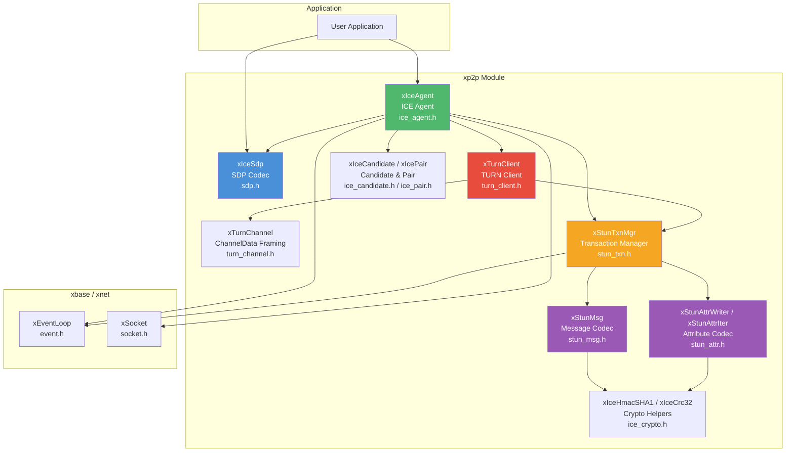

# xp2p — P2P Connectivity

## Introduction

**xp2p** is xKit's peer-to-peer connectivity module, implementing the **ICE** (Interactive Connectivity Establishment) protocol suite for NAT traversal and direct UDP transport between two peers. It includes a full STUN/TURN client stack, SDP encoding/decoding, and an event-driven ICE agent that handles candidate gathering, connectivity checks, and nomination.

## Design Philosophy

1. **Single-Threaded, Event-Driven** — The entire ICE state machine runs on the xKit event loop. All callbacks (state changes, candidates, data) are invoked on the event loop thread, keeping the async programming model consistent with the rest of xKit.

2. **RFC Compliance** — Implements ICE (RFC 8445), STUN (RFC 5389), and TURN (RFC 5766) with proper message integrity (HMAC-SHA1), fingerprint (CRC-32), and exponential-backoff retransmission.

3. **Zero External Crypto Dependencies** — All cryptographic primitives (MD5, SHA-1, HMAC-SHA1, CRC-32) are built-in, requiring no external libraries like OpenSSL for the P2P stack itself.

4. **Layered Architecture** — The module is cleanly layered: low-level STUN message codec → STUN transaction manager → TURN client → ICE agent. Each layer can be used independently.

## Architecture



## Sub-Module Overview

| Header | Component | Description | Doc |
| --- | --- | --- | --- |
| `ice_agent.h` | `xIceAgent` | Full ICE agent — gathering, checks, nomination, data send/recv | [ice.md](ice.md) |
| `ice_candidate.h` | `xIceCandidate` | Candidate representation and priority calculation (RFC 8445 §5.1.2.1) | — |
| `ice_pair.h` | `xIcePair` | Candidate pair priority and sorting (RFC 8445 §6.1.2.3) | — |
| `sdp.h` | `xIceSdp` | SDP offer/answer encoding and decoding (RFC 4566) | — |
| `stun_msg.h` | `xStunMsg` | STUN message header encoding/decoding (RFC 5389) | — |
| `stun_attr.h` | `xStunAttrWriter` / `xStunAttrIter` | STUN attribute encoding/decoding with integrity and fingerprint | — |
| `stun_txn.h` | `xStunTxnMgr` | STUN transaction manager with exponential-backoff retransmission | — |
| `turn_client.h` | `xTurnClient` | TURN allocation, permissions, channel bindings, and relay data (RFC 5766) | — |
| `turn_channel.h` | `xTurnChannel` | TURN ChannelData framing (RFC 5766 §11) | — |
| `ice_crypto.h` | `xIceHmacSHA1` / `xIceCrc32` | Built-in HMAC-SHA1, SHA-1, MD5, CRC-32 | — |

## Quick Start

```c
#include <xbase/event.h>
#include <xp2p/ice_agent.h>

#include <stdio.h>
#include <string.h>

static void on_state(xIceAgent agent, xIceState state, void *arg) {
    printf("ICE state: %d\n", state);
    if (state == xIceState_Connected) {
        const char *msg = "Hello P2P!";
        xIceAgentSend(agent, (const uint8_t *)msg, strlen(msg));
    }
}

static void on_candidate(xIceAgent agent, const char *sdp, void *arg) {
    if (sdp) {
        printf("candidate: %s\n", sdp);
    } else {
        printf("gathering complete\n");
        // Exchange SDP with remote peer here
    }
}

static void on_data(xIceAgent agent, const uint8_t *data,
                    size_t len, void *arg) {
    printf("received: %.*s\n", (int)len, (const char *)data);
}

int main(void) {
    xEventLoop loop = xEventLoopCreate();

    xIceConf conf = {0};
    conf.role            = xIceRole_Controlling;
    conf.stun_server     = "stun.l.google.com:19302";
    conf.enable_ipv6     = false;
    conf.on_state_change = on_state;
    conf.on_candidate    = on_candidate;
    conf.on_data         = on_data;

    xIceAgent agent = xIceAgentCreate(loop, &conf);
    xIceAgentGather(agent);

    // After gathering, exchange SDP with remote peer:
    //   char *offer = xIceAgentCreateOffer(agent);
    //   // send offer to remote, receive answer
    //   xIceAgentSetRemoteDescription(agent, remote_answer);

    xEventLoopRun(loop);

    xIceAgentDestroy(agent);
    xEventLoopDestroy(loop);
    return 0;
}
```

## Relationship with Other Modules

- **xbase** — The ICE agent depends on [`xEventLoop`](../xbase/event.md) for async I/O and timers, and [`xSocket`](../xbase/socket.md) for UDP socket management.
- **xnet** — Links against xnet for shared networking types.
- **Application** — The ICE agent exposes a callback-driven API. Applications create an agent, start gathering, exchange SDP with the remote peer (via a signaling channel), and send/receive data once connected.
