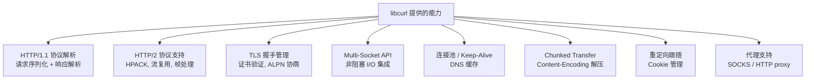
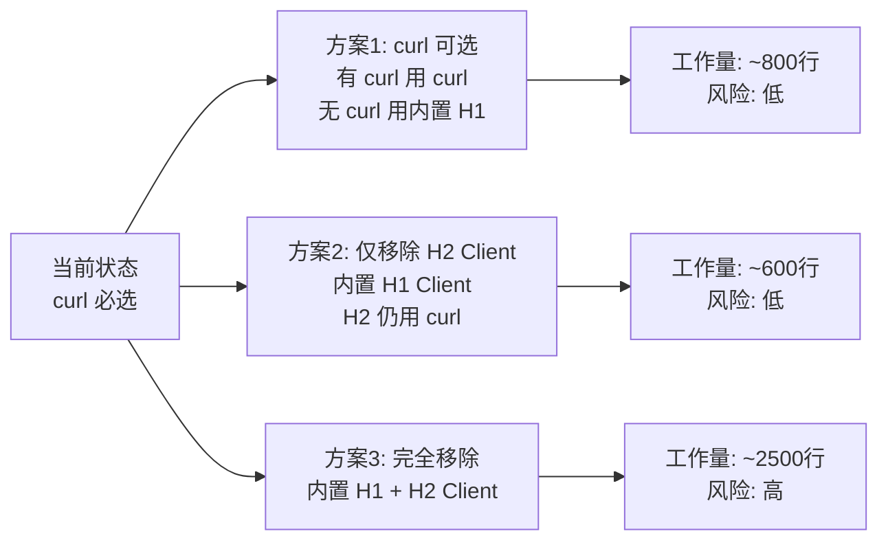

# 移除 libcurl 依赖的可行性与收益分析

## 一、当前 libcurl 的使用范围

libcurl **仅被 HTTP Client 部分使用**，涉及以下文件：

| 文件 | 依赖程度 | 说明 |
| ------ | ---------- | ------ |
| `client.c` | **核心** | 整个文件围绕 `curl_multi` / `curl_easy` 构建 |
| `client.h` | **API 层** | `xHttpResponse` 暴露了 `curl_code` / `curl_error` |
| `client_private.h` | **核心** | `CURL *easy`、`CURLM *multi`、`CURLcode`、`CURL_ERROR_SIZE` |
| `sse.c` | **核心** | SSE 流式传输完全基于 curl write callback |
| `xhttp/CMakeLists.txt` | 构建 | `Libcurl::Libcurl` 链接 |
| `CMakeLists.txt` (顶层) | 构建 | 整个 xhttp 模块的编译以 `Libcurl_FOUND` 为前提 |

**不依赖 curl 的部分**（占 xhttp 模块的大部分）：

- HTTP Server（`server.c`、`proto_h1.c`、`proto_h2.c`）→ 用 llhttp + nghttp2
- WebSocket Server（`ws.c`、`ws_serve.c`、`ws_handshake_server.c`）
- WebSocket Client（`ws_connect.c`、`ws_handshake_client.c`）→ 纯 socket + xEventLoop
- Transport 层（`transport_*.c`）→ 纯 OpenSSL / mbedTLS
- WS Frame / Deflate / Crypto

## 二、libcurl 提供了什么

libcurl 在 xhttp client 中承担了以下职责：

## 三、替换方案分析

如果移除 libcurl，需要**自己实现 HTTP Client 协议栈**：

| 需要自建的组件 | 复杂度 | 说明 |
| --------------- | -------- | ------ |
| HTTP/1.1 请求序列化 | ⭐ 低 | 手动拼 `GET /path HTTP/1.1\r\n...` |
| HTTP/1.1 响应解析 | ⭐⭐ 中 | 可复用已有的 llhttp（server 已在用） |
| Chunked Transfer Decoding | ⭐⭐ 中 | llhttp 可处理 |
| TLS 客户端握手 | ⭐⭐ 中 | WS Client 已有 `transport_tls_client_openssl/mbedtls`，可复用 |
| HTTP/2 客户端 | ⭐⭐⭐⭐ 高 | 需要 nghttp2 的 client session API（server 已用 nghttp2，但 client 模式不同） |
| 连接池 / Keep-Alive | ⭐⭐⭐ 高 | 需要自己管理连接复用、idle timeout |
| Multi-Socket 事件集成 | ⭐⭐ 中 | 已有 xEventLoop，但需要自己管理连接状态机 |
| DNS 异步解析 | ⭐⭐⭐ 高 | curl 内置 c-ares 集成，自建需要额外依赖或阻塞 |
| 重定向 / Cookie / Proxy | ⭐⭐ 中 | 按需实现 |

## 四、收益分析

### ✅ 收益

1. **减少外部依赖**
   - 当前 xhttp 模块需要 libcurl（~600KB 动态库），移除后减少一个系统级依赖
   - 嵌入式 / 交叉编译场景更友好（libcurl 的交叉编译配置较复杂）

2. **统一 TLS 管理**
   - 目前 HTTP Client 的 TLS 由 curl 内部管理（`CURLOPT_CAINFO` 等），与 xnet/xhttp 其他部分的 `xTlsCtx` 体系割裂
   - 移除后可统一使用 `xTlsCtx` 共享模式，与 TCP/WS Client/HTTP Server 一致

3. **消除 API 泄漏**
   - `xHttpResponse` 中的 `curl_code` / `curl_error` 是 curl 特有概念，暴露给用户不够抽象
   - 移除后可用 `xErrno` 统一错误体系

4. **减小二进制体积**
   - 对于只用 server 或 WS 的场景，不再需要链接 curl

5. **更精细的控制**
   - 连接池策略、超时行为、buffer 管理等可以完全自定义

### ❌ 代价

1. **工作量巨大**（估算 **2000-3000 行**新代码）
   - HTTP/1.1 Client 协议栈：~500 行
   - HTTP/2 Client（nghttp2 client session）：~800 行
   - 连接池 + Keep-Alive 管理：~500 行
   - SSE 重新集成：~300 行
   - DNS 解析：~200 行（或引入 c-ares）
   - 测试重写：~500 行

2. **HTTP/2 Client 是最大难点**
   - nghttp2 的 client API 与 server API 差异大，需要处理 SETTINGS、WINDOW_UPDATE、流优先级等
   - curl 内部对 nghttp2 client 做了大量边界处理

3. **失去 curl 的成熟度**
   - libcurl 经过 25+ 年打磨，处理了无数 HTTP 边界情况（畸形响应、各种 Transfer-Encoding、代理认证等）
   - 自建实现短期内很难达到同等健壮性

4. **维护负担增加**
   - HTTP 协议的 edge case 很多，自建意味着长期维护成本

## 五、折中方案

如果目标是**减少依赖但不完全重写**，有几个渐进路径：

**推荐方案1**：让 curl 变为**可选依赖**

- 新增一个轻量的内置 HTTP/1.1 Client（基于已有的 llhttp + `transport_tls_client` + xEventLoop）
- 有 curl 时用 curl（支持 H2、连接池等高级特性）
- 无 curl 时 fallback 到内置 H1 Client（覆盖 80% 的使用场景）
- HTTP Server、WS Server/Client 完全不受影响（它们本来就不依赖 curl）

这样可以：

- 让 xhttp 模块在**无 curl 环境**下也能编译（server + ws + 基础 client）
- 保留 curl 作为增强选项（H2 client、连接池、代理等）
- 统一 TLS 管理（内置 client 用 `xTlsCtx`）
- 逐步迁移，风险可控

## 六、结论

| 维度 | 完全移除 | 可选依赖（推荐） |
| ------ | --------- | ----------------- |
| 工作量 | ~2500 行 + 测试重写 | ~800 行 |
| 风险 | 高（H2 client 复杂） | 低（H1 only，复用现有组件） |
| 收益 | 零外部依赖 | 无 curl 也能用，有 curl 更强 |
| API 变化 | 需要重新设计 Response | 可以抽象一层，渐进迁移 |
| 时间 | 2-3 周 | 3-5 天 |

**建议**：先做方案1（curl 可选），把 HTTP Server / WS 从 curl 依赖中解耦出来（实际上它们已经解耦了，只是 CMake 层面整个 xhttp 模块被 curl 门控了）。然后再根据实际需求决定是否进一步移除 curl。
