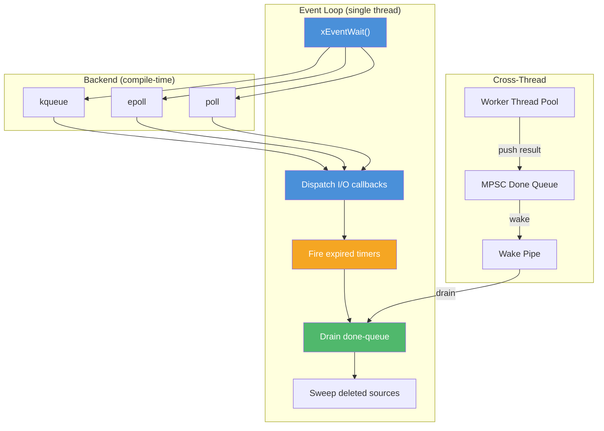

<!-- markdownlint-disable MD041 -->
[xKit](../../README.md) > [xbase](README.md) > event.h

# event.h — Cross-Platform Event Loop

## Introduction

`event.h` provides a cross-platform, edge-triggered event loop abstraction for I/O multiplexing. It unifies three OS-specific backends — **kqueue** (macOS/BSD), **epoll** (Linux), and **poll** (POSIX fallback) — behind a single API. The event loop is the central coordination point in xbase: it monitors file descriptors for readiness, dispatches timer callbacks, offloads CPU-bound work to thread pools, and watches for POSIX signals — all from a single thread.

## Design Philosophy

1. **Edge-Triggered Everywhere** — All three backends operate in edge-triggered mode. kqueue uses `EV_CLEAR`, epoll uses `EPOLLET`, and poll emulates edge-triggered behavior by clearing the event mask after each notification (requiring the caller to re-arm via `xEventMod()`). This design encourages callers to drain fds completely, reducing spurious wakeups.

2. **Backend Selection at Compile Time** — The backend is chosen via preprocessor macros (`XK_HAS_KQUEUE`, `XK_HAS_EPOLL`), with poll as the universal fallback. This means zero runtime dispatch overhead.

3. **Integrated Timer Heap** — Rather than requiring a separate timer facility, the event loop embeds a min-heap of timer entries. `xEventWait()` automatically adjusts its timeout to fire the earliest timer, providing sub-millisecond timer resolution without a dedicated timer thread.

4. **Thread-Pool Offload** — `xEventLoopSubmit()` bridges the event loop and the task system: CPU-bound work runs on a worker thread, and the completion callback is dispatched on the event loop thread via a lock-free MPSC queue + wake pipe, ensuring single-threaded callback semantics.

5. **Self-Pipe Trick for Signals** — On epoll and poll backends, signal delivery uses the self-pipe trick (a `sigaction` handler writes to a pipe) rather than `signalfd`, avoiding the fragile requirement of blocking signals in every thread. On kqueue, `EVFILT_SIGNAL` is used natively.

## Architecture



### Event Loop Lifecycle

```mermaid
sequenceDiagram
    participant App
    participant Loop as xEventLoop
    participant Backend as kqueue/epoll/poll
    participant Timer as Timer Heap

    App->>Loop: xEventLoopCreate()
    App->>Loop: xEventAdd(fd, mask, callback)
    App->>Loop: xEventLoopTimerAfter(fn, 1000ms)
    App->>Loop: xEventLoopRun()

    loop Main Loop
        Loop->>Timer: Check earliest deadline
        Timer-->>Loop: timeout = min(user_timeout, timer_deadline)
        Loop->>Backend: wait(timeout)
        Backend-->>Loop: ready events
        Loop->>App: callback(fd, mask)
        Loop->>Timer: Pop & fire expired timers
        Loop->>Loop: Sweep deleted sources
    end

    App->>Loop: xEventLoopStop()
    App->>Loop: xEventLoopDestroy()
```

## Implementation Details

### Backend Architecture

Each backend is implemented in a separate `.c` file that provides the full public API:

| File | Backend | Trigger Mode | Selection |
| --- | --- | --- | --- |
| `event_kqueue.c` | kqueue | `EV_CLEAR` (native edge) | `#ifdef XK_HAS_KQUEUE` |
| `event_epoll.c` | epoll | `EPOLLET` (native edge) | `#ifdef XK_HAS_EPOLL` |
| `event_poll.c` | poll(2) | Emulated edge (mask cleared after dispatch) | Fallback |

All backends share a common base structure (`struct xEventLoop_`) defined in `event_private.h`, which contains:

- A dynamic source array with deferred deletion (sweep after dispatch)
- A wake pipe (non-blocking) for cross-thread wakeup
- A min-heap for builtin timers (protected by `timer_mu` mutex)
- A lock-free MPSC done-queue for offload completion callbacks
- Signal watch slots (up to `XK_SIGNAL_MAX = 64`)

### Deferred Source Deletion

When `xEventDel()` is called during a callback dispatch, the source is marked `deleted = 1` rather than freed immediately. After the dispatch batch completes, `source_array_sweep()` frees all deleted sources. This prevents use-after-free when multiple events reference the same source in a single `xEventWait()` call.

### Wake Pipe

A non-blocking pipe (`wake_rfd` / `wake_wfd`) is registered with the backend. `xEventWake()` writes a single byte to the write end; the event loop drains the read end and processes the done-queue. Multiple wakes before the next `xEventWait()` are coalesced (EAGAIN on a full pipe is treated as success).

### Timer Integration

Builtin timers are stored in a min-heap inside the event loop. Before each `xEventWait()` call, the effective timeout is clamped to the earliest timer deadline. After I/O dispatch, expired timers are popped and fired. Timer operations (`xEventLoopTimerAfter`, `xEventLoopTimerAt`, `xEventLoopTimerCancel`) are thread-safe, protected by `timer_mu`.

### Signal Handling

| Backend | Mechanism |
| --- | --- |
| kqueue | `EVFILT_SIGNAL` with `EV_CLEAR` — native kernel support |
| epoll | Self-pipe trick: `sigaction` handler writes to a per-signal pipe |
| poll | Self-pipe trick: same as epoll |

The self-pipe approach avoids `signalfd`'s requirement to block signals in all threads, which is fragile in the presence of third-party libraries and test frameworks.

## API Reference

### Types

| Type | Description |
| --- | --- |
| `xEventMask` | Bitmask enum: `xEvent_Read` (1), `xEvent_Write` (2), `xEvent_Timeout` (4) |
| `xEventFunc` | `void (*)(int fd, xEventMask mask, void *arg)` — I/O callback |
| `xEventTimerFunc` | `void (*)(void *arg)` — Timer callback |
| `xEventSignalFunc` | `void (*)(int signo, void *arg)` — Signal callback |
| `xEventDoneFunc` | `void (*)(void *arg, void *result)` — Offload completion callback |
| `xEventLoop` | Opaque handle to an event loop |
| `xEventSource` | Opaque handle to a registered event source |
| `xEventTimer` | Opaque handle to a builtin timer |

### Functions

#### Lifecycle

| Function | Signature | Thread Safety |
| --- | --- | --- |
| `xEventLoopCreate` | `xEventLoop xEventLoopCreate(void)` | Not thread-safe |
| `xEventLoopDestroy` | `void xEventLoopDestroy(xEventLoop loop)` | Not thread-safe |
| `xEventLoopRun` | `void xEventLoopRun(xEventLoop loop)` | Not thread-safe (call from one thread) |
| `xEventLoopStop` | `void xEventLoopStop(xEventLoop loop)` | **Thread-safe** |

#### I/O Sources

| Function | Signature | Thread Safety |
| --- | --- | --- |
| `xEventAdd` | `xEventSource xEventAdd(xEventLoop loop, int fd, xEventMask mask, xEventFunc fn, void *arg)` | Not thread-safe |
| `xEventMod` | `xErrno xEventMod(xEventLoop loop, xEventSource src, xEventMask mask)` | Not thread-safe |
| `xEventDel` | `xErrno xEventDel(xEventLoop loop, xEventSource src)` | Not thread-safe |
| `xEventWait` | `int xEventWait(xEventLoop loop, int timeout_ms)` | Not thread-safe |

#### Timers

| Function | Signature | Thread Safety |
| --- | --- | --- |
| `xEventLoopTimerAfter` | `xEventTimer xEventLoopTimerAfter(xEventLoop loop, xEventTimerFunc fn, void *arg, uint64_t delay_ms)` | **Thread-safe** |
| `xEventLoopTimerAt` | `xEventTimer xEventLoopTimerAt(xEventLoop loop, xEventTimerFunc fn, void *arg, uint64_t abs_ms)` | **Thread-safe** |
| `xEventLoopTimerCancel` | `xErrno xEventLoopTimerCancel(xEventLoop loop, xEventTimer timer)` | **Thread-safe** |

#### Cross-Thread

| Function | Signature | Thread Safety |
| --- | --- | --- |
| `xEventWake` | `xErrno xEventWake(xEventLoop loop)` | **Thread-safe** (signal-handler-safe) |
| `xEventLoopSubmit` | `xErrno xEventLoopSubmit(xEventLoop loop, xTaskGroup group, xTaskFunc work_fn, xEventDoneFunc done_fn, void *arg)` | **Thread-safe** |

#### Signal

| Function | Signature | Thread Safety |
| --- | --- | --- |
| `xEventLoopSignalWatch` | `xErrno xEventLoopSignalWatch(xEventLoop loop, int signo, xEventSignalFunc fn, void *arg)` | Not thread-safe |

#### Deprecated

| Function | Signature | Replacement |
| --- | --- | --- |
| `xEventLoopNowMs` | `uint64_t xEventLoopNowMs(void)` | `xMonoMs()` from `<xbase/time.h>` |

## Usage Examples

### Basic Event Loop with Timer

```c
#include <stdio.h>
#include <xbase/event.h>

static void on_timer(void *arg) {
    printf("Timer fired!\n");
    xEventLoopStop((xEventLoop)arg);
}

int main(void) {
    xEventLoop loop = xEventLoopCreate();
    if (!loop) return 1;

    // Fire after 500ms
    xEventLoopTimerAfter(loop, on_timer, loop, 500);

    xEventLoopRun(loop);
    xEventLoopDestroy(loop);
    return 0;
}
```

### Monitoring a File Descriptor

```c
#include <stdio.h>
#include <unistd.h>
#include <xbase/event.h>

static void on_readable(int fd, xEventMask mask, void *arg) {
    char buf[1024];
    ssize_t n;
    // Edge-triggered: must drain completely
    while ((n = read(fd, buf, sizeof(buf))) > 0) {
        fwrite(buf, 1, (size_t)n, stdout);
    }
    (void)mask;
    (void)arg;
}

int main(void) {
    xEventLoop loop = xEventLoopCreate();

    // Monitor stdin for readability
    xEventAdd(loop, STDIN_FILENO, xEvent_Read, on_readable, NULL);

    // Run for up to 10 seconds
    xEventLoopTimerAfter(loop, (xEventTimerFunc)xEventLoopStop, loop, 10000);
    xEventLoopRun(loop);

    xEventLoopDestroy(loop);
    return 0;
}
```

### Offloading Work to a Thread Pool

```c
#include <stdio.h>
#include <xbase/event.h>

static void *heavy_work(void *arg) {
    // Runs on a worker thread
    int *val = (int *)arg;
    *val *= 2;
    return val;
}

static void on_done(void *arg, void *result) {
    // Runs on the event loop thread
    int *val = (int *)result;
    printf("Result: %d\n", *val);
    (void)arg;
}

int main(void) {
    xEventLoop loop = xEventLoopCreate();
    int value = 21;

    xEventLoopSubmit(loop, NULL, heavy_work, on_done, &value);

    // Run briefly to process the completion
    xEventLoopTimerAfter(loop, (xEventTimerFunc)xEventLoopStop, loop, 1000);
    xEventLoopRun(loop);

    xEventLoopDestroy(loop);
    return 0;
}
```

## Use Cases

1. **Network Servers** — Register listening sockets and accepted connections with the event loop. Use edge-triggered callbacks to read/write data without blocking. Combine with `xSocket` for idle-timeout support.

2. **Timer-Driven State Machines** — Use `xEventLoopTimerAfter()` to schedule state transitions, retries, or heartbeat checks. The timer is integrated into the event loop, so no separate timer thread is needed.

3. **Hybrid I/O + CPU Workloads** — Use `xEventLoopSubmit()` to offload CPU-intensive parsing or compression to a thread pool, then process results on the event loop thread where I/O state is safely accessible.

## Best Practices

- **Always drain fds in edge-triggered mode.** Read/write until `EAGAIN` in every callback. Missing data means you won't be notified again until new data arrives.
- **Never block in callbacks.** The event loop is single-threaded; a blocking call stalls all I/O and timer processing. Offload heavy work via `xEventLoopSubmit()`.
- **Use `xEventLoopRun()` for the main loop.** It handles timer dispatch and stop-flag checking automatically. Only use `xEventWait()` directly if you need custom loop logic.
- **Cancel timers you no longer need.** Uncancelled timers hold memory until they fire. Use `xEventLoopTimerCancel()` to free them early.
- **Be aware of the poll backend's edge emulation.** On systems without kqueue or epoll, the poll backend clears the event mask after dispatch. You must call `xEventMod()` to re-arm.

## Comparison with Other Libraries

| Feature | xbase event.h | libevent | libev | libuv |
| --- | --- | --- | --- | --- |
| **Trigger Mode** | Edge-triggered only | Level (default), edge optional | Level + edge | Level-triggered |
| **Backends** | kqueue, epoll, poll | kqueue, epoll, poll, select, devpoll, IOCP | kqueue, epoll, poll, select, port | kqueue, epoll, poll, IOCP |
| **Timer Integration** | Built-in min-heap | Separate timer API | Built-in | Built-in |
| **Thread Pool** | Built-in (`xEventLoopSubmit`) | None (external) | None (external) | Built-in (`uv_queue_work`) |
| **Signal Handling** | Self-pipe / EVFILT_SIGNAL | evsignal | ev_signal | uv_signal |
| **API Style** | Opaque handles, C99 | Struct-based, C89 | Struct-based, C89 | Handle-based, C99 |
| **Binary Size** | ~15 KB | ~200 KB | ~50 KB | ~500 KB |
| **Dependencies** | None | None | None | None |
| **Windows Support** | Not yet | Yes (IOCP) | Yes (select) | Yes (IOCP) |
| **Design Goal** | Minimal building block | Full-featured framework | Minimal + performant | Cross-platform framework |

**Key Differentiator:** xbase's event loop is intentionally minimal — it provides the essential primitives (I/O, timers, signals, thread-pool offload) without buffered I/O, DNS resolution, or HTTP parsing. This makes it ideal as a foundation layer for higher-level libraries (like xhttp) rather than a standalone application framework.
