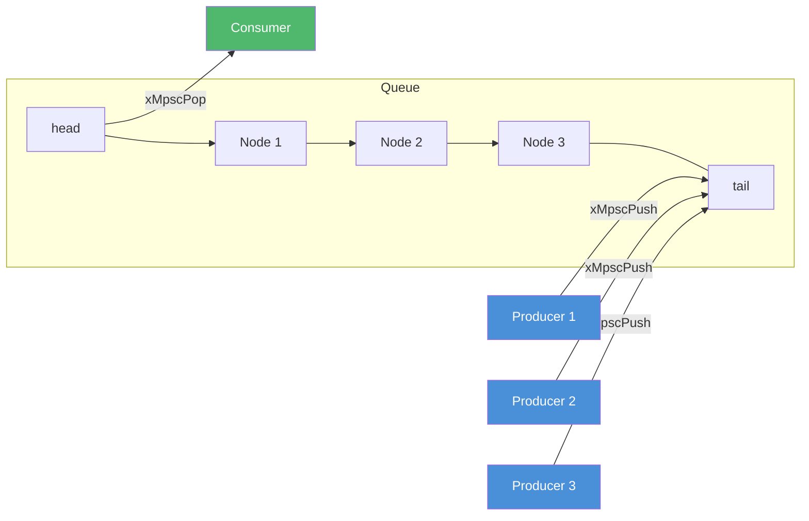
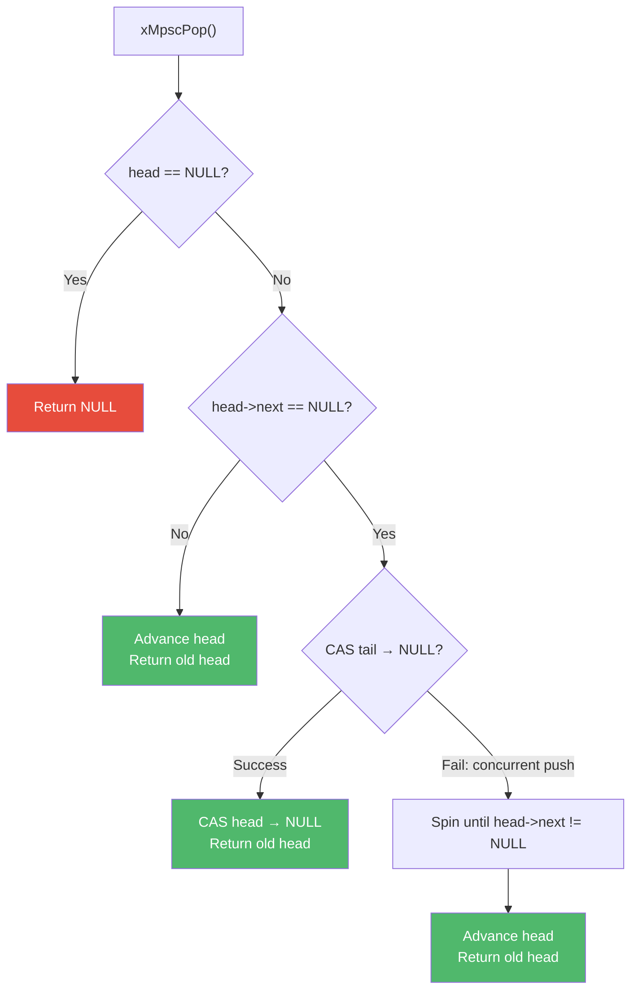

# mpsc.h — Lock-Free MPSC Queue

## Introduction

`mpsc.h` provides a lock-free, intrusive multi-producer single-consumer (MPSC) queue. Multiple threads can push nodes concurrently without locks, while a single consumer thread pops nodes. It is the backbone of xbase's poll-mode timer dispatch and the event loop's offload completion queue.

## Design Philosophy

1. **Intrusive Design** — Nodes embed an `xMpsc` struct directly, avoiding heap allocation per enqueue. This is critical for hot paths like timer expiry and offload completion where allocation overhead would be unacceptable.

2. **Lock-Free Push** — `xMpscPush()` uses a single atomic exchange (`xAtomicXchg`) on the tail pointer, making it wait-free for producers. No mutex, no CAS retry loop.

3. **Single-Consumer Pop** — `xMpscPop()` is designed for exactly one consumer thread. It uses atomic loads and a single CAS for the edge case of popping the last element. This simplification avoids the ABA problem that plagues multi-consumer designs.

4. **Minimal Memory Ordering** — The implementation uses `xAtomicAcqRel` for the exchange and `xAtomicAcquire`/`xAtomicRelease` for loads/stores, providing the minimum ordering needed for correctness without the overhead of sequential consistency.

## Architecture



## Implementation Details

### Data Structure

```c
XDEF_STRUCT(xMpsc) {
    xMpsc *volatile next;  // Pointer to next node
};
```

The queue is represented by two external pointers:

- `head` — Points to the oldest node (consumer reads from here)
- `tail` — Points to the newest node (producers append here)

### Push Algorithm

```c
void xMpscPush(xMpsc **head, xMpsc **tail, xMpsc *node) {
    node->next = NULL;
    xMpsc *prev_tail = xAtomicXchg(tail, node, xAtomicAcqRel);
    if (prev_tail)
        prev_tail->next = node;  // Link to previous tail
    else
        xAtomicStore(head, node, xAtomicRelease);  // First node
}
```

The key insight: `xAtomicXchg` atomically replaces the tail and returns the old value. If the old tail was non-NULL, we link it to the new node. If it was NULL (empty queue), we also update the head.

### Pop Algorithm

The pop operation handles three cases:

1. **Empty queue** — `head` is NULL, return NULL.
2. **Multiple nodes** — Advance `head` to `head->next`, return old head.
3. **Single node** — CAS `tail` to NULL. If CAS succeeds, also CAS `head` to NULL. If CAS fails (concurrent push in progress), spin until `head->next` becomes non-NULL.



### Memory Ordering Analysis

| Operation | Ordering | Reason |
| --- | --- | --- |
| `xAtomicXchg(tail, node)` | `AcqRel` | Acquire: see previous tail's `next` field. Release: make `node` visible to consumer. |
| `xAtomicStore(head, node)` | `Release` | Make the new head visible to the consumer. |
| `xAtomicLoad(head)` | `Acquire` | See the node written by the producer. |
| `xAtomicLoad(&head->next)` | `Acquire` | See the next pointer written by the producer. |
| `xAtomicCasStrong(tail, ...)` | `Release` | Publish the NULL tail to concurrent pushers. |

### Thread Safety

- `xMpscPush()` — **Thread-safe** (multiple producers).
- `xMpscPop()` — **Single-consumer only**. Must not be called concurrently.
- `xMpscEmpty()` — **Thread-safe** (atomic load).

## API Reference

### Types

| Type | Description |
| --- | --- |
| `xMpsc` | Intrusive queue node. Embed in your struct and use `xContainerOf()` to recover the enclosing struct. |

### Functions

| Function | Signature | Description | Thread Safety |
| --- | --- | --- | --- |
| `xMpscPush` | `void xMpscPush(xMpsc **head, xMpsc **tail, xMpsc *node)` | Push a node. Wait-free for producers. | **Thread-safe** (multi-producer) |
| `xMpscPop` | `xMpsc *xMpscPop(xMpsc **head, xMpsc **tail)` | Pop the oldest node. Returns NULL if empty. | **Single-consumer only** |
| `xMpscEmpty` | `bool xMpscEmpty(xMpsc **head)` | Check if the queue is empty. | **Thread-safe** |

## Usage Examples

### Basic Producer-Consumer

```c
#include <stdio.h>
#include <pthread.h>
#include <xbase/mpsc.h>
#include <xbase/base.h>

typedef struct {
    xMpsc node;   // Must embed xMpsc
    int   value;
} Message;

static xMpsc *g_head = NULL;
static xMpsc *g_tail = NULL;

static void *producer(void *arg) {
    Message *msg = (Message *)arg;
    xMpscPush(&g_head, &g_tail, &msg->node);
    return NULL;
}

int main(void) {
    Message msgs[] = {
        { .value = 1 },
        { .value = 2 },
        { .value = 3 },
    };

    // Push from multiple threads
    pthread_t threads[3];
    for (int i = 0; i < 3; i++)
        pthread_create(&threads[i], NULL, producer, &msgs[i]);
    for (int i = 0; i < 3; i++)
        pthread_join(threads[i], NULL);

    // Pop from single consumer
    xMpsc *node;
    while ((node = xMpscPop(&g_head, &g_tail)) != NULL) {
        Message *msg = xContainerOf(node, Message, node);
        printf("Received: %d\n", msg->value);
    }

    return 0;
}
```

## Use Cases

1. **Timer Poll Mode** — [`timer.h`](timer.md) uses the MPSC queue in poll mode to pass expired timer entries from the timer thread to the polling thread without locks.

2. **Event Loop Offload** — The event loop's offload mechanism ([`event.h`](event.md)) uses an MPSC queue to deliver completed work items from worker threads to the event loop thread.

3. **xlog Async Logger** — [`logger.h`](../xlog/logger.md) uses the MPSC queue to pass log messages from application threads to the logger's flush thread.

## Best Practices

- **Embed `xMpsc` in your struct.** Don't allocate `xMpsc` nodes separately. Use `xContainerOf()` to recover the enclosing struct after popping.
- **Initialize head and tail to NULL.** An empty queue has both pointers set to NULL.
- **Only one thread may call `xMpscPop()`.** The single-consumer constraint is fundamental to the algorithm's correctness. Violating it causes data races.
- **Don't access a node after pushing it.** Once pushed, the node is owned by the queue until popped.

## Comparison with Other Libraries

| Feature | xbase mpsc.h | Dmitry Vyukov MPSC | `concurrentqueue` (C++) | Linux `llist` |
| --- | --- | --- | --- | --- |
| **Design** | Intrusive, lock-free | Intrusive, lock-free | Non-intrusive, lock-free | Intrusive, lock-free |
| **Push** | Wait-free (1 atomic xchg) | Wait-free (1 atomic xchg) | Lock-free (CAS loop) | Wait-free (1 atomic xchg) |
| **Pop** | Lock-free (single consumer) | Lock-free (single consumer) | Lock-free (multi-consumer) | Batch pop (splice) |
| **Memory Ordering** | AcqRel / Acquire / Release | SeqCst | Relaxed + fences | Varies |
| **Allocation** | None (intrusive) | None (intrusive) | Per-element (internal) | None (intrusive) |
| **Multi-Consumer** | No | No | Yes | No (batch only) |
| **Language** | C99 | C/C++ | C++11 | C (kernel) |

**Key Differentiator:** xbase's MPSC queue is minimal and intrusive — zero allocation overhead, wait-free push, and carefully chosen memory orderings. It's designed specifically for the single-consumer patterns found in event loops and timer systems.
