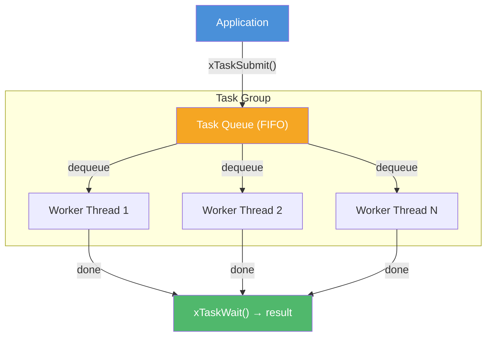
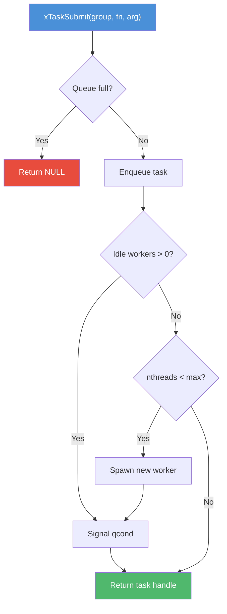

<!-- markdownlint-disable MD041 -->
[xKit](../../README.md) > [xbase](README.md) > task.h

# task.h — N:M Task Model

## Introduction

`task.h` provides a lightweight N:M concurrent task model where N user tasks are multiplexed onto M OS threads managed by a task group (thread pool). It supports lazy thread creation, configurable queue capacity, per-task result retrieval, and a global shared task group for convenience.

## Design Philosophy

1. **Lazy Thread Spawning** — Worker threads are created on-demand when tasks are submitted and no idle thread is available, up to the configured maximum. This avoids pre-allocating threads that may never be used, reducing resource consumption for bursty workloads.

2. **Simple Submit/Wait Model** — Tasks are submitted with `xTaskSubmit()` and optionally awaited with `xTaskWait()`. This mirrors the future/promise pattern found in higher-level languages, but in pure C with minimal overhead.

3. **Configurable Capacity** — The task group can be configured with a maximum thread count and queue capacity. When the queue is full, `xTaskSubmit()` returns NULL, giving the caller explicit backpressure.

4. **Global Shared Group** — `xTaskGroupGlobal()` provides a lazily-initialized, process-wide task group with default settings (unlimited threads, no queue cap). It's automatically destroyed at `atexit()`, making it convenient for fire-and-forget usage.

## Architecture



## Implementation Details

### Internal Structure

```c
struct xTask_ {
    xTaskFunc       fn;       // User function
    void           *arg;      // User argument
    pthread_mutex_t lock;     // Protects done/result
    pthread_cond_t  cond;     // Signals completion
    bool            done;     // Completion flag
    void           *result;   // Return value of fn
    struct xTask_  *next;     // Intrusive queue linkage
};

struct xTaskGroup_ {
    pthread_t      *workers;      // Dynamic array of worker threads
    size_t          max_threads;  // Upper bound (SIZE_MAX if unlimited)
    size_t          nthreads;     // Currently spawned threads
    pthread_mutex_t qlock;        // Protects the task queue
    pthread_cond_t  qcond;        // Wakes idle workers
    struct xTask_  *qhead, *qtail; // FIFO task queue
    size_t          qsize, qcap;  // Current size and capacity
    size_t          idle;         // Number of idle workers
    atomic_size_t   pending;      // Submitted - finished
    atomic_size_t   done_count;   // Tasks completed
    pthread_cond_t  wcond;        // Dedicated cond for xTaskGroupWait()
    bool            shutdown;     // Shutdown flag
};
```

### Worker Loop

Each worker thread runs `worker_loop()`:

1. **Acquire lock** and increment `idle` count.
2. **Wait** on `qcond` while the queue is empty and not shutting down.
3. **Dequeue** one task, decrement `idle`.
4. **Execute** `task->fn(task->arg)`.
5. **Signal completion** via `pthread_cond_broadcast(&task->cond)`.
6. **Update counters** — decrement `pending`, signal `wcond` if all tasks are done.

### Task Submission Flow



### Separate Wait Conditions

The implementation uses two separate condition variables:

- `qcond` — Wakes idle workers when a new task arrives.
- `wcond` — Wakes `xTaskGroupWait()` callers when all tasks complete.

Using a single condition variable caused lost wakeups: `pthread_cond_signal()` could wake an idle worker instead of the `GroupWait` caller, leaving it blocked forever.

### Global Task Group

`xTaskGroupGlobal()` uses `pthread_once` for thread-safe lazy initialization. The group is registered with `atexit()` for automatic cleanup. It uses default configuration (unlimited threads, no queue cap).

## API Reference

### Types

| Type | Description |
| --- | --- |
| `xTaskFunc` | `void *(*)(void *arg)` — Task function signature. Returns a result pointer. |
| `xTask` | Opaque handle to a submitted task |
| `xTaskGroup` | Opaque handle to a task group (thread pool) |
| `xTaskGroupConf` | Configuration struct: `nthreads` (0 = auto), `queue_cap` (0 = unbounded) |

### Functions

| Function | Signature | Description | Thread Safety |
| --- | --- | --- | --- |
| `xTaskGroupCreate` | `xTaskGroup xTaskGroupCreate(const xTaskGroupConf *conf)` | Create a task group. NULL conf = defaults. | Not thread-safe |
| `xTaskGroupDestroy` | `void xTaskGroupDestroy(xTaskGroup g)` | Wait for pending tasks, then destroy. | Not thread-safe |
| `xTaskSubmit` | `xTask xTaskSubmit(xTaskGroup g, xTaskFunc fn, void *arg)` | Submit a task. Returns NULL if queue is full. | **Thread-safe** |
| `xTaskWait` | `xErrno xTaskWait(xTask t, void **result)` | Block until task completes. Frees the task handle. | **Thread-safe** |
| `xTaskGroupWait` | `xErrno xTaskGroupWait(xTaskGroup g)` | Block until all pending tasks complete. | **Thread-safe** |
| `xTaskGroupThreads` | `size_t xTaskGroupThreads(xTaskGroup g)` | Return number of spawned worker threads. | **Thread-safe** (atomic read) |
| `xTaskGroupPending` | `size_t xTaskGroupPending(xTaskGroup g)` | Return number of pending tasks. | **Thread-safe** (atomic read) |
| `xTaskGroupGlobal` | `xTaskGroup xTaskGroupGlobal(void)` | Get the global shared task group (lazy init). | **Thread-safe** |

## Usage Examples

### Basic Task Submission

```c
#include <stdio.h>
#include <xbase/task.h>

static void *compute(void *arg) {
    int *val = (int *)arg;
    *val *= 2;
    return val;
}

int main(void) {
    xTaskGroup group = xTaskGroupCreate(NULL);

    int value = 21;
    xTask task = xTaskSubmit(group, compute, &value);

    void *result;
    xTaskWait(task, &result);
    printf("Result: %d\n", *(int *)result); // 42

    xTaskGroupDestroy(group);
    return 0;
}
```

### Parallel Map

```c
#include <stdio.h>
#include <xbase/task.h>

#define N 8

static void *square(void *arg) {
    int *val = (int *)arg;
    *val = (*val) * (*val);
    return val;
}

int main(void) {
    xTaskGroupConf conf = { .nthreads = 4, .queue_cap = 0 };
    xTaskGroup group = xTaskGroupCreate(&conf);

    int data[N] = {1, 2, 3, 4, 5, 6, 7, 8};
    xTask tasks[N];

    for (int i = 0; i < N; i++)
        tasks[i] = xTaskSubmit(group, square, &data[i]);

    // Wait for all
    xTaskGroupWait(group);

    for (int i = 0; i < N; i++)
        printf("data[%d] = %d\n", i, data[i]);

    // Clean up task handles
    for (int i = 0; i < N; i++)
        xTaskWait(tasks[i], NULL);

    xTaskGroupDestroy(group);
    return 0;
}
```

### Using the Global Task Group

```c
#include <stdio.h>
#include <xbase/task.h>

static void *work(void *arg) {
    printf("Running on global pool: %s\n", (char *)arg);
    return NULL;
}

int main(void) {
    xTask t = xTaskSubmit(xTaskGroupGlobal(), work, "hello");
    xTaskWait(t, NULL);
    // No need to destroy the global group
    return 0;
}
```

## Use Cases

1. **CPU-Bound Parallel Processing** — Distribute computation across multiple cores. Use `xTaskGroupWait()` to synchronize at barriers.

2. **Event Loop Offload** — The event loop's `xEventLoopSubmit()` uses `xTaskGroup` internally to run work functions on worker threads, then delivers results back to the loop thread.

3. **Background I/O** — Offload blocking file I/O (e.g., `fsync`, large reads) to a thread pool to keep the main thread responsive.

## Best Practices

- **Always call `xTaskWait()` or let `xTaskGroupDestroy()` clean up.** Each `xTaskSubmit()` allocates a task struct with a mutex and condvar. `xTaskWait()` frees them. Leaking task handles leaks resources.
- **Set `queue_cap` for backpressure.** Without a cap, unbounded submission can exhaust memory. A bounded queue lets you detect overload via NULL returns from `xTaskSubmit()`.
- **Don't destroy the global group.** `xTaskGroupGlobal()` is managed internally and destroyed at `atexit()`. Passing it to `xTaskGroupDestroy()` is undefined behavior.
- **Use `xTaskGroupWait()` for barriers, not busy-polling.** It uses a dedicated condition variable and blocks efficiently.

## Comparison with Other Libraries

| Feature | xbase task.h | pthread | C11 threads | GCD (libdispatch) |
| --- | --- | --- | --- | --- |
| **Abstraction** | Task (submit/wait) | Thread (create/join) | Thread (create/join) | Block (dispatch_async) |
| **Thread Management** | Automatic (lazy spawn) | Manual | Manual | Automatic |
| **Queue** | Built-in FIFO with cap | N/A | N/A | Built-in (serial/concurrent) |
| **Result Retrieval** | `xTaskWait(t, &result)` | `pthread_join(t, &result)` | `thrd_join(t, &result)` | Completion handler |
| **Group Wait** | `xTaskGroupWait()` | Manual barrier | Manual barrier | `dispatch_group_wait()` |
| **Backpressure** | `queue_cap` → NULL on full | N/A | N/A | N/A (unbounded) |
| **Global Pool** | `xTaskGroupGlobal()` | N/A | N/A | `dispatch_get_global_queue()` |
| **Platform** | macOS + Linux | POSIX | C11 | macOS + Linux (via libdispatch) |
| **Dependencies** | pthread | OS | OS | OS / libdispatch |

**Key Differentiator:** xbase's task model provides a simple, portable thread pool with lazy spawning and explicit backpressure — features that require significant boilerplate with raw pthreads. Unlike GCD, it gives you direct control over thread count and queue capacity.
