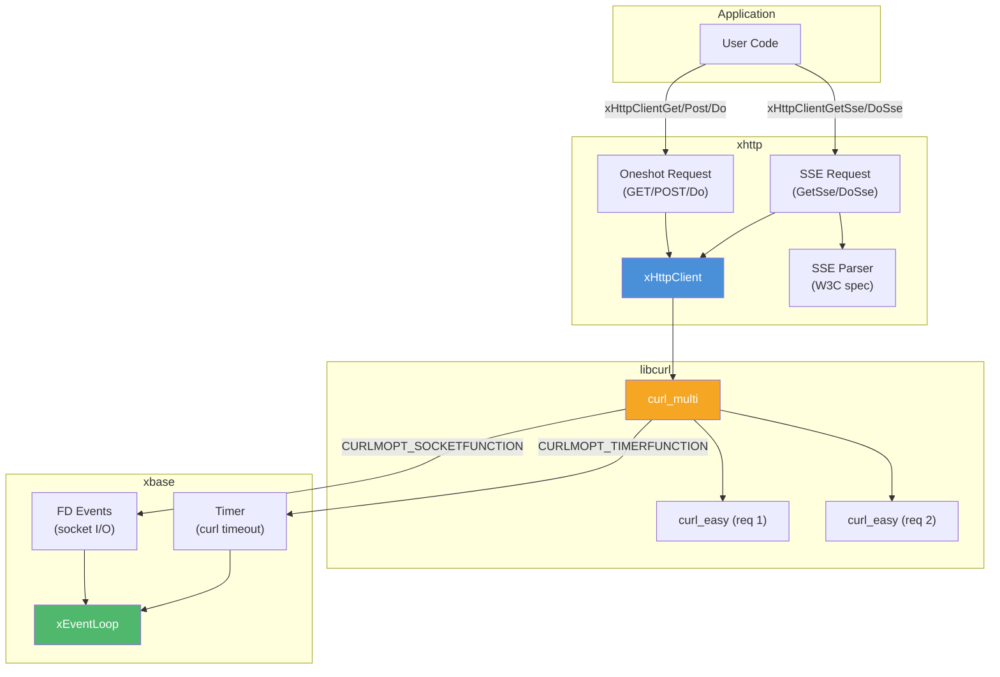

<!-- markdownlint-disable MD041 -->
[xKit](../../README.md) > [xhttp](README.md)

# xhttp — Asynchronous HTTP

## Introduction

**xhttp** is xKit's HTTP module, providing both a fully asynchronous HTTP **client** and **server**, all powered by xbase's event loop.

- The **client** uses libcurl's multi-socket API for non-blocking HTTP requests and SSE streaming — ideal for integrating with REST APIs and LLM streaming endpoints.
- The **server** uses an `xHttpProto` vtable interface for protocol-abstracted parsing, with the current HTTP/1.1 implementation backed by llhttp. Single-threaded, event-driven connection handling — ideal for building lightweight HTTP services and APIs.

## Design Philosophy

1. **Event Loop Integration** — Instead of blocking threads, xhttp registers libcurl's sockets with [`xEventLoop`](../xbase/event.md) and uses event-driven I/O. All callbacks are dispatched on the event loop thread, eliminating the need for synchronization.

2. **Vtable-Based Request Polymorphism** — Internally, different request types (oneshot HTTP, SSE streaming) share the same curl multi handle but use different vtables for completion and cleanup. This avoids code duplication while supporting diverse response handling patterns.

3. **Zero-Copy Response Delivery** — Response headers and body are accumulated in [`xBuffer`](../xbuf/buf.md) instances and delivered to the callback as pointers. No extra copies are made.

4. **Automatic Resource Management** — Request contexts, curl easy handles, and buffers are automatically cleaned up after the completion callback returns. In-flight requests are cancelled with error callbacks when the client is destroyed.

## Architecture



## Sub-Module Overview

| File | Description | Doc |
| --- | --- | --- |
| `server.h` | Async HTTP/1.1 server (routing, request/response, protocol-abstracted parsing) | [server.md](server.md) |
| `client.h` | Async HTTP client API (GET, POST, Do, SSE) | [client.md](client.md) |
| `client_sse.c` | SSE stream parser and request handler | [client_sse.md](client_sse.md) |

## Quick Start

```c
#include <stdio.h>
#include <xbase/event.h>
#include <xhttp/client.h>

static void on_response(const xHttpResponse *resp, void *arg) {
    (void)arg;
    if (resp->curl_code == 0) {
        printf("Status: %ld\n", resp->status_code);
        printf("Body: %.*s\n", (int)resp->body_len, resp->body);
    } else {
        printf("Error: %s\n", resp->curl_error);
    }
}

int main(void) {
    xEventLoop loop = xEventLoopCreate();
    xHttpClient client = xHttpClientCreate(loop);

    xHttpClientGet(client, "https://httpbin.org/get", on_response, NULL);

    xEventLoopRun(loop);

    xHttpClientDestroy(client);
    xEventLoopDestroy(loop);
    return 0;
}
```

## Relationship with Other Modules

- **xbase** — Uses [`xEventLoop`](../xbase/event.md) for I/O multiplexing and [`xEventLoopTimerAfter`](../xbase/timer.md) for curl timeout management.
- **xbuf** — Uses [`xBuffer`](../xbuf/buf.md) for response header and body accumulation.
- **libcurl** — External dependency (client). Uses the multi-socket API (`curl_multi_socket_action`) for non-blocking HTTP.
- **llhttp** — External dependency (server). Provides incremental HTTP/1.1 request parsing, isolated behind the `xHttpProto` vtable in `proto_h1.c`.
