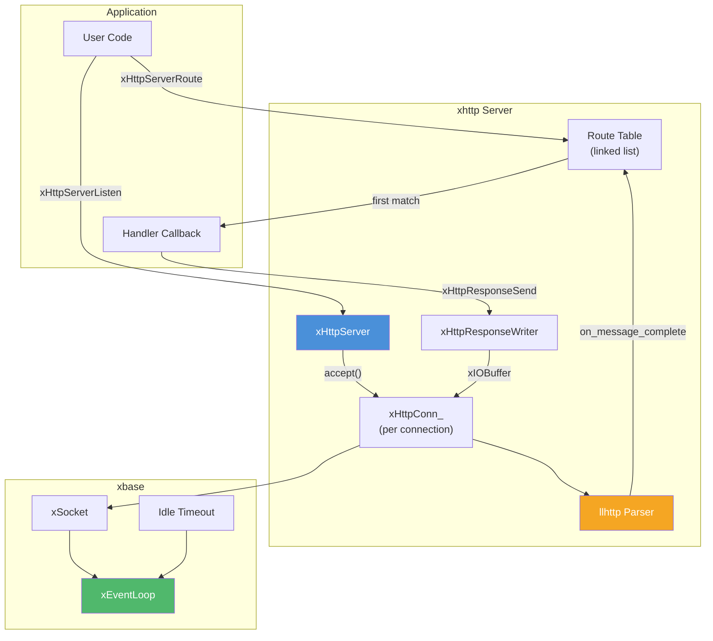
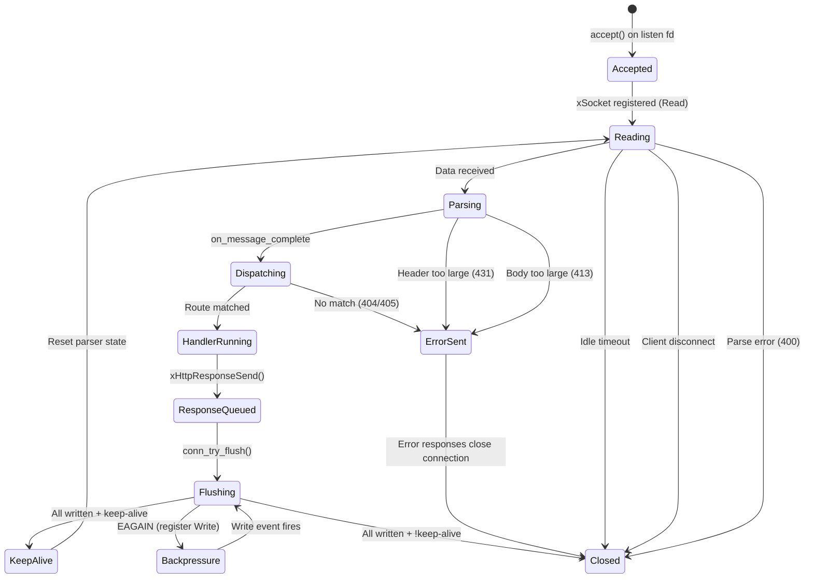
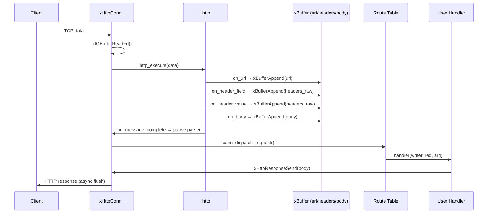

<!-- markdownlint-disable MD041 -->
[xKit](../../README.md) > [xhttp](README.md) > server.h

# server.h — Asynchronous HTTP/1.1 Server

## Introduction

`server.h` provides `xHttpServer`, an asynchronous, non-blocking HTTP/1.1 server powered by [llhttp](https://github.com/nodejs/llhttp) and xbase's event loop. All connection handling, request parsing, and response sending are driven by the event loop on a single thread — no locks or thread pools required. The server supports routing, keep-alive, configurable limits, and automatic error responses.

## Design Philosophy

1. **Single-Threaded Event-Driven I/O** — The server registers listening and client sockets with [`xEventLoop`](../xbase/event.md). Accept, read, parse, dispatch, and write all happen on the event loop thread, eliminating synchronization overhead.

2. **llhttp-Based Parsing** — Request parsing is delegated to llhttp (the HTTP parser used by Node.js). Incremental callbacks accumulate URL, headers, and body into [`xBuffer`](../xbuf/buf.md) instances, supporting chunked and pipelined requests.

3. **First-Match Routing** — Routes are registered as (method, path) pairs and matched in registration order. Path patterns support both exact segments and `:param` segments (e.g. `/users/:id`). This keeps the routing logic simple and predictable.

4. **Writer-Based Response API** — Handlers receive an `xHttpResponseWriter` handle to set status, headers, and body. The response is serialized into an [`xIOBuffer`](../xbuf/io.md) and flushed asynchronously, with backpressure handled automatically.

5. **Defensive Limits** — Configurable limits on header size (default 8 KiB), body size (default 1 MiB), and idle timeout (default 60 s) protect against slow clients and oversized payloads. Violations produce appropriate 4xx error responses.

## Architecture



## Implementation Details

### Connection Lifecycle



### Request Parsing Flow



### Routing

Routes are stored in a singly-linked list and matched in registration order (first match wins):

1. **Path match** — Segment-by-segment comparison. Static segments require exact match; `:param` segments match any non-empty string and capture the value.
2. **Method match** — Case-insensitive comparison (`strcasecmp`). A `NULL` method matches any HTTP method.
3. **Fallback** — If the path matches but no method matches → 405 Method Not Allowed. If no path matches → 404 Not Found.
4. **Parameter access** — Inside a handler, call `xHttpRequestParam(req, "id", &len)` to retrieve the captured value.

### Response Serialization

When `xHttpResponseSend()` is called:

1. Status line (`HTTP/1.1 <code> <reason>\r\n`) is written to the `xIOBuffer`.
2. `Content-Length` header is added automatically.
3. `Connection: keep-alive` or `Connection: close` is added based on the parser's determination.
4. User-set headers are appended.
5. Header section is terminated with `\r\n`.
6. Body is appended.
7. `conn_try_flush()` attempts an immediate `writev()`. If `EAGAIN`, the socket is registered for write events and flushing continues asynchronously.

### Keep-Alive & Pipelining

- HTTP/1.1 connections default to keep-alive. After a response is fully flushed, the parser state is reset and the connection waits for the next request.
- The parser is paused in `on_message_complete` to prevent parsing the next pipelined request before the current response is sent.
- Error responses always set `Connection: close`.

### Idle Timeout

Each connection has an idle timeout (default 60 s). If no data is received within this period, the connection is closed automatically via `xEvent_Timeout`. The timeout is reset after each response is sent on a keep-alive connection.

## API Reference

### Types

| Type | Description |
| --- | --- |
| `xHttpServer` | Opaque handle to an HTTP server bound to an event loop |
| `xHttpResponseWriter` | Opaque handle to a response writer (valid only during handler) |
| `xHttpRequest` | Request data delivered to the handler callback |
| `xHttpHandlerFunc` | `void (*)(xHttpResponseWriter writer, const xHttpRequest *req, void *arg)` |

### xHttpRequest Fields

| Field | Type | Description |
| --- | --- | --- |
| `method` | `const char *` | HTTP method string (e.g. `"GET"`, `"POST"`) |
| `url` | `const char *` | Request URL / path (NUL-terminated) |
| `headers` | `const char *` | Raw request headers (NUL-terminated) |
| `headers_len` | `size_t` | Length of headers in bytes |
| `body` | `const char *` | Request body, or `NULL` if no body |
| `body_len` | `size_t` | Length of body in bytes |

All pointers are valid only for the duration of the handler callback.

### Lifecycle

| Function | Signature | Description |
| --- | --- | --- |
| `xHttpServerCreate` | `xHttpServer xHttpServerCreate(xEventLoop loop)` | Create a server bound to an event loop. |
| `xHttpServerListen` | `xErrno xHttpServerListen(xHttpServer server, const char *host, uint16_t port)` | Start listening on the given address and port. |
| `xHttpServerDestroy` | `void xHttpServerDestroy(xHttpServer server)` | Destroy server, close all connections, free all routes. |

### Route Registration

| Function | Signature | Description |
| --- | --- | --- |
| `xHttpServerRoute` | `xErrno xHttpServerRoute(xHttpServer server, const char *method, const char *path, xHttpHandlerFunc handler, void *arg)` | Register a route. `method` may be `NULL` to match all methods. `path` supports `:param` segments (e.g. `/users/:id`). First match wins. |

### Request Parameters

| Function | Signature | Description |
| --- | --- | --- |
| `xHttpRequestParam` | `const char *xHttpRequestParam(const xHttpRequest *req, const char *name, size_t *len)` | Look up a path parameter by name. Returns a pointer to the value (NOT NUL-terminated) and sets `*len`, or returns `NULL` if not found. |

### Response

| Function | Signature | Description |
| --- | --- | --- |
| `xHttpResponseSetStatus` | `void xHttpResponseSetStatus(xHttpResponseWriter writer, int code)` | Set HTTP status code (default 200). |
| `xHttpResponseSetHeader` | `xErrno xHttpResponseSetHeader(xHttpResponseWriter writer, const char *key, const char *value)` | Add a response header. Call before `Send` or the first `Write`. |
| `xHttpResponseSend` | `xErrno xHttpResponseSend(xHttpResponseWriter writer, const char *body, size_t body_len)` | Send a complete response. May only be called once. Mutually exclusive with `Write`. |
| `xHttpResponseWrite` | `xErrno xHttpResponseWrite(xHttpResponseWriter writer, const char *data, size_t len)` | Write data to a streaming response. First call flushes headers (no `Content-Length`). Mutually exclusive with `Send`. |
| `xHttpResponseEnd` | `void xHttpResponseEnd(xHttpResponseWriter writer)` | End a streaming response. Optional — auto-called when the handler returns. |

### Configuration

| Function | Signature | Description | Default |
| --- | --- | --- | --- |
| `xHttpServerSetIdleTimeout` | `xErrno xHttpServerSetIdleTimeout(xHttpServer server, int timeout_ms)` | Set idle timeout for connections. | 60000 ms |
| `xHttpServerSetMaxHeaderSize` | `xErrno xHttpServerSetMaxHeaderSize(xHttpServer server, size_t max_size)` | Set max header size. Exceeding → 431. | 8192 bytes |
| `xHttpServerSetMaxBodySize` | `xErrno xHttpServerSetMaxBodySize(xHttpServer server, size_t max_size)` | Set max body size. Exceeding → 413. | 1048576 bytes |

All configuration functions must be called **before** `xHttpServerListen()`.

## Usage Examples

### Minimal Server

```c
#include <stdio.h>
#include <xbase/event.h>
#include <xhttp/server.h>

static void on_hello(xHttpResponseWriter w, const xHttpRequest *req, void *arg) {
    (void)req; (void)arg;
    xHttpResponseSetHeader(w, "Content-Type", "text/plain");
    xHttpResponseSend(w, "Hello, World!\n", 14);
}

int main(void) {
    xEventLoop loop = xEventLoopCreate();
    xHttpServer server = xHttpServerCreate(loop);

    xHttpServerRoute(server, "GET", "/hello", on_hello, NULL);
    xHttpServerListen(server, "0.0.0.0", 8080);

    printf("Listening on :8080\n");
    xEventLoopRun(loop);

    xHttpServerDestroy(server);
    xEventLoopDestroy(loop);
    return 0;
}
```

### JSON API with POST

```c
#include <stdio.h>
#include <string.h>
#include <xbase/event.h>
#include <xhttp/server.h>

static void on_echo(xHttpResponseWriter w, const xHttpRequest *req, void *arg) {
    (void)arg;
    xHttpResponseSetHeader(w, "Content-Type", "application/json");
    xHttpResponseSend(w, req->body, req->body_len);
}

static void on_not_found(xHttpResponseWriter w, const xHttpRequest *req, void *arg) {
    (void)req; (void)arg;
    const char *body = "{\"error\": \"not found\"}";
    xHttpResponseSetStatus(w, 404);
    xHttpResponseSetHeader(w, "Content-Type", "application/json");
    xHttpResponseSend(w, body, strlen(body));
}

int main(void) {
    xEventLoop loop = xEventLoopCreate();
    xHttpServer server = xHttpServerCreate(loop);

    xHttpServerSetMaxBodySize(server, 4 * 1024 * 1024); /* 4 MiB */

    xHttpServerRoute(server, "POST", "/echo", on_echo, NULL);

    xHttpServerListen(server, NULL, 9090);
    xEventLoopRun(loop);

    xHttpServerDestroy(server);
    xEventLoopDestroy(loop);
    return 0;
}
```

### Server-Sent Events (SSE)

```c
#include <stdio.h>
#include <string.h>
#include <xbase/event.h>
#include <xhttp/server.h>

static void on_events(xHttpResponseWriter w, const xHttpRequest *req, void *arg) {
    (void)req; (void)arg;
    xHttpResponseSetHeader(w, "Content-Type", "text/event-stream");
    xHttpResponseSetHeader(w, "Cache-Control", "no-cache");

    xHttpResponseWrite(w, "data: hello\n\n", 13);
    xHttpResponseWrite(w, "data: world\n\n", 13);
    /* xHttpResponseEnd(w) is optional; auto-called on return */
}

int main(void) {
    xEventLoop loop = xEventLoopCreate();
    xHttpServer server = xHttpServerCreate(loop);

    xHttpServerRoute(server, "GET", "/events", on_events, NULL);

    xHttpServerListen(server, NULL, 8080);
    printf("SSE server on :8080/events\n");
    xEventLoopRun(loop);

    xHttpServerDestroy(server);
    xEventLoopDestroy(loop);
    return 0;
}
```

### RESTful API with Path Parameters

```c
#include <stdio.h>
#include <string.h>
#include <xbase/event.h>
#include <xhttp/server.h>

static void on_get_user(xHttpResponseWriter w, const xHttpRequest *req, void *arg) {
    (void)arg;
    size_t id_len = 0;
    const char *id = xHttpRequestParam(req, "id", &id_len);

    char body[128];
    int len = snprintf(body, sizeof(body),
                       "{\"user_id\": \"%.*s\"}\n", (int)id_len, id);

    xHttpResponseSetHeader(w, "Content-Type", "application/json");
    xHttpResponseSend(w, body, (size_t)len);
}

int main(void) {
    xEventLoop loop = xEventLoopCreate();
    xHttpServer server = xHttpServerCreate(loop);

    xHttpServerRoute(server, "GET", "/users/:id", on_get_user, NULL);

    xHttpServerListen(server, NULL, 8080);
    printf("REST API on :8080\n");
    xEventLoopRun(loop);

    xHttpServerDestroy(server);
    xEventLoopDestroy(loop);
    return 0;
}
```

### Multiple Routes with Shared State

```c
#include <stdio.h>
#include <xbase/event.h>
#include <xhttp/server.h>

typedef struct {
    int counter;
} AppState;

static void on_count(xHttpResponseWriter w, const xHttpRequest *req, void *arg) {
    (void)req;
    AppState *state = (AppState *)arg;
    state->counter++;

    char body[64];
    int len = snprintf(body, sizeof(body), "{\"count\": %d}\n", state->counter);

    xHttpResponseSetHeader(w, "Content-Type", "application/json");
    xHttpResponseSend(w, body, (size_t)len);
}

static void on_health(xHttpResponseWriter w, const xHttpRequest *req, void *arg) {
    (void)req; (void)arg;
    xHttpResponseSend(w, "ok\n", 3);
}

int main(void) {
    xEventLoop loop = xEventLoopCreate();
    xHttpServer server = xHttpServerCreate(loop);

    AppState state = { .counter = 0 };

    xHttpServerRoute(server, "POST", "/count", on_count, &state);
    xHttpServerRoute(server, "GET",  "/health", on_health, NULL);

    xHttpServerListen(server, NULL, 8080);
    xEventLoopRun(loop);

    xHttpServerDestroy(server);
    xEventLoopDestroy(loop);
    return 0;
}
```

## Best Practices

- **Don't block in handlers.** Handlers run on the event loop thread. Blocking delays all other connections.
- **Always call `xHttpResponseSend()` or `xHttpResponseWrite()`.** If the handler returns without sending, a default 200 OK with empty body is sent automatically — but it's better to be explicit.
- **Don't mix `Send` and `Write`.** `xHttpResponseSend()` is for one-shot responses; `xHttpResponseWrite()` is for streaming. They are mutually exclusive — calling one after the other returns `xErrno_InvalidState`.
- **Configure limits before listening.** `SetIdleTimeout`, `SetMaxHeaderSize`, and `SetMaxBodySize` must be called before `xHttpServerListen()`.
- **Register routes before listening.** Routes should be set up before the server starts accepting connections.
- **Destroy server before event loop.** `xHttpServerDestroy()` closes all connections and frees all resources.
- **Copy data you need to keep.** `xHttpRequest` pointers (`url`, `headers`, `body`) are only valid during the handler callback.

## Comparison with Other Libraries

| Feature | xhttp server.h | libuv + http-parser | libmicrohttpd | Go net/http | Node.js http |
| --- | --- | --- | --- | --- | --- |
| **I/O Model** | Async (event loop) | Async (event loop) | Threaded / select | Goroutines | Async (event loop) |
| **Event Loop** | xEventLoop integration | libuv | Internal | Go runtime | libuv (V8) |
| **HTTP Parser** | llhttp | http-parser / llhttp | Internal | Internal | llhttp |
| **Streaming Response** | Built-in (`Write`/`End`) | Manual | Manual | Built-in (`Flusher`) | Built-in (`write`/`end`) |
| **Routing** | Built-in (first match) | None (manual) | None (manual) | Built-in (`ServeMux`) | None (manual) |
| **Keep-Alive** | Automatic | Manual | Automatic | Automatic | Automatic |
| **Thread Model** | Single-threaded | Single-threaded | Multi-threaded | Multi-goroutine | Single-threaded |
| **Language** | C99 | C | C | Go | JavaScript |

**Key Differentiator:** xhttp server provides a complete, single-threaded HTTP/1.1 server with built-in routing, streaming responses, and automatic keep-alive — all integrated with xEventLoop. Unlike libuv + http-parser (which requires manual response assembly) or libmicrohttpd (which uses threads), xhttp keeps everything on one thread with zero synchronization overhead. The streaming API (`xHttpResponseWrite`/`xHttpResponseEnd`) makes it straightforward to implement SSE or chunked streaming without external dependencies.

## Relationship with Other Modules

- **xbase** — Uses [`xEventLoop`](../xbase/event.md) for I/O multiplexing, [`xSocket`](../xbase/socket.md) for non-blocking socket management, and socket timeouts for idle connection detection.
- **xbuf** — Uses [`xBuffer`](../xbuf/buf.md) for request parsing accumulation (URL, headers, body) and [`xIOBuffer`](../xbuf/io.md) for read/write buffering with scatter-gather I/O.
- **llhttp** — External dependency. Provides incremental HTTP/1.1 request parsing via callbacks.
