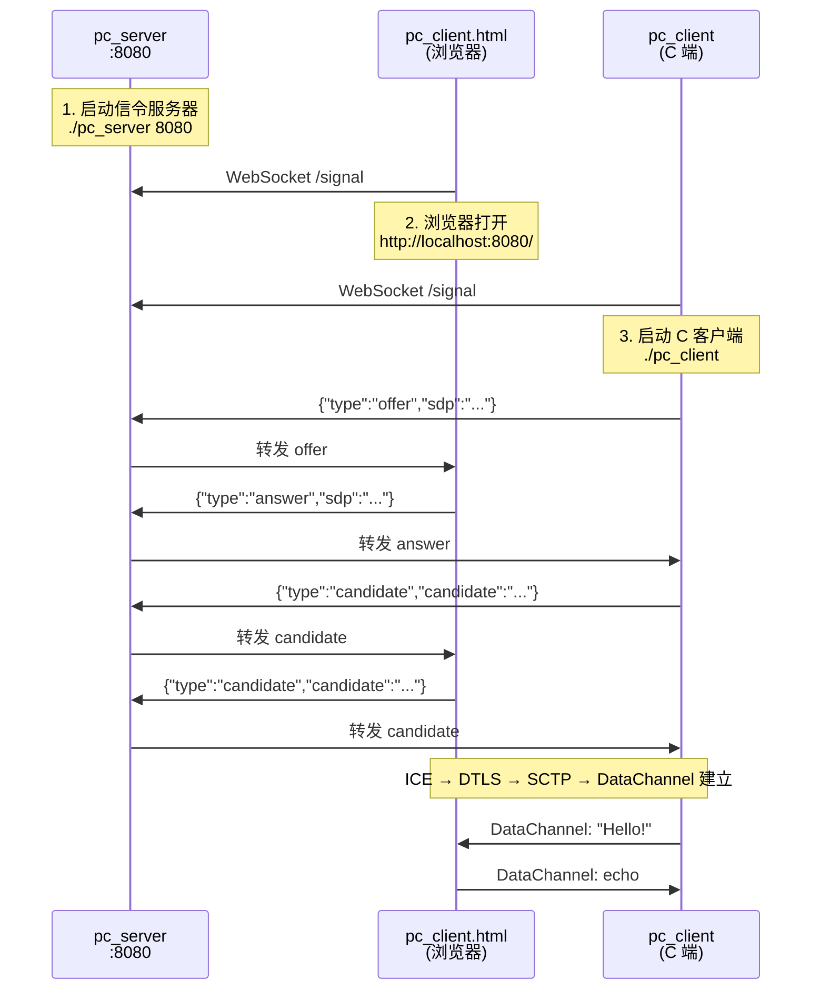

# WebRTC PeerConnection 联合测试流程

## 组件

- **pc_server** — WebSocket 信令服务器，负责在浏览器和 C 客户端之间转发 SDP/ICE
- **pc_client** — C 端 WebRTC 客户端，通过 WebSocket 连接信令服务器
- **pc_client.html** — 浏览器端 WebRTC 客户端，自动通过 WebSocket 交换信令

## 信令协议（JSON over WebSocket）

```json
{"type":"offer","sdp":"v=0\r\n..."}
{"type":"answer","sdp":"v=0\r\n..."}
{"type":"candidate","candidate":"candidate:..."}
```

## 测试流程



## 具体步骤

1. **启动信令服务器**：`./pc_server 8080`
2. **打开浏览器**：访问 `http://localhost:8080/`
3. **启动 C 客户端**：`./pc_client ws://localhost:8080/signal`
4. C 客户端自动创建 Offer → 信令服务器转发 → 浏览器自动创建 Answer → 转发回来
5. ICE Candidate 双向自动交换
6. DataChannel 建立后，在 C 端终端输入消息发送，浏览器页面上也可以发送消息
